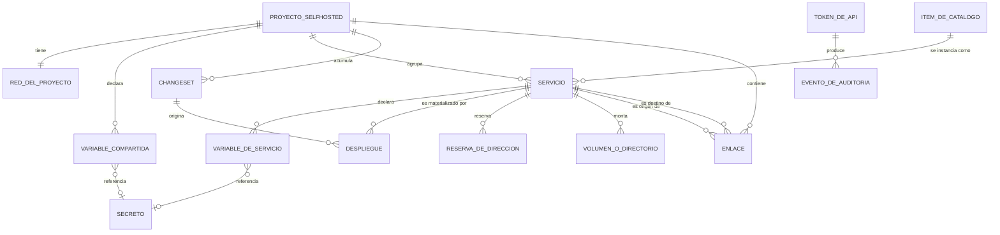

# Modelo conceptual — SelfHosted Service

**Proyecto:** SelfHosted Service
**Documento:** Modelo-Conceptual.md
**Versión:** 1.0
**Estado:** Propuesto
**Fecha:** 2026-07-29
**Autor:** Analista Funcional Senior (AG-02)

**Trazabilidad upstream:** SOLUTION-INTAKE-SelfHosted-Service anexo E-9 (esquema relacional completo), anexo E-1, E-2, E-3, E-4, E-5, E-6, E-8, E-11, E-12, E-17, E-21; §17.P.2 (invariantes I1 a I10), §17.P.4, §17.P.11 (decisiones del modelo de dominio, D-12), §24.3 (los tres objetos declarados y no diseñados), §12 (glosario del dominio).

---

## Tabla de contenido

- [1. Entidades](#1-entidades)
- [2. Atributos clave](#2-atributos-clave)
- [3. Relaciones](#3-relaciones)
- [4. Cardinalidades](#4-cardinalidades)
- [5. Reglas conceptuales](#5-reglas-conceptuales)
- [6. Glosario](#6-glosario)
- [7. Diagrama](#7-diagrama)
- [8. Trazabilidad](#8-trazabilidad)
- [9. Brechas declaradas](#9-brechas-declaradas)
- [10. Control de cambios](#10-control-de-cambios)

---

## 0. Alcance y conteo de entidades

Este modelo es conceptual: nombra entidades, atributos y relaciones del dominio, y no declara tipos físicos, claves ni índices. La forma persistida de todo esto vive en el anexo E-9 del intake y su modelo lógico es materia de 05-Arquitectura-Tecnica.

Conteo de entidades, que es el dato del que depende la obligatoriedad de las reglas conceptuales según §2.2 de `Rules-Especificacion-Funcional.md`:

| Origen | Cantidad | Detalle |
| --- | --- | --- |
| Tablas declaradas en el anexo E-9 | 11 | `proyectos`, `variables_proyecto`, `enlaces`, `servicios`, `variables`, `changesets`, `despliegues`, `reservas_ip`, `catalogo_items`, `tokens_api`, `eventos_auditoria` |
| Objetos con identidad que E-9 declara y no diseña (D-12) | 2 | Secreto y Red del proyecto. E-9 declara literalmente «pasa a ser objeto» para los dos |
| Objeto con identidad que el intake §24.3 declara y no diseña | 1 | Volumen o directorio al que apunta un montaje |
| Total conceptual | 14 | |

**Decisión:** el modelo supera las diez entidades por las dos vías de conteo —once tablas persistidas, catorce entidades conceptuales—, de modo que las reglas conceptuales `RC-XX` son obligatorias y se emiten en [reglas-conceptuales-de-modelo/](reglas-conceptuales-de-modelo/).

Lo que E-9 declara explícitamente como **atributo y no entidad**, por la prueba de tres condiciones de D-12, y que por lo tanto no aparece acá como entidad: recursos, verificación de salud, montajes y disposición del lienzo.

---

## 1. Entidades

### 1.1 Proyecto SelfHosted

Unidad de agrupación del producto: la arquitectura completa de servicios contenedorizados, con su red y su lienzo. Es lo que el usuario crea desde el portal. Traza: E-9 tabla `proyectos`; glosario §12; invariante I1.

Ejemplo de instancia: el proyecto 12, «Portal Interno», slug `portal-interno`, con red bridge propia, autoarranque activo y estado `parcialmente-activo` (E-1).

### 1.2 Red del proyecto

La red en la que viven los servicios de un proyecto SelfHosted, con su modo, su subred, su pasarela y su interfaz padre cuando corresponde. Traza: E-9, bloque de identidad de objeto, que la declara objeto con identidad porque la comparten todos los servicios del proyecto, se crea antes que los contenedores y les sobrevive; §24.3.

Ejemplo de instancia: red `portal-interno-net`, modo bridge, subred `172.20.0.0/24`, pasarela `172.20.0.1`, creada por el servicio (E-1).

### 1.3 Variable compartida del proyecto

Valor declarado una sola vez a nivel proyecto y referenciable desde cualquiera de sus servicios. Puede ser secreta. Traza: E-9 tabla `variables_proyecto` (D-5); capacidad F-23; glosario §12.

Ejemplo de instancia: `TZ = America/Argentina/Buenos_Aires`, no secreta, del proyecto 12 (E-1).

### 1.4 Servicio

La configuración de un contenedor dentro de un proyecto SelfHosted: origen, variables, red, montajes, dispositivos, límites, política de reinicio y marca de efímero. No tiene estado de encendido. Traza: E-9 tabla `servicios`; E-2; invariantes I2, I3.

Ejemplo de instancia: servicio 101, `api`, del proyecto 12, origen imagen `registro-privado/portal-api:1.4.2` con política fijada, red bridge con alias `api` (E-2).

### 1.5 Variable de servicio

Par de clave y valor que el proceso del contenedor recibe. Su valor puede ser un literal o una referencia sin resolver a otra variable. Puede ser secreta. Traza: E-9 tabla `variables`; E-2; E-4.

Ejemplo de instancia: `ConnectionStrings__Default` de `api`, cuyo valor legible es `Host=${{ db.SELFHOSTED_HOST }};Port=5432;Database=portal` y cuya forma vinculada apunta al servicio 103 (E-2, E-4).

### 1.6 Variable provista por el sistema

Variable de sólo lectura que el sistema expone en cada servicio y que el usuario no declara ni edita. El conjunto es exactamente dos: el host interno y el nombre del servicio. Traza: RN-32; E-4; glosario §12.

Ejemplo de instancia: `SELFHOSTED_HOST` del servicio 103, que resuelve según el modo de red del destino.

No es una entidad persistida propia: es una proyección derivada del servicio, y se declara acá porque el modelo la referencia como si fuese una variable.

### 1.7 Enlace

Arista que materializa que un servicio depende de otro del mismo proyecto SelfHosted. Tiene dos ejes independientes: declarar espera al destino y referenciar el host del destino. Traza: E-9 tabla `enlaces`; E-4; RN-04, RN-05, RN-14, RN-34.

Ejemplo de instancia: enlace 9002 del proyecto 12, de `api` a `db`, con clave de origen `ConnectionStrings__Default`, clave de destino `SELFHOSTED_HOST`, puerto de destino 5432 y espera declarada (E-4).

### 1.8 Changeset

Conjunto de cambios de configuración acumulados y pendientes de aplicar en lote sobre un proyecto SelfHosted, con su informe de impacto. Traza: E-9 tabla `changesets`; E-5; invariante I9.

Ejemplo de instancia: changeset 331 del proyecto 12, estado pendiente, con cuatro cambios y un informe que declara `api` y `cache` a redesplegar y `db` sin impacto (E-5).

### 1.9 Despliegue

Intento concreto de materializar la configuración de un servicio en un contenedor, con su ciclo de vida. Traza: E-9 tabla `despliegues`; E-3; E-17; invariantes I4, I5; RN-31.

Ejemplo de instancia: despliegue 5471 del servicio 101, réplica 1, contenedor `3f9a1c7b2e4d`, estado activo, solicitado desde la interfaz, asociado al changeset 331 (E-3).

### 1.10 Reserva de dirección

Dirección de la red local reservada por una réplica de un servicio, con su interfaz padre. Es el único dato que se consulta entre proyectos. Traza: E-9 tabla `reservas_ip`; E-8; §17.P.4 decisión de esquema 1.

Ejemplo de instancia: `192.168.1.139` reservada por el servicio 305 del proyecto 7, activa (E-8).

### 1.11 Ítem del catálogo

Plantilla parametrizada en reposo que contiene un subgrafo de uno o varios servicios con sus enlaces y sus variables compartidas. Nada del catálogo corre. Traza: E-9 tabla `catalogo_items`; E-6; capacidad F-14 (D-7); RN-30.

Ejemplo de instancia: ítem `cat-api-con-base`, categoría de base de datos, formato 2, con dos servicios y una arista entre ellos (E-6).

### 1.12 Token de API

Credencial de máquina con ámbitos, vigencia y estado de revocación, usada por automatismos. Traza: E-9 tabla `tokens_api`; E-12; RN-16; §17.P.5.

Ejemplo de instancia: token `tk_7f3c9a12`, nombre `github-actions-portal`, ámbitos `proyectos:leer despliegues:ejecutar` (E-12).

### 1.13 Evento de auditoría

Registro de una operación con su actor, su acción, la entidad alcanzada, el detalle y el resultado. Traza: E-9 tabla `eventos_auditoria`; RN-17; §17.P.10; DA-07 para la retención.

Ejemplo de instancia: fila con actor `token:tk_7f3` tras una operación de escritura por API (T-26).

### 1.14 Secreto

Material sensible que una variable referencia en lugar de contenerlo. Se comparte entre servicios, se rota y tiene historia. Traza: E-9, bloque de identidad de objeto, que lo declara objeto con identidad; §24.3.

Ejemplo de instancia: `sec-011`, referenciado por la variable compartida `DB_PASSWORD` del proyecto 12 (E-1).

### 1.15 Volumen o directorio de montaje

Recurso de almacenamiento al que apunta un montaje de un servicio, que sobrevive al servicio. Traza: intake §24.3, que lo declara objeto con identidad y no diseñado; invariante I6; RN-09; RN-10.

Ejemplo de instancia: el directorio `/srv/despliegues/print-server/data` montado en `/data` por el servicio 305 (E-11).

---

## 2. Atributos clave

Sin tipos físicos. Sólo nombre y semántica, según §4.5 de las reglas de la categoría.

| Entidad | Atributo | Semántica | Restricción conceptual |
| --- | --- | --- | --- |
| Proyecto SelfHosted | Identidad | Identificador propio del proyecto | Toda relación se establece por él y nunca por el nombre (RC-17) |
| Proyecto SelfHosted | Nombre | Denominación legible elegida por el usuario | **No exige unicidad.** La consecuencia 2 de D-12 cierra la lista de nombres únicos del modelo en dos lugares y ninguno es éste, y E-9 declara `nombre` sin restricción de unicidad frente al identificador legible, que sí la lleva |
| Proyecto SelfHosted | Identificador legible | Forma corta y estable usada para nombrar recursos derivados | Único en la instalación (RC-01) |
| Proyecto SelfHosted | Autoarranque | Marca de que el proyecto se levanta al iniciar el administrador | Booleana |
| Proyecto SelfHosted | Disposición del lienzo | Posición y agrupación de los nodos | Atributo, no entidad (D-12). No entra al changeset (RN-12) |
| Red del proyecto | Modo | Bridge o macvlan | Bridge es el valor por defecto de un proyecto nuevo (DA-03) |
| Red del proyecto | Subred, pasarela, interfaz padre | Parámetros de la red | Presentes según el modo |
| Variable compartida del proyecto | Clave | Nombre descriptivo de la variable | No exige unicidad dentro del proyecto (RC-04, RN-28); sí respeta el formato de clave |
| Variable compartida del proyecto | Valor | Literal, ausente cuando la variable es secreta | Nunca una referencia (RC-05, RN-22) |
| Variable compartida del proyecto | Marca de secreta | Declara que el material viaja como referencia a un secreto | Cuando es verdadera, el valor está ausente (RC-16) |
| Servicio | Identidad | Identificador propio del servicio | Toda referencia lo usa a él y no al nombre (RC-17, RN-33) |
| Servicio | Nombre | Denominación y a la vez alias DNS dentro de la red del proyecto | Único dentro del proyecto, en minúsculas, con guiones, de 1 a 32 caracteres (RC-02, RN-01) |
| Servicio | Origen | Imagen de registro, repositorio remoto o Dockerfile local | El origen repositorio exige ruta de Dockerfile y rama (RN-08) |
| Servicio | Modo de red y dirección | Modo del servicio, alias, dirección fija e interfaz padre | En macvlan no publica puertos (RN-07) |
| Servicio | Puertos, montajes, dispositivos, recursos, verificación de salud | Dimensiones de configuración que el parque real exige | Atributos, no entidades (D-12) |
| Servicio | Réplicas | Cantidad de instancias paralelas | Cada réplica necesita su propia dirección cuando la dirección es fija (RN-18) |
| Servicio | Marca de efímero | Servicio pensado para reconstruirse en cada uso | Booleana |
| Servicio | Traza de adopción | Datos de la incorporación de un contenedor existente, incluida la clasificación de variables confirmada | Ausente cuando el servicio no fue adoptado |
| Variable de servicio | Clave | Contrato con el proceso que corre en el contenedor | Única dentro de su servicio (RC-03, RN-28). No puede empezar con el prefijo reservado (RN-32) |
| Variable de servicio | Referencia | Expresión sin resolver, en forma vinculada | Fuente de verdad cuando está presente |
| Variable de servicio | Último valor resuelto y momento de resolución | Materialización de la referencia | Sólo hay momento de resolución si hay referencia (RC-11) |
| Variable de servicio | Marca de secreta | Declara el carácter sensible del valor | Se propaga por la referencia (RN-23) |
| Variable de servicio | Forma de creación | Cómo nació la variable: manual, por enlace, por catálogo, por adopción o por referencia escrita | Registro, no clase distinta de variable |
| Enlace | Servicio de origen y servicio de destino | Extremos de la dependencia | Distintos entre sí (RC-06) |
| Enlace | Clave de la variable de origen y clave referenciada del destino | Par que sostiene la referencia | Van las dos o ninguna (RC-07) |
| Enlace | Puerto de destino | Registro de dependencia, no mecanismo de resolución | Ausente cuando la arista no involucra puerto |
| Enlace | Espera al destino | Propiedad declarada por el usuario que define el grafo de arranque | El sistema la propone y el usuario la cambia (RN-34) |
| Changeset | Estado | Pendiente, aplicado o descartado | Un cambio visual nunca entra (RN-12) |
| Changeset | Cambios | Lista de cambios con su antes, su después y los servicios que obligan a redesplegar | La entidad de un cambio puede ser servicio, proyecto o lienzo |
| Changeset | Informe de impacto | Servicios a redesplegar, servicios sin impacto y conflictos de dirección | Se presenta antes de ejecutar (RN-13) |
| Despliegue | Servicio y número de réplica | Qué materializa este intento | Un despliegue activo por réplica (I5) |
| Despliegue | Identificador del contenedor y nombre del contenedor | Vínculo con el motor | Ausentes mientras el contenedor no existe |
| Despliegue | Estado y código de salida | Punto de la máquina de estados de E-17 | Se resuelve siempre en un estado, nunca en «no se sabe» (RN-31) |
| Despliegue | Solicitante | Interfaz, API, autoarranque o política | Registro del disparador |
| Reserva de dirección | Dirección e interfaz padre | Dirección reservada de la red local | Debe pertenecer al rango gestionado y no estar excluida (RN-06) |
| Reserva de dirección | Servicio y número de réplica | A quién pertenece la reserva | Una reserva por réplica (RC-12, RN-18) |
| Ítem del catálogo | Subgrafo parametrizado | Servicios, enlaces y variables compartidas con huecos parametrizables | Al instanciarse crea N servicios y N contenedores (RN-30) |
| Ítem del catálogo | Versión del contenido y versión del formato | Distinguen lo que publica el usuario de la forma del ítem | El formato admite exactamente dos valores (RC-14) |
| Token de API | Nombre, prefijo y resumen del valor | Identificación del token sin conservar su valor | Sólo se persiste el resumen; el valor se muestra una vez (RC-13, RN-16) |
| Token de API | Ámbitos, vigencia y momento de revocación | Alcance y ciclo de vida | El conjunto de ámbitos es cerrado (§17.P.5) |
| Evento de auditoría | Momento, actor, acción, entidad, detalle y resultado | Los cinco campos de auditoría | Toda escritura genera uno (RN-17) |
| Secreto | Identidad y material | El valor sensible referenciado por una variable | Nunca se devuelve en claro ni se escribe en una exportación (RN-15) |
| Volumen o directorio de montaje | Identidad y ubicación | El recurso al que apunta un montaje | Sobrevive a la detención y puede conservarse al eliminar (RN-09, RN-10) |

---

## 3. Relaciones

Verbalizadas, según §4.2.2 de las reglas.

1. Un proyecto SelfHosted **agrupa** servicios; un servicio **pertenece a** exactamente un proyecto SelfHosted (I1, RN-02).
2. Un proyecto SelfHosted **tiene** una red; la red **da conectividad a** todos los servicios del proyecto.
3. Un proyecto SelfHosted **declara** variables compartidas; una variable compartida **pertenece a** un proyecto SelfHosted.
4. Un servicio **declara** variables de servicio; una variable de servicio **pertenece a** un servicio.
5. Un servicio **expone** variables provistas por el sistema, que no declara nadie y que son referenciables como cualquier otra.
6. Una variable de servicio **referencia** a otra variable —del propio servicio, compartida del proyecto o de otro servicio del mismo proyecto—; el vínculo se establece por identidad y no por nombre (RN-21, RN-33, RN-35).
7. Un servicio **depende de** otro servicio del mismo proyecto a través de un enlace; el enlace **sostiene** la referencia que le da origen, o **declara** únicamente la espera (RN-34).
8. Un proyecto SelfHosted **acumula** cambios en un changeset; el changeset **alcanza a** los servicios que su informe de impacto declara (RN-13).
9. Un servicio **es materializado por** despliegues; un despliegue **materializa** un servicio en una réplica concreta (I4, RN-31).
10. Un despliegue **puede originarse en** un changeset, cuando la operación que lo disparó fue la aplicación de ese changeset.
11. Una réplica de un servicio **reserva** una dirección; una reserva **pertenece a** una réplica de un servicio (RN-18).
12. Un ítem del catálogo **se instancia en** un proyecto SelfHosted, produciendo N servicios, N contenedores y los enlaces entre ellos (RN-30).
13. Una variable **referencia a** un secreto cuando es secreta; un secreto **puede ser referenciado por** varias variables.
14. Un montaje de un servicio **apunta a** un volumen o directorio; el volumen **sobrevive a** la detención del servicio y puede conservarse al eliminarlo (I6, RN-09, RN-10).
15. Un actor —el administrador o un token de API— **produce** eventos de auditoría; un evento **registra** una operación de escritura (RN-17).
16. Un servicio adoptado **queda vinculado a** un contenedor preexistente del motor por su identificador, sin recrearlo (RA-02, RA-03).

---

## 4. Cardinalidades

Notación uniforme: 1, N, 0..1, 1..N.

| Relación | Cardinalidad |
| --- | --- |
| Proyecto SelfHosted — Servicio | Proyecto (1) —— (0..N) Servicio |
| Proyecto SelfHosted — Red del proyecto | Proyecto (1) —— (1) Red |
| Proyecto SelfHosted — Variable compartida | Proyecto (1) —— (0..N) Variable compartida |
| Servicio — Variable de servicio | Servicio (1) —— (0..N) Variable de servicio |
| Servicio — Variable provista por el sistema | Servicio (1) —— (2) Variable provista |
| Servicio — Enlace (como origen) | Servicio (1) —— (0..N) Enlace |
| Servicio — Enlace (como destino) | Servicio (1) —— (0..N) Enlace |
| Variable de servicio — Enlace | Variable (1) —— (0..N) Enlace, una fila por clave referenciada |
| Proyecto SelfHosted — Changeset | Proyecto (1) —— (0..N) Changeset |
| Servicio — Despliegue | Servicio (1) —— (0..N) Despliegue, con como máximo 1 activo por réplica |
| Changeset — Despliegue | Changeset (0..1) —— (0..N) Despliegue |
| Servicio — Reserva de dirección | Servicio (1) —— (0..N) Reserva, una por réplica |
| Ítem del catálogo — Servicio instanciado | Ítem (1) —— (0..N) Servicio, N por instanciación |
| Variable — Secreto | Variable (0..N) —— (0..1) Secreto |
| Servicio — Volumen o directorio de montaje | Servicio (1) —— (0..N) Volumen o directorio |
| Actor — Evento de auditoría | Actor (1) —— (0..N) Evento |
| Servicio adoptado — Contenedor preexistente | Servicio (1) —— (1) Contenedor, y un contenedor pertenece a un solo proyecto (I10, RN-11) |

---

## 5. Reglas conceptuales

Dieciocho reglas conceptuales, una por archivo, en [reglas-conceptuales-de-modelo/](reglas-conceptuales-de-modelo/). Todas derivan de una restricción declarada en el anexo E-9 o en el bloque de identidad de objeto del mismo anexo; ninguna se origina en esta categoría.

| RC | Enunciado abreviado | Entidades |
| --- | --- | --- |
| [RC-01](reglas-conceptuales-de-modelo/RC-01-Unicidad-Del-Identificador-Legible-Del-Proyecto.md) | El identificador legible del proyecto SelfHosted es único en la instalación | Proyecto SelfHosted |
| [RC-02](reglas-conceptuales-de-modelo/RC-02-Unicidad-Del-Nombre-De-Servicio-En-Su-Proyecto.md) | El nombre del servicio es único dentro de su proyecto SelfHosted | Servicio, Proyecto SelfHosted |
| [RC-03](reglas-conceptuales-de-modelo/RC-03-Unicidad-De-La-Clave-De-Variable-En-Su-Servicio.md) | La clave de una variable de servicio es única dentro de su servicio | Variable de servicio, Servicio |
| [RC-04](reglas-conceptuales-de-modelo/RC-04-Ausencia-De-Unicidad-De-La-Clave-Compartida.md) | La clave de una variable compartida no exige unicidad dentro del proyecto | Variable compartida del proyecto |
| [RC-05](reglas-conceptuales-de-modelo/RC-05-Ausencia-De-Referencia-En-La-Variable-Compartida.md) | Una variable compartida contiene un literal o material secreto, nunca una referencia | Variable compartida del proyecto |
| [RC-06](reglas-conceptuales-de-modelo/RC-06-Irreflexividad-Del-Enlace.md) | Un enlace no puede tener el mismo servicio como origen y como destino | Enlace, Servicio |
| [RC-07](reglas-conceptuales-de-modelo/RC-07-Solidaridad-De-Las-Claves-Del-Enlace.md) | Las dos claves de referencia de un enlace están las dos presentes o las dos ausentes | Enlace |
| [RC-08](reglas-conceptuales-de-modelo/RC-08-Aporte-Minimo-Del-Enlace.md) | Todo enlace referencia una variable, declara espera, o las dos cosas | Enlace |
| [RC-09](reglas-conceptuales-de-modelo/RC-09-Unicidad-Del-Enlace-Por-Par-Y-Claves.md) | No hay dos enlaces con el mismo origen, destino y par de claves | Enlace |
| [RC-10](reglas-conceptuales-de-modelo/RC-10-Unicidad-Del-Enlace-De-Espera-Sin-Variable.md) | Entre dos servicios hay como máximo un enlace de espera sin variable | Enlace |
| [RC-11](reglas-conceptuales-de-modelo/RC-11-Coherencia-Entre-Referencia-Y-Resolucion.md) | Sólo una variable con referencia tiene momento de resolución | Variable de servicio |
| [RC-12](reglas-conceptuales-de-modelo/RC-12-Unicidad-De-La-Reserva-Por-Replica.md) | Cada réplica de un servicio reserva como máximo una dirección | Reserva de dirección, Servicio |
| [RC-13](reglas-conceptuales-de-modelo/RC-13-Unicidad-Del-Resumen-Del-Token.md) | El resumen del valor de un token de API es único y es lo único que se conserva | Token de API |
| [RC-14](reglas-conceptuales-de-modelo/RC-14-Valores-Admitidos-Del-Formato-Del-Item.md) | El formato de un ítem del catálogo admite exactamente dos valores | Ítem del catálogo |
| [RC-15](reglas-conceptuales-de-modelo/RC-15-Dependencia-Existencial-Del-Servicio.md) | Un servicio, sus variables, sus enlaces y sus reservas dependen existencialmente de su proyecto | Proyecto SelfHosted, Servicio, Variable de servicio, Enlace, Reserva |
| [RC-16](reglas-conceptuales-de-modelo/RC-16-Exclusion-Entre-Valor-Y-Marca-De-Secreta.md) | Una variable secreta no lleva valor en claro: lleva referencia a secreto | Variable de servicio, Variable compartida, Secreto |
| [RC-17](reglas-conceptuales-de-modelo/RC-17-Vinculo-Por-Identidad-Del-Modelo.md) | Toda relación entre objetos del modelo se establece por identidad y nunca por nombre | Todas |
| [RC-18](reglas-conceptuales-de-modelo/RC-18-Conservacion-Del-Historial-De-Despliegues.md) | El despliegue no se borra: es historial con política de retención declarada | Despliegue |

---

## 6. Glosario

Términos del dominio reutilizados por toda la categoría 02. Transcriptos del glosario del intake §12; no se reinterpretan, salvo las entradas que este glosario **acuña** y que se declaran como tales.

**Criterio de inclusión aplicado.** Entra al glosario todo término que aparece en más de un artefacto de la categoría, y **todo término con más de un referente**, con sus referentes declarados. El criterio de desambiguación es el que el intake §12 fija al tratar el término «proyecto»: se califica cuando los sentidos pueden aparecer en el mismo contexto de lectura, y no se califica cuando son disjuntos, porque hacerlo carga el texto sin resolver nada. **En esta categoría el contexto de lectura es la sección, no el documento**, porque los artefactos de las categorías siguientes se generan leyendo secciones y no documentos completos.

| Término | Definición |
| --- | --- |
| Proyecto SelfHosted | Unidad de agrupación del producto: la arquitectura completa de servicios contenedorizados, con su red y su lienzo. Es lo que el usuario crea desde el portal |
| Proyecto de código | La unidad de compilación del repositorio, `SelfHosted.Service.Core`. No es algo que el usuario cree ni vea |
| Capa | Cada una de las cuatro divisiones internas del proyecto de código: dominio, aplicación, infraestructura y presentación |
| Servicio | La configuración de un contenedor dentro de un proyecto SelfHosted. No tiene estado de encendido |
| Despliegue | Intento concreto de materializar la configuración de un servicio: el contenedor creado, con su ciclo de vida |
| Arista o enlace | Conexión dibujada en el lienzo. Representa que un servicio depende de otro del mismo proyecto. Tiene dos ejes independientes: espera al destino y referencia el host |
| Changeset | Conjunto de cambios de configuración acumulados y pendientes de aplicar en lote sobre un proyecto SelfHosted |
| Adopción | Incorporación de un contenedor ya existente en el servidor a un proyecto SelfHosted, sin recrearlo |
| Huérfano | Servicio cuyo contenedor vinculado ya no existe en el motor |
| Referencia de variable | Valor de una variable expresado como una expresión que apunta a otra variable, resuelta en el backend antes de crear el contenedor |
| Registro **(cuatro referentes)** | Término **polisémico acuñado por la categoría**. Sus cuatro referentes, con la forma calificada que corresponde a cada uno: **registro del sistema**, el estado persistido de proyectos, servicios, despliegues y reservas —es el referente por defecto y el más frecuente—; **registro de auditoría**, la bitácora de operaciones de escritura de `RN-17`; **registro del contenedor**, la salida que emite el contenedor y que `CU-14` consulta; y **registro de imágenes**, el servidor externo del que se descarga una imagen, que `CU-13` nombra «imagen de registro». **Regla de uso:** las cuatro formas calificadas no colisionan y se usan tal cual. La forma «el registro» a secas **sólo** se admite para el registro del sistema, y sólo cuando la sección en curso ya lo fijó |
| Variable provista por el sistema | Variable de sólo lectura que el sistema expone en cada servicio: su host interno y su nombre |
| Variable compartida del proyecto | Variable definida una sola vez a nivel proyecto y referenciable desde cualquiera de sus servicios |
| Objeto con identidad | Elemento del modelo con identificador propio, cuyas relaciones con otros se establecen por ese identificador y nunca por su nombre |
| Catálogo | Colección de plantillas reutilizables. Nada del catálogo corre: sus ítems son definiciones en reposo |
| Subgrafo parametrizado | Contenido de un ítem del catálogo: uno o varios servicios con sus aristas y con huecos parametrizables |
| Modo pendiente | Estado visual de un nodo o arista que existe en el changeset y todavía no se aplicó |
| Higiene del modelo | Conjunto de condiciones que el sistema detecta y advierte sin bloquear |
| Token de API | Credencial de máquina, con ámbitos y vigencia, revocable individualmente, usada por automatismos |
| Ámbito | Permiso concreto asociado a un token de API |
| Bridge | Red virtual del motor de contenedores con su propia subred privada |
| Macvlan | Modo de red en el que el contenedor obtiene una dirección propia de la red local. El host no lo alcanza por la misma placa |
| Efímero | Servicio pensado para reconstruirse en cada uso, sin estado persistente propio |
| Verificación de salud | Comprobación periódica que determina si el contenedor está sano |

---

## 7. Diagrama

El diagrama omite deliberadamente la variable provista por el sistema, que es una proyección derivada del servicio y no una entidad persistida.

---

## 8. Trazabilidad

| Entidad | CU que la consumen | RN que la restringen |
| --- | --- | --- |
| Proyecto SelfHosted | CU-01, CU-02, CU-04, CU-05, CU-09, CU-10, CU-11, CU-12, CU-18, CU-20, CU-21, CU-22, CU-24, CU-27, CU-34, CU-36 | RN-02, RN-03, RN-12, RN-20, RN-35 |
| Red del proyecto | CU-01, CU-03, CU-19, CU-20 | RN-03, RN-06, RN-07, RN-35 |
| Variable compartida del proyecto | CU-34, CU-35, CU-16, CU-22, CU-25, CU-36, CU-09, CU-11 | RN-15, RN-22, RN-23, RN-27, RN-28, RN-37 |
| Servicio | CU-03, CU-04, CU-07, CU-08, CU-13, CU-15, CU-16, CU-18, CU-22, CU-24, CU-27, CU-28 | RN-01, RN-02, RN-06, RN-07, RN-08, RN-09, RN-10, RN-18, RN-19, RN-33, RN-36 |
| Variable de servicio | CU-03, CU-04, CU-07, CU-34, CU-35, CU-22, CU-25 | RN-21, RN-22, RN-23, RN-24, RN-27, RN-28, RN-32, RN-33 |
| Variable provista por el sistema | CU-04, CU-35 | RN-32, RN-04 |
| Registro del sistema | CU-01, CU-02, CU-11, CU-20, CU-26, CU-36 | RN-13, RN-17 |
| Enlace | CU-04, CU-11, CU-16, CU-18, CU-22, CU-25 | RN-04, RN-05, RN-14, RN-34 |
| Changeset | CU-22, CU-23, CU-24, CU-25, CU-34 | RN-12, RN-13 |
| Despliegue | CU-13, CU-15, CU-18, CU-24, CU-27, CU-28, CU-33 | RN-13, RN-20, RN-24, RN-31 |
| Reserva de dirección | CU-19, CU-20, CU-21 | RN-03, RN-06, RN-18 |
| Ítem del catálogo | CU-16, CU-17 | RN-30, RN-36, RN-37 |
| Token de API | CU-32, CU-33 | RN-15, RN-16, RN-17 |
| Evento de auditoría | CU-32, CU-33, y toda operación de escritura | RN-17 |
| Secreto | CU-07, CU-09, CU-34, CU-35 | RN-15, RN-23, RN-25 |
| Volumen o directorio de montaje | CU-03, CU-08, CU-18 | RN-09, RN-10 |

---

## 9. Brechas declaradas

| Brecha | Traza | Destinatario |
| --- | --- | --- |
| El modelo lógico del Secreto, de la Red del proyecto y del Volumen o directorio de montaje no está diseñado: el intake declara que son objetos con identidad y que su mapeo es materia de la Fase C | Intake §24.3 y bloque de identidad de objeto de E-9 | 05-Arquitectura-Tecnica |
| Un volumen conservado tras eliminar su servicio queda hoy sin ninguna entidad que lo represente. El intake lo registra como hallazgo real y no lo resuelve | Intake §24.3 | 05-Arquitectura-Tecnica |
| Catorce de las dieciséis especificaciones derivadas `[D-i]` que sostienen partes de este modelo siguen sin revisar; se consumen declarándolas revisables | Intake §24.1 | Agente humano del proyecto |
| El intake no declara si un proyecto SelfHosted admite más de un changeset pendiente a la vez. El anexo E-9 no impone ninguna restricción de unicidad sobre `changesets`, y la invariante I9 declara sólo que los cambios se acumulan en un changeset y se aplican en lote | Anexo E-9, tabla `changesets`; intake §17.P.2, invariante I9 | 05-Arquitectura-Tecnica, al fijar el modelo lógico |
| El intake no declara política de purga para las reservas de dirección de servicios eliminados o inactivos | Anexo E-9, tabla `reservas_ip`; §17.P.4 decisión de esquema 1 | 05-Arquitectura-Tecnica |

---

## 10. Control de cambios

| Versión | Fecha | Cambios |
| --- | --- | --- |
| 1.0 | 2026-07-29 | Corrección absorbida dentro de la versión 1.0, por `Master-Prompt.md` §5. §6 suma la entrada **Registro**, que declara sus **cuatro referentes** —del sistema, de auditoría, del contenedor y de imágenes— con la forma calificada de cada uno y la regla de uso de la forma a secas, admitida sólo para el registro del sistema. Se agrega el **criterio de inclusión** del glosario, que el archivo de reglas no fija: entra todo término que aparece en más de un artefacto y todo término con más de un referente. El criterio de desambiguación es el del intake §12, con una precisión propia de esta categoría: **el contexto de lectura es la sección y no el documento**. §8 suma la fila de trazabilidad del registro del sistema. |
| 1.0 | 2026-07-29 | Tres correcciones absorbidas dentro de la versión 1.0, sin subirla y sin archivar, por la política de versionado de `Master-Prompt.md` §5: el documento está en estado `Propuesto` y las tres provienen del audit de su propia fase de emisión. Primera: §4 declaraba la cardinalidad del changeset como «con como máximo uno pendiente», restricción que ninguna fuente sostiene —el anexo E-9 crea `changesets` sin clave única ni índice parcial sobre el estado, y es explícito cuando quiere expresar una restricción de esa forma; la invariante I9 declara sólo que los cambios se acumulan y se aplican en lote—. Se retira el inciso y la pregunta se declara como brecha en §9, con 05-Arquitectura-Tecnica como destinataria. Origen: hallazgo H-03 del informe [Audit/B-02-03-r1.md](../../Audit/B-02-03-r1.md). Segunda: §9 declaraba como brecha la retención de los eventos de auditoría, que el intake §17.P.11 sí declara en DA-07 —90 días, configurables—; el componente falso se retira y la fila queda acotada a la purga de las reservas de dirección, que sigue abierta. Tercera: §2 declaraba el nombre del proyecto SelfHosted como «sin unicidad declarada», cuando la consecuencia 2 de D-12 cierra la lista de nombres únicos del modelo en dos lugares y ninguno es éste; se reescribe la celda como dato resuelto y se retira la brecha correspondiente de §9. Origen de las dos últimas: §7.1 del mismo informe, veredictos de B-17 y B-03 |
| 1.0 | 2026-07-29 | Versión inicial. Derivada del anexo E-9 del intake y del bloque de identidad de objeto del mismo anexo, en lenguaje conceptual y sin tipos físicos. Declara catorce entidades conceptuales sobre once tablas persistidas, lo que activa la obligatoriedad de las reglas conceptuales por §2.2 de las reglas de la categoría. Declara cinco brechas con su destinatario y no resuelve ninguna |
