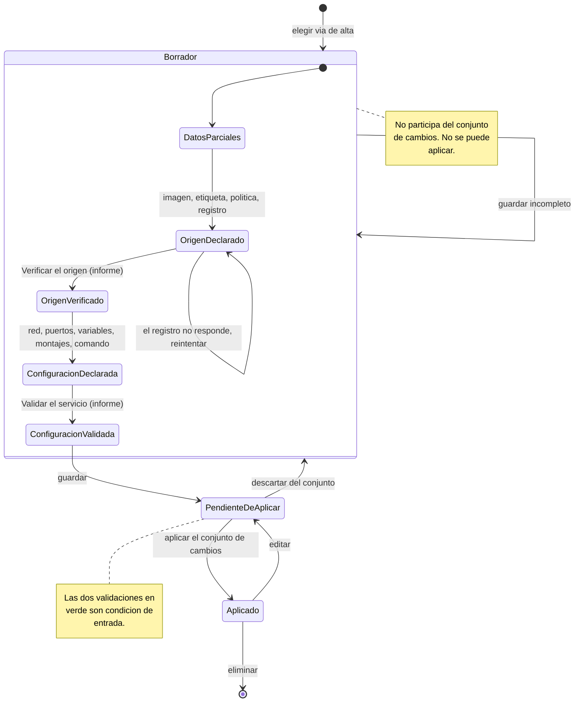
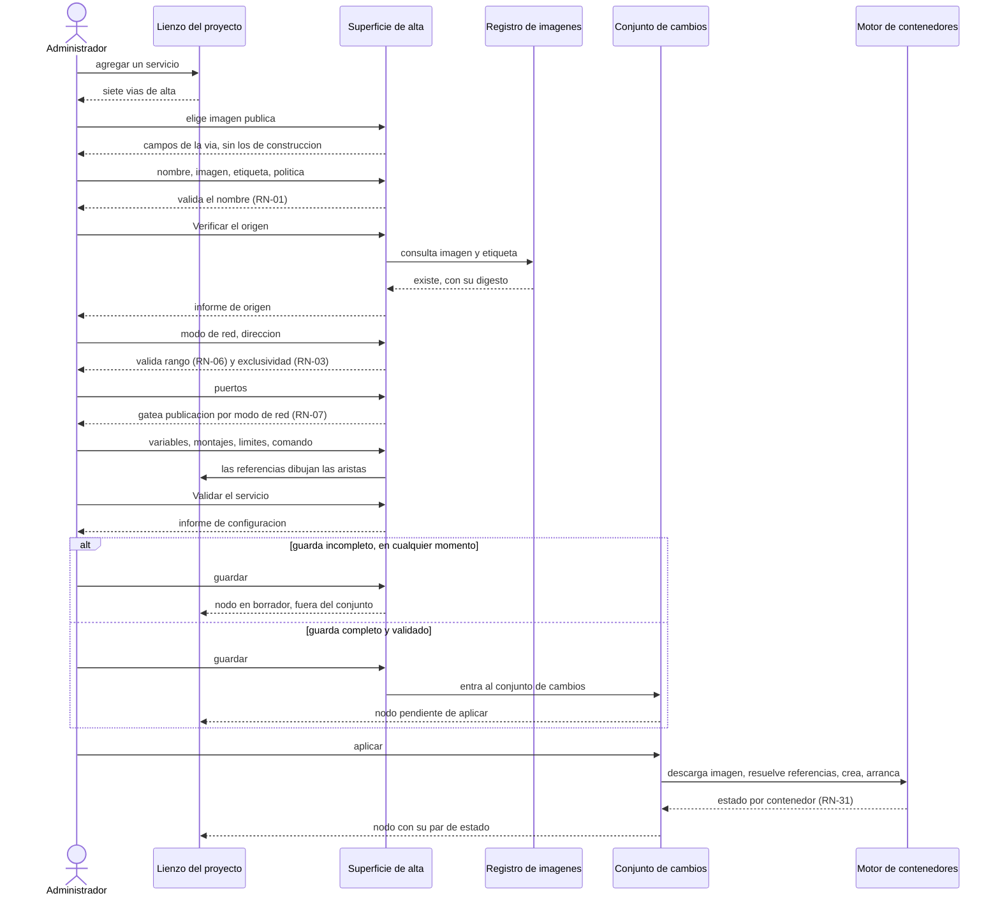

# Redefinición del origen del servicio

**Solución:** SelfHosted Service (identidad de código `SelfHosted.Service.Core`)
**Documento:** `Redefinicion-Servicio.md`
**Versión:** 1.15
**Estado:** Propuesto — análisis y propuesta para decisión del Product Owner. No modifica ningún artefacto
**Fecha:** 2026-07-29
**Autor:** Orquestador SDD
**Naturaleza:** Documento de trabajo del proceso, fuera de `SDD/Docs/`. No es artefacto de ninguna de las doce categorías y ningún subagente lo consume como insumo. Registra un hallazgo de producto detectado durante el paso 5 de la Fase B2 y el análisis de impacto que su corrección requeriría.

**Fuente de referencia:** análisis de Railway en `SelfHosted.Service.Core.Documentos/Analisis/Analisis-SaaS-Service/Analisis-Rayway.md`, secciones §2, §3.2, §4.2, §4.3, §6.1, §7 y el glosario de §10.

**Sobre nombrar a Railway en este documento.** La solución no menciona a Railway en ninguno de sus artefactos: ni el intake, ni los 117 documentos de `02-Especificacion-Funcional` y `03-UX-UI-DX`, ni los otros documentos de `SDD/Estado/`. Es deliberado y lo verifica el audit, porque D7 prohíbe el vocabulario del dominio fuente en los artefactos generados. **Este documento es la excepción y lo declara**: es de trabajo, vive fuera de `SDD/Docs/`, ningún subagente lo consume, y su objeto es precisamente la comparación contra Railway. Si algo de acá se traslada a un artefacto de `SDD/Docs/`, ahí sí corresponde reexpresarlo como «la plataforma de referencia».

## Tabla de contenido

- [1. Cómo se llegó a este hallazgo](#1-cómo-se-llegó-a-este-hallazgo)
- [2. Lo que Railway ofrece](#2-lo-que-railway-ofrece)
  - [2.1 Capa 1 · el menú de alta](#21-capa-1--el-menú-de-alta)
  - [2.2 Capa 2 · los orígenes admitidos](#22-capa-2--los-orígenes-admitidos)
  - [2.3 Definición por opción del menú](#23-definición-por-opción-del-menú)
- [3. Los cuatro problemas de nuestro modelo](#3-los-cuatro-problemas-de-nuestro-modelo)
- [4. Alcance real de la corrección](#4-alcance-real-de-la-corrección)
- [5. Las cuatro preguntas que hay que responder antes de tocar nada](#5-las-cuatro-preguntas-que-hay-que-responder-antes-de-tocar-nada)
- [6. Hallazgos colaterales de la misma sesión](#6-hallazgos-colaterales-de-la-misma-sesión)
- [7. Propuesta · adaptar el modelo de Railway a nuestra base](#7-propuesta--adaptar-el-modelo-de-railway-a-nuestra-base)
  - [7.1 El principio de adaptación](#71-el-principio-de-adaptación)
  - [7.2 Capa 1 · el menú de alta propuesto](#72-capa-1--el-menú-de-alta-propuesto)
  - [7.3 Capa 2 · el origen en el modelo](#73-capa-2--el-origen-en-el-modelo)
  - [7.4 Lo que Railway no tiene y nosotros sí](#74-lo-que-railway-no-tiene-y-nosotros-sí)
  - [7.5 Qué se descarta de Railway, con su motivo](#75-qué-se-descarta-de-railway-con-su-motivo)
  - [7.6 Cómo esta propuesta responde las cuatro preguntas](#76-cómo-esta-propuesta-responde-las-cuatro-preguntas)
  - [7.7 Qué habría que tocar si esto se aprueba](#77-qué-habría-que-tocar-si-esto-se-aprueba)
- [8. Validación antes de aplicar](#8-validación-antes-de-aplicar)
  - [8.1 Cómo lo trata Railway](#81-cómo-lo-trata-railway)
  - [8.2 Validación 1 · el origen](#82-validación-1--el-origen)
  - [8.3 Validación 2 · la configuración completa](#83-validación-2--la-configuración-completa)
  - [8.4 Guardar en cualquier momento, incluso incompleto](#84-guardar-en-cualquier-momento-incluso-incompleto)
- [9. Escenario de evaluación del flujo completo](#9-escenario-de-evaluación-del-flujo-completo)
- [10. El flujo objetivo, para el caso planteado](#10-el-flujo-objetivo-para-el-caso-planteado)
  - [10.1 La secuencia](#101-la-secuencia)
  - [10.2 Los dos puntos de guardado, que es lo que el usuario pidió](#102-los-dos-puntos-de-guardado-que-es-lo-que-el-usuario-pidió)
  - [10.3 Qué es opcional y qué no](#103-qué-es-opcional-y-qué-no)
  - [10.4 Lo que este flujo no resuelve](#104-lo-que-este-flujo-no-resuelve)
  - [10.5 Representación conceptual](#105-representación-conceptual)
- [11. El origen repositorio · de Railway a nuestra base](#11-el-origen-repositorio--de-railway-a-nuestra-base)
  - [11.1 Cómo lo hace Railway](#111-cómo-lo-hace-railway)
  - [11.2 La restricción de fondo · el disparo automático no nos alcanza](#112-la-restricción-de-fondo--el-disparo-automático-no-nos-alcanza)
  - [11.3 Lo que nuestro modelo tiene, y lo que le falta](#113-lo-que-nuestro-modelo-tiene-y-lo-que-le-falta)
  - [11.4 El flujo de usuario, para el origen repositorio](#114-el-flujo-de-usuario-para-el-origen-repositorio)
  - [11.5 Lo que este origen agrega y el de imagen no tiene](#115-lo-que-este-origen-agrega-y-el-de-imagen-no-tiene)
  - [11.6 Lo que hay que decidir para este origen](#116-lo-que-hay-que-decidir-para-este-origen)
  - [11.7 El flujo del origen repositorio, derivado del de Railway](#117-el-flujo-del-origen-repositorio-derivado-del-de-railway)
- [12. Cómo se engancha GitHub · el webhook, por qué no, y qué sí](#12-cómo-se-engancha-github--el-webhook-por-qué-no-y-qué-sí)
  - [12.1 Qué es un webhook y por qué acá no sirve](#121-qué-es-un-webhook-y-por-qué-acá-no-sirve)
  - [12.2 Lo que sí funciona · el ejecutor autoalojado](#122-lo-que-sí-funciona--el-ejecutor-autoalojado)
  - [12.3 Los dos patrones posibles, y hay que elegir](#123-los-dos-patrones-posibles-y-hay-que-elegir)
  - [12.4 Qué hay que configurar del lado de GitHub](#124-qué-hay-que-configurar-del-lado-de-github)
  - [12.5 Ejemplo realista completo · patrón A](#125-ejemplo-realista-completo--patrón-a)
  - [12.6 El flujo de usuario, para enganchar un repositorio](#126-el-flujo-de-usuario-para-enganchar-un-repositorio)
  - [12.7 Lo que este caso agrega a las decisiones pendientes](#127-lo-que-este-caso-agrega-a-las-decisiones-pendientes)
  - [12.8 Dónde viven las variables · la pregunta del pipeline](#128-dónde-viven-las-variables--la-pregunta-del-pipeline)
- [13. El origen «Dockerfile del servidor» · la vía sin equivalente](#13-el-origen-dockerfile-del-servidor--la-vía-sin-equivalente)
  - [13.1 Lo que Railway tiene, y por qué no es lo mismo](#131-lo-que-railway-tiene-y-por-qué-no-es-lo-mismo)
  - [13.2 Qué declara nuestro modelo](#132-qué-declara-nuestro-modelo)
  - [13.3 La restricción que gobierna esta vía](#133-la-restricción-que-gobierna-esta-vía)
  - [13.4 El problema de seguridad, que es propio de esta vía](#134-el-problema-de-seguridad-que-es-propio-de-esta-vía)
  - [13.5 Quién pone el Dockerfile ahí, y la pregunta que eso abre](#135-quién-pone-el-dockerfile-ahí-y-la-pregunta-que-eso-abre)
  - [13.6 El flujo, diez pasos](#136-el-flujo-diez-pasos)
  - [13.7 Lo que hay que decidir para esta vía](#137-lo-que-hay-que-decidir-para-esta-vía)
- [14. El ciclo de vida de las imágenes · el hueco más grande encontrado](#14-el-ciclo-de-vida-de-las-imágenes--el-hueco-más-grande-encontrado)
  - [14.1 El dato verificado](#141-el-dato-verificado)
  - [14.2 Lo que agrava el caso · el motor es uno y compartido](#142-lo-que-agrava-el-caso--el-motor-es-uno-y-compartido)
  - [14.3 Qué hace falta](#143-qué-hace-falta)
  - [14.4 Y en la API, para automatizar desde el workflow](#144-y-en-la-api-para-automatizar-desde-el-workflow)
  - [14.5 Lo que hay que decidir](#145-lo-que-hay-que-decidir)
  - [14.6 Por qué esto es más grande de lo que parecía](#146-por-qué-esto-es-más-grande-de-lo-que-parecía)
- [15. Dockerfile en línea, y la vuelta a una versión anterior](#15-dockerfile-en-línea-y-la-vuelta-a-una-versión-anterior)
  - [15.1 Dockerfile como contenido, no como ruta](#151-dockerfile-como-contenido-no-como-ruta)
  - [15.2 Volver a una versión anterior · Railway lo tiene y nosotros no](#152-volver-a-una-versión-anterior--railway-lo-tiene-y-nosotros-no)
  - [15.3 Las dos propuestas se cierran con el mismo dato](#153-las-dos-propuestas-se-cierran-con-el-mismo-dato)
  - [15.4 Lo que hay que decidir](#154-lo-que-hay-que-decidir)
- [16. Unificación · el tronco común y el delta de cada vía](#16-unificación--el-tronco-común-y-el-delta-de-cada-vía)
  - [16.1 El tronco común · diez pasos que todas las vías comparten](#161-el-tronco-común--diez-pasos-que-todas-las-vías-comparten)
  - [16.2 El delta de cada vía](#162-el-delta-de-cada-vía)
  - [16.3 Criterios unificados · lo que vale para todas las vías](#163-criterios-unificados--lo-que-vale-para-todas-las-vías)
  - [16.4 El modelo consistente que se sigue](#164-el-modelo-consistente-que-se-sigue)
  - [16.5 Qué queda sin cubrir, declarado](#165-qué-queda-sin-cubrir-declarado)
- [17. Modelos de datos y casos concretos](#17-modelos-de-datos-y-casos-concretos)
  - [17.1 Los cinco campos nuevos respecto de E-2](#171-los-cinco-campos-nuevos-respecto-de-e-2)
  - [17.2 El servicio, con su variante de origen](#172-el-servicio-con-su-variante-de-origen)
  - [17.3 Las cinco variantes de `origen`](#173-las-cinco-variantes-de-origen)
  - [17.4 Casos concretos · uno por vía](#174-casos-concretos--uno-por-vía)
  - [17.5 La imagen como objeto con identidad](#175-la-imagen-como-objeto-con-identidad)
  - [17.6 El despliegue, con la imagen que usó](#176-el-despliegue-con-la-imagen-que-usó)
  - [17.7 Los dos informes de verificación](#177-los-dos-informes-de-verificación)
  - [17.8 Cómo usar esto para maqueta y pruebas](#178-cómo-usar-esto-para-maqueta-y-pruebas)
- [18. El catálogo · las dos operaciones y su plan](#18-el-catálogo--las-dos-operaciones-y-su-plan)
  - [18.1 Las dos operaciones, que ya existen](#181-las-dos-operaciones-que-ya-existen)
  - [18.2 Lo que un ítem ya declara](#182-lo-que-un-ítem-ya-declara)
  - [18.3 Los tres huecos reales](#183-los-tres-huecos-reales)
  - [18.4 Flujo A · instanciar desde el catálogo](#184-flujo-a--instanciar-desde-el-catálogo)
  - [18.5 Flujo B · dar de alta una plantilla](#185-flujo-b--dar-de-alta-una-plantilla)
  - [18.6 Situaciones concretas, de punta a punta](#186-situaciones-concretas-de-punta-a-punta)
  - [18.7 Lo que hay que decidir](#187-lo-que-hay-que-decidir)
- [Control de cambios](#control-de-cambios)

---

## 1. Cómo se llegó a este hallazgo

Durante el paso 5 de la Fase B2 —ciclo de corrección de la maqueta— el agente humano del proyecto recorrió el alta de servicio con origen «imagen de registro» y preguntó de dónde saca un usuario el valor `registro-privado/portal-api`. La respuesta expuso que el problema no era de representación visual sino de definición de producto: **el origen del servicio quedó especificado como un campo técnico de tres valores, sin que nadie decidiera qué ofrece el producto al dar de alta un servicio.**

La cadena de preguntas que llevó ahí, en orden, porque el método importa tanto como el resultado:

1. ¿Está contemplado el alta de servicio en la maqueta? — No: había disparador y no había destino.
2. Con el lienzo en tres servicios, ¿qué se abre al hacer clic? — Un panel contextual sin contexto, que contradecía su propia regla.
3. Elegido el origen «imagen de registro», ¿qué datos pide y en qué consiste el despliegue? — Seis campos declarados y una secuencia de nueve pasos sin etapa de construcción.
4. ¿De dónde saca el usuario la dirección de la imagen? — De ningún lado del sistema.
5. Entonces el origen del servicio está mal definido como producto. — Confirmado contra el análisis de Railway.

Ninguno de estos cinco puntos lo levantó el audit independiente de la Fase B, ni el auto-chequeo de los subagentes que produjeron 02 y 03.

---

## 2. Lo que Railway ofrece

Railway ofrece **dos capas distintas**, y nuestro intake las fusionó en una.

### 2.1 Capa 1 · el menú de alta

Es lo que el usuario ve al agregar un nodo al lienzo. La captura de la interfaz real de Railway, citada en §4.2 del análisis, confirma **siete opciones**:

```text
GitHub Repository · Database · Template · Docker Image · Function · Bucket · Empty Service
```

El análisis lo interpreta así, y la lectura es la correcta:

> Lista de orígenes: GitHub Repository, Database, Template, Docker Image, Function, Bucket, Empty Service → **Taxonomía de nodos**: el usuario elige *qué clase de bloque* agrega.

Y anota una propiedad de interacción que importa para el diseño: varias opciones llevan chevron `>`, es decir **flujo progresivo** — primero se elige la clase de bloque, después la instancia concreta.

### 2.2 Capa 2 · los orígenes admitidos

Son **cuatro**, no siete, y viven un nivel más abajo. De §3.2 del análisis, con su detalle textual:

| Origen | Detalle declarado |
|---|---|
| Repositorio GitHub | `Connect Repo`; build y deploy automáticos ante nuevos commits sobre la rama vinculada |
| Imagen Docker **pública** | Docker Hub, GitHub Container Registry, Quay.io, GitLab Container Registry, Microsoft Container Registry |
| Imagen Docker **privada** | requiere plan Pro; **credenciales al crear el servicio** |
| Directorio local / Empty Service | `Empty Service` + `railway up` desde la CLI |

La distinción de capas se apoya en la definición misma de servicio que da Railway, citada en §2 del análisis:

> *«A Railway service is a deployment target. Under the hood, services are containers deployed from an image.»*

Todo servicio termina siendo una imagen. El origen sólo declara **cómo se llega** a esa imagen: dos de los cuatro la construyen, uno la toma hecha y el cuarto la posterga.

### 2.3 Definición por opción del menú

| Opción | Qué es, según el análisis | ¿Es origen de imagen? |
|---|---|---|
| **GitHub Repository** | Vincular un repositorio; construye y despliega ante cada commit de la rama vinculada | Sí, construyendo |
| **Docker Image** | Tomar una imagen ya publicada. Se parte en pública y privada; la privada pide credenciales **en el alta** | Sí, sin construir |
| **Database** | Bloque preconfigurado. En el ejemplo de §6.1 se agrega «Postgres» y expone `${{ Postgres.DATABASE_URL }}` sin que el usuario declare imagen ni variables | **No.** Es un atajo curado |
| **Template** | *«Templates provide a way to jumpstart a project by packaging a service or set of services into a reusable, distributable format»* — uno o **varios** servicios de una vez | **No.** Es una vía de alta |
| **Empty Service** | *«Servicio creado sin fuente, para desplegar luego con `railway up` desde la CLI»* | **No.** Es ausencia de origen |
| **Function** | Sólo nombrada en la captura. El análisis no la define | Sin datos |
| **Bucket** | Sólo nombrada en la captura. El análisis no la define | Sin datos |

---

## 3. Los cuatro problemas de nuestro modelo

### P-1 · Colapsamos los dos ejes en un solo campo

Railway separa «qué clase de bloque agrego» de «de dónde sale la imagen». Nuestro modelo tiene un único `origen.tipo` con tres valores —`imagen`, `repositorio`, `dockerfile`— y el catálogo quedó afuera, como cuarta vía, en otra superficie.

El anexo E-6 del intake **hace bien la distinción**:

> El catálogo como **cuarta vía de alta** y **no como cuarto origen de imagen**.

Pero esa distinción **no llegó a la pantalla**. El alta presenta tres orígenes técnicos en igualdad de condiciones y el catálogo vive en `SUP-11`, alcanzable desde el menú lateral, sin que ninguna superficie los presente como alternativas entre las que elegir. Una distinción declarada en un anexo y ausente de la interfaz no gobierna nada.

### P-2 · Perdimos el nivel curado, que es el que resuelve el primer uso

`Database` es la respuesta de Railway a «no sé la dirección de la imagen»: el usuario elige «Postgres» y la plataforma sabe cuál es la imagen, qué variables expone y cómo se conecta.

Nosotros tenemos el catálogo, que cumple esa función, **pero lo llena el propio usuario** (`CU-17`). Arranca vacío. Railway trae el nivel curado de fábrica; nuestro equivalente está vacío en el primer arranque, que es exactamente el momento en que un usuario lo necesitaría.

Consecuencia verificada: **no existe ninguna capacidad de buscar, listar ni explorar imágenes de un registro.** Cero ocurrencias en el intake. Si el usuario no conoce la dirección de la imagen y el catálogo está vacío, **no tiene camino**.

### P-3 · Fusionamos imagen pública con imagen privada

Railway las trata como orígenes distintos porque **piden datos distintos**: la privada agrega credenciales, y las pide **en el alta**.

Nosotros tenemos un solo tipo `imagen` con un booleano `requiereCredenciales` y un `credencialId` que apunta a un almacén de credenciales **que no existe**: ninguna superficie las da de alta, las lista ni las revoca. `SUP-12` declara credenciales de máquina, que son tokens de API con ámbitos — otra entidad.

El agujero no es un olvido de la especificación de UX: **nació al apartarse del modelo de Railway sin bajar la consecuencia al plano de la interfaz.** Elegir un identificador en lugar de credenciales en línea crea una entidad que hay que administrar, y nadie modeló dónde.

### P-4 · No modelamos el servicio sin origen

`Empty Service` es un servicio que existe sin fuente. En nuestro modelo `origen` es obligatorio con tres valores, de modo que ese estado **no es representable**. Es el que haría falta para el flujo «creo el nodo ahora y le pongo contenido después», que es una forma natural de trabajar sobre un lienzo.

---

## 4. Alcance real de la corrección

Esto **no** es un hallazgo de maqueta que se corrija en el paso 6 de la Fase B2. Es una decisión de producto que falta, y su lugar es el intake.

| Artefacto | Qué habría que tocar |
|---|---|
| `SOLUTION-INTAKE` §4 | Las capacidades del alta de servicio |
| `SOLUTION-INTAKE` anexo E-2 | El modelo de `origen`, que es donde viven los tres valores |
| `SOLUTION-INTAKE` anexo E-6 | El catálogo, si cambia su papel |
| `02-Especificacion-Funcional` | `CU-03` alta y configuración, `CU-13` despliegue desde imagen, `CU-15` despliegue construyendo, `CU-16` alta desde plantilla, más las reglas de negocio del origen |
| `03-UX-UI-DX` | `SUP-17` alta de servicio, `SUP-06` panel lateral, `SUP-11` catálogo de plantillas |
| `SDD/Maquetas/` | La superficie de alta y su cableado |

Modificar el intake es el flujo controlado de `Master-Prompt.md` §13, con archivado previo y una entrada de control de cambios por sección. Y como toca §4 y un anexo de la Parte D, **obliga a rehacer parte de la Fase B ya auditada**: no es un parche hacia adelante.

---

## 5. Las cuatro preguntas que hay que responder antes de tocar nada

De la respuesta a estas cuatro depende cuánto se rehace. No se toca ningún artefacto hasta que estén resueltas.

| # | Pregunta | Qué cambia según la respuesta |
|---|---|---|
| Q-1 | ¿El alta presenta una **taxonomía de bloques** como Railway —repositorio, imagen, base de datos, plantilla, vacío— o **tres orígenes técnicos** como ahora, con el catálogo aparte? | Si es taxonomía, cambia el modelo de `origen` en E-2 y se rehace `SUP-17` completa |
| Q-2 | ¿Se separa **imagen pública de imagen privada**? | Si se separan, las credenciales se declaran en el alta y **desaparece el almacén fantasma** de `credencialId` |
| Q-3 | ¿Existe el **servicio sin origen**? | Si existe, `origen` deja de ser obligatorio y aparece un estado nuevo del servicio en el modelo conceptual |
| Q-4 | ¿El catálogo viene con **algo precargado**? | Si viene precargado, resuelve el primer uso y `CU-17` deja de ser la única vía de poblarlo |

---

## 6. Hallazgos colaterales de la misma sesión

Cuatro más, detectados al verificar lo anterior, todos sin corregir y ninguno bloqueante para responder las preguntas de §5.

### H-A · El término «registro» a secas no era resoluble por sección — **corregido**

**Enunciado original de este hallazgo, que era falso.** Decía que los cuatro sentidos de «registro» en los títulos de la categoría eran un defecto: «imagen de registro» en `CU-13`, «registro del contenedor» en `CU-14`, «higiene del registro» en `CU-36` y «registro de auditoría» en `RN-17`. **No lo eran.** Las formas calificadas se distinguen solas, sus contextos son disjuntos y ningún lector se confunde. El propio intake §12 fija el criterio al tratar el término «proyecto»: no se califica cuando los contextos son disjuntos, porque «cargaría el texto sin resolver un problema que no existe». El hallazgo aplicaba la forma de ese criterio sin aplicar el criterio.

**Lo que sí era defecto, verificado.** La forma **«el registro» a secas**, sin calificador, aparecía **14 veces** con tres referentes distintos según el documento: el estado persistido en `CU-01`, `CU-02`, `CU-11`, `CU-20`, `CU-26` y `CU-36`; la bitácora de auditoría en `RN-17` y `CU-31`; la salida del contenedor en `CU-14`. Y el glosario de la categoría —que **sí existe**, con 25 términos, en `Modelo-Conceptual.md` §6— no tenía entrada para el término.

**El mecanismo, que es lo que lo vuelve un defecto real y no una molestia de estilo.** `Master-Prompt.md` §8 construye cada despacho de subagente con una lista de paths, y el subagente lee **por secciones, no de corrido**. Un lector humano abre el documento entero y el contexto le resuelve la referencia; un subagente que recibió tres secciones de setenta, no. El caso concreto: en la Fase C, AG-05 lee las secciones «en caso de fallo» de `CU-01` y `CU-20` para derivar una decisión sobre transaccionalidad, encuentra «el registro queda en el estado previo», y tiene que elegir entre tres referentes que producen tres decisiones de arquitectura distintas.

**Corregido el 2026-07-29**, con los dos niveles más baratos de intervención y sin declarar ninguna invariante:

| Nivel aplicado | Qué se hizo |
|---|---|
| Entrada de glosario | `Modelo-Conceptual.md` §6 declara **Registro** con sus **cuatro referentes** y la forma calificada de cada uno, más la regla de uso: la forma a secas se admite **sólo** para el registro del sistema, y sólo cuando la sección ya lo fijó. §6 declara además el criterio de inclusión del glosario, que el archivo de reglas no fija |
| Forma calificada en las que colisionaban | Las 14 ocurrencias desnudas quedaron calificadas en nueve archivos: `CU-01`, `CU-02`, `CU-11`, `CU-14`, `CU-20`, `CU-26`, `CU-31`, `CU-36` y `RN-17`. **Las formas ya calificadas no se tocaron**, que es lo que el criterio del intake §12 manda |

**Lo que no se hizo, y es deliberado:** no se declaró una invariante de solución con prohibición de fusión, como la C-1 de «proyecto». Era desproporcionado para este caso: alcanzaba con el glosario y la calificación puntual.

**Y el defecto de fondo es del framework, no de esta solución.** El criterio de cuándo desambiguar no existe como regla de `IA.SDD` —vive dentro del intake de esta solución—, y el glosario de la categoría 02 es sección de un documento condicional que ningún criterio de aceptación verifica. Los dos están documentados con su solución propuesta en [`Fix-Ejecución-Glosario-Framework.md`](Fix-Ejecución-Glosario-Framework.md), para aplicar sobre el framework de forma independiente.

### H-B · Falta el campo de comando de arranque

`CU-03` paso 6 enumera lo que el administrador declara: variables, puertos, montajes, dispositivos, capacidades, límites de procesador y memoria, política de reinicio, verificación de salud y marca de efímero. **No está el comando de arranque.**

Tres pruebas de que debería estar:

1. El modelo de E-2 lo tiene: `"comando": null`, como campo de primer nivel del servicio, distinto del `comando` del healthcheck.
2. Railway lo exige: §7 del análisis traduce `Service` a *«registro en la BD con imagen, **comando**, variables, política»*.
3. El parque real lo usa: E-20 declara el contenedor `ia-video` corriendo con `command: ${VIDEO_ARGS}`.

Y `grep -rn 'comando'` sobre los 94 archivos de `02-Especificacion-Funcional` devuelve **cero**. La dimensión existe en el modelo del intake, la usa un contenedor real del parque, y **se cayó entre el intake y la especificación funcional**.

Consecuencia concreta: el alta tal como está especificada hoy **no puede dar de alta `ia-video`**, uno de los ocho contenedores del parque que `NB-02` exige poder adoptar.

### H-C · Las cuatro vías de alta no se presentan como alternativas

Nuestro sistema tiene las cuatro, pero **en ninguna parte le explica al usuario cuál le conviene**. Es una decisión de diseño que nadie tomó explícitamente: quedó así porque las cuatro vías se especificaron por separado y ninguna superficie las presenta juntas.

Para el perfil declarado en §2 del intake —un administrador que ya opera un parque de contenedores— es defendible. Deja de serlo combinado con P-2: si el usuario no sabe la dirección de la imagen y el catálogo está vacío, no hay camino ni indicación de que exista otro.

### H-E · No hay regla de colisión de puerto en el host

Nueve reglas de negocio gobiernan puertos y direcciones —`RN-03`, `RN-04`, `RN-06`, `RN-07`, `RN-18`, `RN-20`, `RN-26`, `RN-32` y `RN-34`— y **ninguna cubre que el puerto del host que se va a publicar ya esté ocupado**, ni por otro servicio del modelo ni por un proceso ajeno al producto.

Es el error más probable en el contexto declarado: un servidor con parque preexistente, donde el producto no es el único que publica puertos. Y hoy se descubre al desplegar, con el fallo determinado por contenedor según `RN-31`, de modo que un conjunto de cambios aplicado deja unos servicios andando y otros fallidos.

Detectado al construir el escenario de §9, paso 6.

#### Solución propuesta · prevalidación en tres niveles

Decisión de principio del agente humano del proyecto, 2026-07-29: **el rol del producto es administrar y mantener el orden de qué se asigna, qué no, cómo y cuándo.** Si es quien administra, es quien debe impedir la asignación de un puerto ya tomado, en lugar de dejar que el motor falle.

El principio es correcto y hay que aplicarlo con un límite declarado: **el modelo sólo conoce lo que adoptó.** De ahí salen tres niveles con costo y alcance distintos.

| Nivel | Contra qué se valida | Qué cubre | Costo |
|---|---|---|---|
| **1 · El modelo** | Los puertos declarados por los servicios del propio modelo, excluyendo el que se está configurando | Todo lo que el producto administra | **Ninguno.** El dato ya está persistido: es una consulta sobre `puertos` |
| **2 · El motor** | Los puertos publicados por contenedores del host que el modelo todavía no adoptó | El parque preexistente, que es el escenario declarado | **Bajo, pero no cero.** Requiere un campo que hoy no existe |
| **3 · El sistema operativo** | Puertos ocupados por procesos que no son contenedores | Todo lo demás | Alto, y discutible |

**Nivel 1 es obligatorio y gratis.** Es exactamente lo que el agente humano propone: buscar el puerto entre los servicios existentes, excluyendo el que se configura, y si aparece, no dejar asignarlo. El dato ya está en el modelo y no hace falta consultar nada externo. Es coherente con `RN-03`, que ya hace lo mismo con las direcciones IP: exclusividad entre servicios activos.

**Nivel 2 es el que el escenario declarado exige, y tiene un hueco verificado.** El anexo E-7 declara los campos del candidato de descubrimiento —`imagen`, `estado`, `redes`, `montajes`, `variablesDetectadas`, `etiquetasCompose`, entre otros— y **ninguno es puerto**. Trae la dirección IP de cada red, no los puertos publicados en el host. De modo que hoy el producto **no puede** validar contra el parque no adoptado, aunque tenga acceso al motor y la capacidad de descubrimiento ya especificada. Agregar el campo a E-7 es la intervención más barata, y sirve además para la propia adopción: un contenedor que se adopta con puertos publicados debería traerlos.

**Nivel 3 se propone descartar, con su motivo.** Un puerto ocupado por un proceso ajeno al producto y ajeno al motor de contenedores está fuera de lo que el producto administra. Validar contra el sistema operativo obligaría a leer el estado de red del host, que hoy sólo se lee para métricas, y a sostener una afirmación —«este puerto está libre»— que deja de ser cierta en cuanto otro proceso lo tome. **La alternativa correcta para ese caso es que el informe de validación declare su alcance**: «verificado contra el modelo y contra el motor; no contra procesos del host».

#### La regla que falta, y por qué es una y no dos

La forma propuesta, en la línea de `RN-03`:

> **Exclusividad del puerto de host entre servicios que lo publican.** Un servicio no puede publicar un puerto de host que otro servicio del modelo ya publica, ni que un contenedor no adoptado del host esté publicando. La verificación excluye al propio servicio en curso, para que editar no colisione consigo mismo.

Dos precisiones que la regla debe declarar y que salen del modelo ya existente:

- **Sólo aplica a servicios que publican.** Un servicio en macvlan no publica puertos —lo prohíbe `RN-07`— de modo que no participa de esta exclusividad. Dos servicios macvlan pueden declarar el mismo puerto de contenedor sin conflicto, porque cada uno tiene dirección propia.
- **Aplica a servicios activos y a pendientes de aplicar.** Si dos cambios del mismo conjunto declaran el mismo puerto, el conflicto existe **antes** de aplicar y el informe del conjunto debe declararlo. Es el caso que hoy dejaría dos servicios fallidos por `RN-31`.

### H-D · Dos ambigüedades emitidas y no resueltas

Las dos las emitió AG-03M al construir la superficie de alta, y **correctamente no las resolvió por su cuenta**:

- **`credencialId`**: con qué nombre elige el administrador una credencial de registro, y desde qué superficie se dan de alta, se listan y se revocan. Queda absorbida por Q-2.
- **`proveedor`**: si el conjunto admitido de proveedores de repositorio es sólo `github` o hay otros. E-2 exhibe un único valor y ninguna fuente declara si es el conjunto completo. Es la diferencia entre un selector de un ítem y un campo que va a crecer.

---

## 7. Propuesta · adaptar el modelo de Railway a nuestra base

**Estado de esta sección: propuesta.** No está decidida ni aplicada. Responde a `Q-1` a `Q-4` de §5 con una opción concreta, para que la discusión sea sobre algo verificable en lugar de sobre alternativas abstractas.

### 7.1 El principio de adaptación

Railway resuelve el alta con **dos capas** y nosotros necesitamos las mismas dos, pero **el contenido de la primera no puede ser una copia**, por una razón de fondo: Railway es dueño de todo lo que corre en su plataforma, y nosotros llegamos a un servidor **que ya tiene un parque de contenedores andando**.

Eso invierte la prioridad del menú. En Railway la vía natural es «traé tu código o tu imagen». Acá la vía natural, y la que `NB-02` declara como necesidad de negocio, es **«tomá lo que ya está corriendo sin reinstanciarlo»**.

Tres criterios para adaptar, en este orden:

1. **Se conserva la separación de capas**, que es el acierto estructural de Railway: qué clase de bloque agrego, y de dónde sale la imagen, son dos preguntas distintas.
2. **Se agrega lo que nuestro dominio tiene y Railway no.** Verificado: el análisis de Railway no menciona adopción de contenedores existentes en ninguna de sus secciones.
3. **Se descarta lo que nuestras exclusiones ya prohíben**, sin inventar equivalentes.

### 7.2 Capa 1 · el menú de alta propuesto

Siete vías, en el orden en que conviene presentarlas. El orden **no** es cosmético: la primera es la que el producto declara como su necesidad principal.

| # | Vía de alta | Qué problema del usuario resuelve | Qué origen produce |
|---|---|---|---|
| 1 | **Adoptar un contenedor existente** | «Ya lo tengo corriendo y no quiero recrearlo» | El observado, traducido por `CU-08` |
| 2 | **Desde el catálogo** | «No sé la dirección de la imagen» o «quiero un conjunto de servicios de una vez» | El que declare la plantilla |
| 3 | **Imagen de registro pública** | «Sé la dirección y el registro es abierto» | `imagen-publica` |
| 4 | **Imagen de registro privada** | «Sé la dirección y el registro pide credenciales» | `imagen-privada` |
| 5 | **Repositorio remoto** | «El código está afuera y quiero que se construya» | `repositorio` |
| 6 | **Dockerfile del servidor** | «El Dockerfile está en este servidor» | `dockerfile` |
| 7 | **Servicio vacío** | «Quiero el nodo ahora y el contenido después» | `ninguno` |

Las vías 1 y 2 **no son orígenes**: son formas de llegar a uno. Es exactamente la distinción que E-6 ya hace para el catálogo y que esta propuesta extiende a la adopción.

Las vías 3 a 6 admiten el **flujo progresivo** que Railway usa: se elige la vía y después se completan los datos de esa vía, sin mostrar campos de las otras.

### 7.3 Capa 2 · el origen en el modelo

`origen.tipo` pasa de tres valores a **cinco**:

| Valor | Datos que exige | Construye imagen |
|---|---|---|
| `imagen-publica` | imagen, etiqueta, política de actualización, registro | No |
| `imagen-privada` | los anteriores más credenciales | No |
| `repositorio` | proveedor, url, rama, ruta del Dockerfile, contexto, argumentos de build | Sí |
| `dockerfile` | ruta del Dockerfile en el servidor, contexto, argumentos de build | Sí |
| `ninguno` | ninguno | No, y no se puede desplegar |

Y **el catálogo y la adopción no aparecen acá**, porque resuelven a uno de los cinco. Un servicio adoptado queda con el origen que `CU-08` deduzca de lo observado; un servicio instanciado desde plantilla, con el que la plantilla declare.

### 7.4 Lo que Railway no tiene y nosotros sí

La adopción es **nuestro diferenciador y no tiene equivalente en la referencia**. Railway no la necesita porque en Railway no hay nada previo que adoptar.

Consecuencias de ponerla primera en el menú:

- El primer uso del producto deja de estar vacío. Un administrador que instala esto sobre un servidor con ocho contenedores andando ve ocho candidatos, no una pantalla en blanco. **Es la respuesta más barata al problema `P-2`**, y no requiere curar ningún catálogo.
- `CU-06`, `CU-07` y `CU-08` ya están especificados y auditados: la vía existe, lo que falta es **presentarla como vía de alta** en lugar de como una superficie separada a la que se llega por el menú lateral.
- El descubrimiento es de sólo lectura y la incorporación pide confirmación explícita, así que ponerla primera no agrega riesgo.

### 7.5 Qué se descarta de Railway, con su motivo

| Opción de Railway | Decisión propuesta | Motivo |
|---|---|---|
| **Database** | **No se replica como vía.** Se resuelve **sembrando el catálogo** | Es un catálogo curado con otro nombre. Ya tenemos catálogo (`CU-16`, `CU-17`); lo que falta es que no arranque vacío. Sembrarlo reusa dos casos de uso ya especificados en lugar de agregar una vía nueva |
| **Function** | Se descarta | Modelo serverless. El análisis de Railway sólo la nombra en la captura y no la define, así que no hay nada que adaptar. Y §9 excluye el modelo PaaS |
| **Bucket** | Se descarta | Almacenamiento de objetos. Mismo caso: nombrada y no definida, y fuera del alcance declarado |
| **Environment** | Ya descartado | El intake lo declara explícitamente al tratar la invariante I5 de la fuente: un único servidor y un único administrador |

Vale registrar que dos de los siete ítems del menú de Railway **no están definidos en el análisis**: se los vio en una captura y nadie relevó qué hacen. Descartarlos por alcance es correcto; darlos por entendidos no lo sería.

### 7.6 Cómo esta propuesta responde las cuatro preguntas

| Pregunta | Respuesta propuesta |
|---|---|
| `Q-1` taxonomía o tres orígenes | **Taxonomía de siete vías** en la interfaz, sobre cinco valores de origen en el modelo. El catálogo entra al menú del alta en lugar de vivir sólo en `SUP-11` |
| `Q-2` separar pública de privada | **Sí.** Y las credenciales se piden **en el alta**, como en Railway, con un «recordar esta credencial para este registro» que las persiste para reuso. Su administración —listar y revocar— vive en `SUP-12`, como sección **separada** de los tokens de máquina, que son otra entidad |
| `Q-3` servicio sin origen | **Sí, con una diferencia declarada respecto de Railway.** En Railway el servicio vacío existe para empujarle contenido desde una CLI que nosotros no tenemos. Acá sería un **nodo borrador**: sirve para bosquejar la arquitectura en el lienzo antes de resolver cada pieza, y no se puede desplegar hasta que tenga origen |
| `Q-4` catálogo precargado | **Sí, sembrado desde el parque de referencia.** El anexo E-19 declara ocho contenedores reales con sus patrones; son la base natural de la siembra, y ya son el juego de datos de la maqueta |

### 7.7 Qué habría que tocar si esto se aprueba

Ordenado por dependencia, porque el orden importa: tocar el intake primero y regenerar después es más barato que corregir en las dos puntas.

| Orden | Artefacto | Cambio |
|---|---|---|
| 1 | `SOLUTION-INTAKE` §4 | Las capacidades del alta: siete vías en lugar de tres orígenes |
| 2 | `SOLUTION-INTAKE` E-2 | `origen.tipo` de tres a cinco valores; credenciales en línea; `comando` visible como dimensión (ver `H-B`) |
| 3 | `SOLUTION-INTAKE` E-6 | El catálogo declara que se siembra, y con qué |
| 4 | `02-Especificacion-Funcional` | `CU-03` alta, `CU-13` y `CU-15` despliegue, `CU-16` plantilla, `CU-07` incorporación como vía de alta, más las reglas del origen y el modelo conceptual |
| 5 | `03-UX-UI-DX` | `SUP-17` alta con las siete vías, `SUP-11` catálogo, `SUP-12` credenciales de registro, `SUP-10` descubrimiento como vía |
| 6 | `SDD/Maquetas/` | La superficie de alta y su cableado |

**Lo que esta propuesta no cambia**, y conviene decirlo porque acota el costo: el modelo de changeset (`RN-13`), la resolución de referencias antes de crear el contenedor (`RN-24`), la máquina de estados del despliegue, el lienzo y sus aristas, y la determinación del resultado por contenedor (`RN-31`). Todo eso sigue igual: la propuesta cambia **cómo entra un servicio al modelo**, no qué le pasa después.

---

## 8. Validación antes de aplicar

Incorporado a la propuesta el 2026-07-29, a partir de una observación del agente humano del proyecto durante el recorrido de la maqueta: al declarar una imagen debería haber un botón que verifique que existe, y al terminar de configurar el servicio, otro que valide el conjunto, ambos con informe.

### 8.1 Cómo lo trata Railway

**No lo trata: Railway valida fallando.** El análisis no releva ningún mecanismo de verificación previa. Lo que documenta es:

| Mecanismo | Qué hace | Qué no hace |
|---|---|---|
| Changeset con banner y color violeta | Acumula los cambios y los muestra pendientes | No los valida |
| Botón **Details** | Diff de valores viejos contra nuevos | Es un diff, no una verificación: compara lo declarado contra lo anterior, no contra la realidad |
| Descarte granular con «x» | Quita un cambio individual del conjunto | — |
| Mensaje de commit | Anota el conjunto antes de aplicarlo | — |
| **Deploy** | Aplica todos los cambios y redespliega los afectados | Es el momento en que se descubre si algo estaba mal |
| **`Alt` + Deploy** | *«allows you to commit the changes without triggering a redeploy»* | Es el equivalente de «guardar sin desplegar», y **sí existe** |

La detección de errores vive en el ciclo de vida del despliegue, que el análisis transcribe de la documentación: `Initializing → Building → Deploying → Active`, con `Building → Failed` ante error de construcción y `Deploying → Failed` ante error de despliegue. El usuario se entera **cuando el deploy falla**, y lo diagnostica leyendo los logs de build y deploy.

**Por qué Railway puede permitirse eso y nosotros no.** Tres diferencias de contexto, y ninguna es menor:

1. **No hay parque previo que dañar.** En Railway todo lo que corre lo creó Railway. Acá el despliegue ocurre sobre el servidor del usuario, **junto a contenedores que ya están en producción** y que el producto se propone adoptar, no reemplazar.
2. **El fallo parcial nos deja un estado mixto.** `RN-31` —decisión D-1 del agente humano— determina el resultado **por contenedor y no por operación**. Aplicar un conjunto de tres servicios con un nombre de imagen mal tipeado deja dos andando y uno fallido. En Railway un deploy fallido es un deploy fallido.
3. **El changeset promete revisión y hoy no puede revisar.** El sentido declarado del conjunto de cambios pendientes es *revisar antes de aplicar*. Hoy la revisión muestra **qué** va a cambiar, y no puede decir **si va a funcionar**, que es lo único verificable sin desplegar.

La conclusión es que la propuesta de dos validaciones **no copia a Railway: lo mejora para nuestro contexto**, y el fundamento de por qué hace falta está en las tres diferencias de arriba.

### 8.2 Validación 1 · el origen

Se dispara al terminar de declarar el origen, antes de pasar a las dimensiones. Qué comprueba, por variante:

| Variante de origen | Qué se puede verificar sin desplegar |
|---|---|
| `imagen-publica` | Que la imagen y la etiqueta existan en el registro elegido, y que sea alcanzable |
| `imagen-privada` | Lo mismo, más que las credenciales autentiquen |
| `repositorio` | Que el repositorio y la rama existan, que sean alcanzables, y que la ruta del Dockerfile exista en esa rama |
| `dockerfile` | Que la ruta exista en el servidor y sea legible por el proceso |
| `ninguno` | No aplica |

**El informe declara qué se verificó y qué no.** No alcanza con un tilde: un «existe» sin decir qué se consultó es una afirmación sin evidencia. Mínimo: qué registro se consultó, con qué identidad, qué se encontró, y —cuando corresponda— el digesto de la imagen resuelta, que es el dato que distingue una etiqueta fijada de una flotante.

### 8.3 Validación 2 · la configuración completa

Se dispara al terminar el paso 6, antes de guardar o desplegar. Comprueba el conjunto contra las reglas que ya están declaradas y que hoy sólo se evalúan al aplicar:

| Qué se valida | Regla declarada |
|---|---|
| Nombre único en el proyecto, que es el alias de resolución de nombres | `RN-01` |
| Pertenencia al proyecto | `RN-02` |
| Dirección dentro del rango gestionado | `RN-06` |
| Dirección no ocupada por un servicio activo de otro proyecto | `RN-03` |
| Compatibilidad de puertos con el modo de red | `RN-07` |
| Canal alcanzable en las aristas que referencian el host | `RN-04` |
| Aporte obligatorio de cada arista | `RN-34` |
| Ausencia del prefijo reservado en variables declaradas | `RN-32` |
| Que ninguna referencia quede sin resolver | `RN-22`, ciclos de valor |

**Y un hueco que este ejercicio destapó: no hay regla de colisión de puerto en el host.** De las nueve reglas que gobiernan puertos y direcciones —`RN-03`, `RN-04`, `RN-06`, `RN-07`, `RN-18`, `RN-20`, `RN-26`, `RN-32`, `RN-34`— ninguna cubre que el puerto del host que se va a publicar ya esté ocupado, ni por otro servicio del modelo ni por un proceso ajeno al producto. Es el error más probable de un servidor con parque preexistente, y hoy se descubre al desplegar. Queda registrado como `H-E` en §6, **con su solución propuesta en tres niveles**: contra el modelo, que es gratis; contra el motor, que exige un campo que E-7 hoy no declara; y contra el sistema operativo, que se propone descartar declarando el alcance del informe en lugar de sostener una afirmación que caduca.

### 8.4 Guardar en cualquier momento, incluso incompleto

Es coherente con el modelo de changeset y con lo que Railway hace con `Alt` + Deploy. Tres estados a distinguir, que hoy el modelo no distingue:

| Estado | Qué significa | Se puede desplegar |
|---|---|---|
| **Borrador** | Guardado con datos incompletos. No participa del conjunto de cambios pendientes | No |
| **Pendiente de aplicar** | Completo y validado, en el conjunto de cambios | Sí, al aplicar el conjunto |
| **Aplicado** | Tiene despliegue registrado | Redespliegue |

El **borrador** es lo que hace utilizable el «guardar en cualquier momento», y es el mismo estado que `Q-3` necesita para el servicio sin origen: un nodo que existe en el lienzo, se ve como incompleto, y no se puede desplegar hasta que lo esté. Con eso, `Empty Service` deja de ser una vía aparte del menú y pasa a ser **la consecuencia natural de guardar un borrador vacío**.

---

## 9. Escenario de evaluación del flujo completo

Sirve para responder una pregunta concreta: **¿la cadena está completa para dar de alta un servicio?** Se recorre paso por paso y en cada uno se declara si la especificación lo cubre, no lo cubre, o lo cubre a medias.

Los datos son del parque real declarado en el anexo E-19, para que el escenario no sea hipotético.

### 9.1 El escenario

**Punto de partida.** El proyecto SelfHosted `ia-local` existe y tiene tres servicios andando: `ia-api`, `ia-webui` e `ia-video`, todos en la red bridge `ia-net`, con direcciones `172.19.0.2` a `172.19.0.4`.

**Lo que el administrador quiere hacer.** Agregar un servicio de caché en memoria, con una imagen pública de Docker Hub, que `ia-webui` va a consumir. Necesita persistir su estado en disco y quiere alcanzarlo desde el host para inspeccionarlo.

**Por qué este escenario y no otro.** Ejercita en un solo recorrido: origen de imagen pública, las dos validaciones propuestas, el gateo de puertos por modo de red, un volumen, una variable de referencia que dibuja arista, y el guardado sin desplegar. Y toca tres de los huecos ya identificados.

### 9.2 El recorrido, paso por paso

| # | Paso | ¿Lo cubre la especificación? |
|---|---|---|
| 1 | Está en el lienzo de `ia-local` y agrega un servicio | **Sí.** `SUP-05` tiene la acción. Pero hasta la Fase B2 no llevaba a ningún lado: es `PA-15`, y su superficie `SUP-17` hoy existe sólo en la maqueta, como propuesta |
| 2 | Elige la vía de alta entre las disponibles | **No.** Hoy el alta ofrece tres orígenes técnicos y el catálogo vive en otra superficie. Es `P-1` y `H-C` |
| 3 | Elige imagen pública y declara `imagen`, `etiqueta`, política | **Sí**, están en E-2. Pero el campo «registro» es una URL libre, cuando para una pública debería ser un selector de registros conocidos con Docker Hub por defecto. Es `P-3` |
| 4 | **Verifica que la imagen exista** | **No existe.** Es §8.2. Hoy se descubre al desplegar |
| 5 | Declara el modo de red: bridge `ia-net`, dirección `172.19.0.5` | **Sí.** `RN-06` valida el rango y `RN-03` la exclusividad |
| 6 | Declara el puerto a publicar en el host | **Sí** como dato, y `RN-07` lo gatea correctamente por modo de red. **Pero nada valida que el puerto del host esté libre**: es `H-E` |
| 7 | Declara el volumen para persistir el estado | **Sí.** E-2 modela montajes de volumen y de directorio |
| 8 | Declara límites de memoria y procesador, política de reinicio, salud | **Sí**, las diez dimensiones del paso 6 de `CU-03` |
| 9 | Declara el **comando de arranque** con parámetros propios | **No.** Es `H-B`: está en el modelo del intake y no en la especificación funcional |
| 10 | **Valida el conjunto** antes de guardar | **No existe.** Es §8.3 |
| 11 | Guarda **sin desplegar**, con datos aún incompletos | **A medias.** El changeset guarda sin desplegar, pero el modelo no tiene estado de **borrador**: hoy o está completo y pendiente, o no está. Es §8.4 y `Q-3` |
| 12 | Va a `ia-webui` y declara una variable que referencia al servicio nuevo | **Sí.** La referencia dibuja la arista sola, y `RN-04` exige canal alcanzable |
| 13 | Revisa el conjunto de cambios pendientes | **Sí.** `SUP-07` con su informe de impacto |
| 14 | Aplica | **Sí.** `CU-13`, con el fallo determinado por contenedor según `RN-31` |

### 9.3 Veredicto: la cadena no está completa

De catorce pasos, **cinco no están cubiertos y dos lo están a medias**. Y los faltantes no son de detalle: son **los dos extremos del recorrido**.

| Qué falta | Dónde duele |
|---|---|
| La elección de vía de alta | El paso 2. El usuario no sabe qué opciones tiene ni cuál le conviene |
| Las dos validaciones | Los pasos 4 y 10. Todo error se descubre al aplicar, con fallo parcial por `RN-31` |
| El estado borrador | El paso 11. «Guardar cuando quiera» no es representable |
| El comando de arranque | El paso 9. Impide dar de alta un contenedor del propio parque de referencia |
| La colisión de puerto en el host | El paso 6. Es el error más probable en un servidor con parque preexistente |

**La lectura de fondo.** El medio de la cadena —pasos 5 a 8 y 12 a 14— está bien especificado y auditado: red, dimensiones, aristas, changeset, despliegue. Lo que falta es **la entrada y la salida**: cómo empieza el alta y cómo se cierra con confianza. Es coherente con el diagnóstico de §3: el modelo se especificó desde el dato persistido hacia afuera, y las dos puntas del recorrido del usuario quedaron sin cubrir.

### 9.4 Cómo usar este escenario

Es el guion de verificación de la corrección, no sólo un diagnóstico. Cuando las decisiones de §5 estén tomadas y aplicadas, **este mismo recorrido de catorce pasos debe poder completarse sin encontrar un «no»**. Sirve además como guion de demostración de la etapa correspondiente, en los términos que el intake §15.1 exige para un informe de cierre: parte de un estado declarado, recorre pasos concretos y declara qué se debe observar en cada uno.

---

## 10. El flujo objetivo, para el caso planteado

Es el recorrido **como quedaría** si la propuesta de §7 y las validaciones de §8 se aprueban. Se separa deliberadamente de §9: **§9 es el diagnóstico del estado actual y §10 es el estado objetivo.** Mezclarlos haría imposible saber qué es hoy y qué es propuesta.

Caso: **imagen pública de Docker Hub**, que es el que el agente humano del proyecto planteó. Los otros orígenes cambian sólo los pasos 3 y 4.

### 10.1 La secuencia

| # | Qué hace el usuario | Qué hace el sistema | Estado del servicio |
|---|---|---|---|
| 1 | En el lienzo del proyecto, agrega un servicio | Ofrece las **siete vías de alta** de §7.2, con la adopción primera | — |
| 2 | Elige **imagen pública** | Muestra sólo los campos de esa vía. No aparecen rama, ruta de Dockerfile ni contexto de construcción: esta vía no construye | — |
| 3 | Declara nombre del servicio | Advierte que es también su alias de resolución de nombres, y valida `RN-01` al salir del campo | **Borrador** |
| 4 | Declara **imagen** y **etiqueta**; el **registro** queda en Docker Hub por defecto | Deja el registro como selector entre registros conocidos, no como URL libre | **Borrador** |
| 5 | Elige la **política de actualización**: fijada o flotante | Declara la consecuencia: con fijada, un redespliegue conserva la imagen ya descargada | **Borrador** |
| 6 | **Presiona «Verificar el origen»** | Consulta el registro y emite **informe de origen**: qué registro consultó, con qué identidad, si la imagen y la etiqueta existen, y el **digesto** de la imagen resuelta | **Borrador**, con origen verificado |
| 7 | Declara el **modo de red** y, si corresponde, dirección e interfaz padre | Valida el rango (`RN-06`) y la exclusividad contra servicios activos de otros proyectos (`RN-03`) | **Borrador** |
| 8 | Declara **puertos** | Si el modo es macvlan, **deshabilita la publicación** con su motivo (`RN-07`). Si es bridge, la admite | **Borrador** |
| 9 | Declara variables, montajes, dispositivos, capacidades, límites, política de reinicio, salud, efímero y **comando de arranque** | Las referencias `${{ … }}` que declare **dibujan las aristas** del lienzo solas | **Borrador** |
| 10 | **Presiona «Validar el servicio»** | Emite **informe de configuración**: nombre, pertenencia, dirección, compatibilidad de puertos con el modo de red, **puerto del host libre**, aristas con canal alcanzable y aporte declarado, prefijo reservado, referencias resolubles | **Borrador**, con configuración validada |
| 11 | Elige **guardar** o **aplicar** | **Guardar**: si está completo y validado pasa a pendiente de aplicar y entra al conjunto de cambios; si no, queda borrador y **no** entra. **Aplicar**: ejecuta el conjunto completo | **Pendiente de aplicar** o **Borrador** |
| 12 | Revisa el conjunto de cambios y aplica | `CU-13`: descarga la imagen, resuelve las referencias inmediatamente antes de crear el contenedor, crea, arranca, traduce el estado con E-17, y determina el resultado **por contenedor** (`RN-31`) | **Aplicado** |

### 10.2 Los dos puntos de guardado, que es lo que el usuario pidió

El flujo tiene **dos** momentos en que se puede abandonar sin perder nada, y son distintos:

| Momento | Qué queda guardado | Qué pasa en el lienzo |
|---|---|---|
| En cualquier punto entre 3 y 10 | El servicio como **borrador**, con los datos que haya | Aparece el nodo, marcado incompleto. **No participa del conjunto de cambios** y no se puede aplicar |
| En el paso 11, completo y validado | El servicio como **pendiente de aplicar** | El nodo aparece en modo pendiente y **entra al conjunto de cambios** |

Esa distinción es lo que hace utilizable el «guardar en cualquier momento». Sin el estado borrador, guardar a mitad de camino metería un servicio incompleto en el conjunto de cambios pendientes, y aplicar el conjunto fallaría por algo que el usuario nunca terminó de declarar.

### 10.3 Qué es opcional y qué no

Las dos validaciones **no bloquean el guardado**, y esto es deliberado:

- Se puede guardar un borrador **sin verificar el origen**. Un borrador no se despliega, así que no hay nada que proteger.
- **No se puede pasar a pendiente de aplicar sin las dos validaciones en verde.** Es el punto del changeset: lo que entra al conjunto tiene que poder aplicarse.
- La verificación del origen **puede fallar por causas ajenas** —el registro no responde, no hay red— y eso no es un error del usuario. El informe distingue «la imagen no existe» de «no pude consultar el registro», que tienen tratamiento distinto: la primera es un dato a corregir, la segunda es un reintento.

### 10.4 Lo que este flujo no resuelve

Tres cosas, declaradas para que el flujo no se lea como completo cuando no lo es:

| Qué queda afuera | Por qué |
|---|---|
| Elegir la imagen **sin conocer su dirección** | El flujo la pide y la verifica; no la busca. Para eso está la vía del catálogo, y depende de que el catálogo esté sembrado (`Q-4`) |
| La **credencial** de un registro privado | Este flujo es el de la imagen pública. La variante privada agrega el paso de credenciales, que depende de `Q-2` |
| El **valor** de los datos declarados | La validación comprueba coherencia contra reglas, no que la configuración sea correcta para el servicio. Que el puerto sea el que la imagen expone, o que el límite de memoria alcance, se descubre desplegando |

### 10.5 Representación conceptual

Dos diagramas, porque muestran cosas distintas y ninguno reemplaza al otro. Los dos tipos tienen precedente: `Rules-Especificacion-Funcional.md` §4.3 recomienda `sequenceDiagram` para el flujo de un caso de uso —«o Mermaid sequenceDiagram cuando el flujo lo amerite»— y el análisis de Railway usa `stateDiagram-v2` para el ciclo de vida del despliegue en su §3.4 y `sequenceDiagram` para el alta de servicio en su §4.3.

**El panorama: la máquina de estados con sus dos compuertas.** Es la vista que responde «dónde puede estar un servicio y qué lo hace avanzar», y es la que conviene mirar primero.



Lo que el diagrama hace visible y la tabla de §10.1 no: que **`Borrador` es un estado con vida interna**, que se puede guardar y retomar en cualquiera de sus subestados, y que **la única puerta hacia el conjunto de cambios pasa por las dos validaciones**. También que el fallo de consulta al registro es un **bucle sobre el mismo subestado** y no una salida de error, que es la distinción de §10.3.

**El detalle: la interacción usuario↔sistema.**



**Por qué dos y no uno.** El `stateDiagram-v2` no puede mostrar quién hace qué ni contra qué sistema externo se consulta; el `sequenceDiagram` no puede mostrar que un servicio guardado a medias sigue siendo el mismo objeto en un estado distinto. La pregunta «¿dónde puede quedar esto y qué lo mueve?» la contesta el primero; «¿quién habla con quién y en qué orden?», el segundo.

**Nota sobre el destino de estos diagramas.** Viven acá como parte de la propuesta. Si se aprueba, el `sequenceDiagram` es candidato natural a `CU-03` §4 —donde la regla lo recomienda— y el `stateDiagram-v2` al modelo conceptual, porque declara estados de una entidad. **No se copian a `SDD/Docs/` desde este documento**: los emite la categoría correspondiente en su regeneración, y ahí corresponde reexpresar «Registro de imagenes» sin nombrar productos de terceros.

---

## 11. El origen repositorio · de Railway a nuestra base

Segundo origen definido, después del de imagen. El método es el mismo: partir de lo que Railway hace, y adaptar en lugar de copiar.

### 11.1 Cómo lo hace Railway

| Aspecto | Lo que el análisis releva |
|---|---|
| Vinculación | `Connect Repo`, sobre un repositorio de GitHub |
| Disparo del despliegue | **«build y deploy automáticos ante nuevos commits sobre la rama vinculada»** |
| Qué persiste el servicio | *«variables, source references, and build/start commands»* — los comandos de **build** y de **start** son campos del servicio |
| Ciclo del despliegue | `Initializing → Building → Deploying → Active`, con `Building → Failed` propio de este origen |
| Restricción del build | **«Durante el build la red privada no está disponible: cualquier migración de base de datos debe correr en el *start command*, no en el build»** |

**Límite de la fuente, declarado.** El análisis releva el **comportamiento** de este origen, no su formulario. Describe la vinculación como `Connect Repo` y su ejemplo trabajado de §6.1 la muestra como un solo paso —`New` → GitHub Repository → aparece el nodo como cambio pendiente—, sin detallar qué campos pide ni cómo Railway determina el método de construcción. **No hay base en la fuente para afirmar que construye sin Dockerfile, ni para describir un detector de lenguajes**: son cosas que el relevamiento no cubrió. Lo que sí releva, y alcanza para adaptar, son las cinco filas de arriba.

Dos de ellas son las que más pesan, y son las que nuestro modelo no tiene.

### 11.2 La restricción de fondo · el disparo automático no nos alcanza

Railway se enteraría de un commit porque GitHub le habla. Nosotros **no podemos recibir esa llamada**: §9 del intake declara, marcado `[E]`, que el servicio **no se expone a internet**, y la razón es dura —el acceso al socket del motor equivale a control total del host—.

De modo que «build y deploy automáticos ante nuevos commits» **no es replicable tal cual**. Tres salidas posibles, y la tercera es la que la arquitectura ya tiene:

| Salida | Qué implica | Veredicto |
|---|---|---|
| Recibir un webhook de GitHub | Exponer un punto de entrada a internet | **Descartada.** Contradice una exclusión `[E]` |
| Consultar el repositorio periódicamente | El producto pregunta cada N minutos si hay commits nuevos | Posible, pero agrega trabajo de fondo y latencia, y hay que decidir la frecuencia |
| **El disparo viene de afuera hacia adentro** | Un automatismo que ya corre **en el propio servidor** llama a la API del producto cuando hay novedad | **Es la que la arquitectura ya soporta**, sin agregar nada |

**Por qué la tercera ya está.** El intake declara en §17.P.8, marcado `[E]`, que la plataforma de integración continua es GitHub Actions **con el runner autoalojado del propio servidor**. Un runner que corre en el servidor no necesita que nada entre desde internet: es él el que sale. Y el producto ya tiene la pieza receptora especificada: `CU-33`, «disparo de despliegue con credencial de ámbito mínimo», con el ámbito `despliegues:ejecutar` que el intake declara exactamente para automatismos.

O sea que el flujo equivalente al de Railway existe y es de dos piezas que ya están: **el workflow del repositorio construye o avisa, y llama a la API del producto con un token de ámbito mínimo.** Lo que falta es **declararlo como la forma de este origen**, en lugar de dejarlo como una capacidad genérica de la API.

### 11.3 Lo que nuestro modelo tiene, y lo que le falta

E-2 declara la variante con estos campos:

```json
{
  "origen": {
    "tipo": "repositorio",
    "proveedor": "github",
    "url": "https://github.com/usuario/portal-api",
    "rama": "main",
    "rutaDockerfile": "src/Api/Dockerfile",
    "contextoBuild": ".",
    "argumentosBuild": { "CONFIGURATION": "Release" },
    "credencialId": 2,
    "reconstruirEnDespliegue": true
  }
}
```

Y `RN-08` fija los obligatorios: **ruta de Dockerfile y rama**.

| Comparación | Railway | Nuestro modelo |
|---|---|---|
| Qué le pide al usuario para construir | **No relevado.** El análisis describe la vinculación como `Connect Repo` y no detalla qué campos pide ni cómo determina el método de construcción. Su ejemplo trabajado de §6.1 muestra un solo paso: `New` → GitHub Repository → aparece el nodo | **Explícito.** `RN-08` exige **ruta de Dockerfile y rama**. Nuestro flujo pide más porque no infiere nada |
| Comando de **build** | Campo del servicio | Cubierto por `argumentosBuild` y el Dockerfile |
| Comando de **start** | Campo del servicio | **Falta.** Es `H-B`, el campo `comando` que E-2 declara y la especificación funcional perdió |
| Reconstruir en cada despliegue | Implícito en el push | **Explícito y mejor**: `reconstruirEnDespliegue` es un booleano del modelo |
| Disparo por commit | Webhook entrante | **A declarar**, por runner autoalojado más `CU-33` |
| Proveedores admitidos | GitHub, con otros orígenes aparte | `proveedor: "github"`, y **si es el conjunto completo no está declarado** — es la ambigüedad de `H-D` |

**Y aparece una consecuencia de la restricción del build que nuestro modelo tampoco declara.** Railway advierte que durante el build la red privada no está disponible, y que por eso las migraciones van en el comando de arranque. En nuestro caso la restricción es la misma —al construir la imagen, el contenedor todavía no existe ni está en la red del proyecto—, de modo que **las referencias `${{ … }}` no son resolubles en tiempo de build**. Es coherente con `RN-24`, que fija la resolución **inmediatamente antes de crear el contenedor**, o sea después del build. Falta declararlo como límite explícito: `argumentosBuild` no puede contener referencias.

### 11.4 El flujo de usuario, para el origen repositorio

> **Superada.** Este flujo quedó duplicado al emitirse §11.7, que lo deriva del comportamiento relevado, y **ambos quedan subsumidos por §16**, que es la sección canónica de flujos. Se conserva porque su tabla declara las diferencias con el flujo de imagen, que §16.2 condensa.

Doce pasos, en el mismo formato que §10.1. Las diferencias con el flujo de imagen están marcadas.

| # | Qué hace el usuario | Qué hace el sistema | Estado |
|---|---|---|---|
| 1 | En el lienzo, agrega un servicio | Ofrece las siete vías de alta | — |
| 2 | Elige **repositorio remoto** | Muestra los campos de esta vía. **Aparecen** rama, ruta de Dockerfile, contexto y argumentos de build; **no aparece** política de actualización, que es de la vía de imagen | — |
| 3 | Declara nombre del servicio | Valida `RN-01` | **Borrador** |
| 4 | Declara **proveedor** y **URL** del repositorio | Si el repositorio es privado, pide credencial de acceso | **Borrador** |
| 5 | Declara la **rama** | Obligatoria por `RN-08` | **Borrador** |
| 6 | Declara **ruta del Dockerfile**, **contexto** y **argumentos de build** | Ruta obligatoria por `RN-08`. Rechaza argumentos que contengan referencias `${{ … }}`: no son resolubles en build | **Borrador** |
| 7 | **Presiona «Verificar el origen»** | Informe de origen, **más exigente que el de imagen**: que el repositorio exista y sea alcanzable, que la rama exista, que **la ruta del Dockerfile exista en esa rama**, y con qué identidad se consultó. Devuelve el identificador del último commit de la rama | **Borrador**, con origen verificado |
| 8 | Declara si **reconstruye en cada despliegue** | Declara la consecuencia: con `false`, un redespliegue reusa la imagen construida; con `true`, vuelve a construir | **Borrador** |
| 9 | Declara red, puertos, variables, montajes, límites, salud, y el **comando de arranque** | Igual que el flujo de imagen. El comando de arranque es donde van las migraciones, porque en build no hay red | **Borrador** |
| 10 | **Presiona «Validar el servicio»** | Igual que en §8.3, más la verificación de que ningún argumento de build lleve referencias | **Borrador**, validado |
| 11 | Guarda o aplica | Igual que §10.1 paso 11 | **Pendiente de aplicar** o **Borrador** |
| 12 | Aplica | `CU-15`: **construye la imagen** y después sigue como `CU-13`. La construcción es una etapa propia, con su salida de construcción consultable y su estado de fallo distinguible del fallo de despliegue | **Aplicado** |

### 11.5 Lo que este origen agrega y el de imagen no tiene

| Aspecto | Por qué importa |
|---|---|
| **Una etapa de construcción con su propio fallo** | `Building → Failed` no es lo mismo que `Deploying → Failed`. El usuario necesita distinguir «no compiló» de «compiló y no arrancó», y para eso hace falta la salida de construcción, que es distinta del registro del contenedor de `CU-14` |
| **Un vínculo vivo con una fuente externa** | El servicio de imagen apunta a algo inmutable. Éste apunta a una rama que se mueve, así que el modelo necesita saber **qué commit construyó**, para que el usuario sepa qué está corriendo |
| **Un disparo posible desde afuera** | Es el único origen donde tiene sentido que algo externo pida el redespliegue, y es lo que §11.2 resuelve con el runner autoalojado |
| **Una superficie de riesgo mayor** | Construir ejecuta código del repositorio en el servidor. `RN-08` exige Dockerfile, lo que acota el qué, pero no el quién: falta declarar si cualquier repositorio alcanzable puede construirse |

### 11.6 Lo que hay que decidir para este origen

Como `Q-1` a `Q-4` de §5, pero propias de esta vía:

| # | Pregunta | Por qué no se puede diferir |
|---|---|---|
| `Q-5` | ¿El disparo automático se declara por **runner autoalojado más `CU-33`**, se agrega **consulta periódica**, o el redespliegue es **siempre manual**? | Define si este origen tiene paridad funcional con Railway o es deliberadamente más manual |
| `Q-6` | ¿El modelo registra **qué commit construyó** cada despliegue? | Sin eso, el usuario no puede saber qué versión está corriendo, y el origen pierde su ventaja sobre el de imagen |
| `Q-7` | ¿El conjunto admitido de **proveedores** es sólo GitHub? | Es la ambigüedad de `H-D`. Cambia el control de la interfaz: un selector de uno, o un campo que va a crecer |
| `Q-8` | ¿Se admite construir **cualquier repositorio alcanzable**, o hay una lista declarada? | Construir ejecuta código en el servidor que administra el motor de contenedores |

### 11.7 El flujo del origen repositorio, derivado del de Railway

Se construye desde lo que la fuente sí releva —el **comportamiento**— y no desde su formulario, que el análisis no cubre. Lo que Railway hace y que este flujo tiene que reproducir:

| Comportamiento relevado | Qué obliga en nuestro flujo |
|---|---|
| La vinculación es un paso: `New` → GitHub Repository → aparece el nodo pendiente | El alta no puede ser un formulario largo antes de ver nada. El servicio debe existir como **borrador** desde que se elige el repositorio |
| Construye y despliega ante nuevos commits sobre **la rama vinculada** | La rama es parte de la identidad del origen, no un parámetro más. Y hay que declarar qué dispara la reconstrucción |
| El servicio persiste **comandos de build y de start** | Nuestro `comando` de arranque —hoy ausente de la especificación, `H-B`— es obligatorio en esta vía, no opcional |
| El ciclo tiene una etapa `Building` con su fallo propio | La construcción es una etapa observable y distinguible del fallo de despliegue |
| Durante el build la red privada no está disponible | Las referencias `${{ … }}` no son resolubles en build. Las migraciones van en el comando de arranque |

**Y una diferencia que no es de implementación sino de contrato con el usuario.** Railway pide poco porque el resto lo determina él. Nosotros exigimos **ruta de Dockerfile y rama** por `RN-08`, de modo que pedimos más y a cambio no adivinamos nada. Es una decisión de alcance defendible —evita cargar un detector de métodos de construcción— pero **hay que declararla como tal en la interfaz**, porque un usuario que viene del modelo de Railway espera vincular y listo.

#### El flujo, doce pasos

| # | Qué hace el usuario | Qué hace el sistema | Estado |
|---|---|---|---|
| 1 | En el lienzo, agrega un servicio y elige **repositorio remoto** | Crea el servicio como **borrador** y lo muestra en el lienzo desde ya, sin esperar el formulario completo | **Borrador** |
| 2 | Declara **proveedor** y **URL** del repositorio | Si el repositorio es privado, pide la credencial de acceso | **Borrador** |
| 3 | Declara la **rama** | Obligatoria por `RN-08`. Es parte de la identidad del origen: cambiarla es cambiar qué se construye | **Borrador** |
| 4 | Declara **ruta del Dockerfile**, **contexto** y **argumentos de build** | Ruta obligatoria por `RN-08`. **Declara acá por qué los pide**: el panel no infiere el método de construcción. Rechaza argumentos con referencias `${{ … }}`: no son resolubles en build | **Borrador** |
| 5 | **Verifica el origen** | Informe: repositorio alcanzable, rama existente, **la ruta del Dockerfile existe en esa rama**, con qué identidad se consultó, y el identificador del último commit | **Borrador**, origen verificado |
| 6 | Declara si **reconstruye en cada despliegue** | Declara la consecuencia de cada valor | **Borrador** |
| 7 | Declara el **comando de arranque** | **Obligatorio en esta vía.** Es donde van las migraciones, porque en build no hay red | **Borrador** |
| 8 | Declara red, puertos, variables, montajes, límites, salud | Igual que cualquier servicio. Las referencias dibujan las aristas | **Borrador** |
| 9 | **Valida el servicio** | Igual que §8.3, más que ningún argumento de build lleve referencias | **Borrador**, validado |
| 10 | Guarda o aplica | Igual que §10.1 | **Pendiente** o **Borrador** |
| 11 | Aplica | `CU-15`: clona en el directorio de repositorios, **construye**, y sigue como `CU-13`. La construcción tiene su salida consultable y su fallo distinguible | **Aplicado** |
| 12 | **Opcional: activa el disparo externo** | Genera el token de ámbito mínimo y el fragmento de workflow. Con el disparo externo, el workflow sólo **avisa** y el panel reconstruye desde la rama | **Aplicado** |

**El paso 12 es lo que cierra la paridad con Railway**, y depende de `Q-9`: si el disparo externo es propiedad transversal del servicio, un servicio de origen repositorio puede ser disparado por un workflow que sólo avisa —sin construir ni publicar imagen— y el panel hace el resto. Ése es el equivalente exacto de «build y deploy automáticos ante nuevos commits», con la dirección invertida.

#### Lo que este flujo pide y el de imagen no

| Dato | Por qué |
|---|---|
| URL del repositorio y proveedor | Identifica la fuente |
| **Rama** | Parte de la identidad del origen |
| Credencial de acceso al repositorio | Si es privado. Es una credencial de repositorio, **distinta** de la de registro |
| **Ruta del Dockerfile** | `RN-08`. No se infiere |
| Contexto y argumentos de build | Sin referencias |
| **Comando de arranque** | Obligatorio acá: es donde corren las migraciones |
| Reconstruir en cada despliegue | Booleano, decide si el redespliegue vuelve a construir |


---

## 12. Cómo se engancha GitHub · el webhook, por qué no, y qué sí

Sección de respuesta a una pregunta concreta del agente humano del proyecto: si Railway despliega ante cada commit, ¿hay que armar un webhook y engancharlo a GitHub? La respuesta es **no**, y conviene entender por qué, porque la alternativa cambia el diseño.

### 12.1 Qué es un webhook y por qué acá no sirve

Un webhook es una llamada que **el servicio externo le hace a tu servidor** cuando ocurre algo. GitHub, ante un push, hace un `POST` a una URL que vos le declaraste. Para que funcione, **tu servidor tiene que ser alcanzable desde internet**.

Y ahí se rompe: §9 del intake declara `[E]` que el servicio **no se expone a internet**, con un fundamento que no es de comodidad —el acceso al socket del motor de contenedores equivale a control total del host—. Un webhook exigiría abrir un punto de entrada al único proceso que puede crear y destruir contenedores en el servidor.

**La distinción que importa es de dirección, no de conectividad.** El servidor **sí tiene salida** a internet: el parque baja imágenes de registros públicos y privados, y hay 29 referencias a registros en el intake. Lo que no tiene, y no debe tener, es **entrada**.

### 12.2 Lo que sí funciona · el ejecutor autoalojado

GitHub Actions admite ejecutar los workflows en una máquina propia, con un **ejecutor autoalojado**. La propiedad que lo hace aplicable acá es que **el ejecutor sale, no recibe**: se conecta a GitHub por HTTPS saliente y espera trabajo. No requiere abrir ningún puerto de entrada, ni dirección pública, ni nombre de dominio.

Y ya está en la arquitectura: §17.P.8 declara `[E]` que la plataforma de integración continua es GitHub Actions **con el ejecutor autoalojado del propio servidor**, usado hoy para construir y probar la propia solución.

Cómo queda la cadena, comparada con la de Railway:

| | Railway | Nuestra base |
|---|---|---|
| Quién se entera del commit | GitHub avisa a Railway | El ejecutor, que ya está preguntando |
| Dirección de la conexión | **Entrante** hacia la plataforma | **Saliente** desde el servidor |
| Qué hay que exponer | Un punto de entrada público | **Nada** |
| Quién dispara el despliegue | La plataforma, internamente | El workflow, llamando a la API local con un token de ámbito mínimo (`CU-33`) |

### 12.3 Los dos patrones posibles, y hay que elegir

Al mirar el contrato del endpoint aparece algo que no era evidente: **E-13 ya documenta este flujo, y el patrón que documenta no es el que E-2 modela.** Son dos, y la diferencia es quién construye la imagen.

| | **Patrón A · el workflow construye** | **Patrón B · el producto construye** |
|---|---|---|
| Quién construye | El ejecutor, en el servidor, dentro del workflow | El producto, clonando el repositorio |
| Dónde queda la imagen | Publicada en un registro | Sólo en el motor local |
| Origen del servicio | `imagen-privada`, con la etiqueta que el workflow acaba de publicar | `repositorio` |
| Qué pide el workflow a la API | «desplegá la etiqueta `1.4.3`» | «reconstruí y desplegá» |
| Quién lo documenta hoy | **E-13**, cuyo ejemplo lleva `etiquetaImagen: "1.4.3"` y el mensaje «Despliegue automatico desde workflow build-and-deploy 482» | **E-2**, con `rutaDockerfile`, `contextoBuild` y `argumentosBuild` |
| Ejecuta código del repositorio | En el workflow, aislado del producto | **En el producto**, que administra el motor |
| Requiere registro propio | Sí | No |

**Recomendación: el patrón A, con el B conservado.** Decisión de criterio del agente humano del proyecto, 2026-07-29, y el fundamento es de reparto de responsabilidades: **construir exige herramientas de ensamblado**, y el lugar donde eso está resuelto —con caché, matrices, versiones de compilador, secretos de construcción— es el pipeline, no un panel de administración de contenedores. Poner el ensamblado dentro del producto lo obliga a competir con una herramienta que ya existe y hace eso mejor.

Lo que el producto **sí** puede hacer, y es lo que el patrón A le deja, es **compilar la imagen cuando hace falta** —vía `dockerfile` o `repositorio`— sin pretender ser una plataforma de construcción. Es capacidad, no vocación.

**Los dos se conservan igual, y no son dos formas de resolver lo mismo: son dos modalidades distintas que conviven.** Decisión del agente humano del proyecto, 2026-07-29, al reformular el circuito: los dos se conservan, y la diferencia deja de plantearse como una elección de implementación para pasar a ser **una elección del usuario al dar de alta el servicio**.

| Modalidad | Para quién | Qué elige en el alta |
|---|---|---|
| **A · imagen privada con disparo externo** | Quien ya tiene pipeline y registro. Es la del ejemplo de §12.5 | Vía **imagen privada**, y después activa el disparo externo |
| **B · repositorio** | Quien no quiere montar pipeline ni registro, y prefiere que el panel construya | Vía **repositorio remoto** |

**Y de ahí sale la precisión que ordena las dos secciones**: el **disparo externo no es un origen, es una propiedad de cualquier servicio**. El contrato lo confirma: el ejemplo de E-13 dispara `POST /api/v1/servicios/101/desplegar` sobre el servicio 101, que en E-2 tiene origen **imagen**. De modo que la modalidad A no es «el origen repositorio implementado de otra manera»: es un servicio de origen imagen **más** una propiedad que cualquier servicio puede tener.

Con esa separación, `Q-9` deja de preguntar cuál de los dos patrones adoptar —se adoptan los dos— y pasa a preguntar lo que sigue abierto: si el disparo externo se declara como propiedad transversal del servicio o queda atado a la modalidad A. Ver §11.6.

### 12.4 Qué hay que configurar del lado de GitHub

Tres cosas, una vez por repositorio. Ninguna requiere exponer nada.

| # | Qué | Dónde | Nota |
|---|---|---|---|
| 1 | **Registrar el ejecutor autoalojado** en el servidor | Configuración del repositorio → Actions → Runners → nuevo ejecutor autoalojado | Ya existe para la propia solución. Se puede reusar o registrar uno por repositorio |
| 2 | **Guardar el token de la API como secreto** del repositorio | Configuración → Secrets and variables → Actions | El intake lo exige `[E]`: ningún secreto entra al repositorio, y el token se emite con **ámbito mínimo**, típicamente sólo `despliegues:ejecutar` |
| 3 | **Agregar el archivo de workflow** al repositorio | `.github/workflows/` | Es el único artefacto que vive en el repositorio del usuario |

### 12.5 Ejemplo realista completo · patrón A

Servicio `api` del proyecto `Portal Interno`, identificador 101, con origen imagen privada en `registry.interno.lan`. El objetivo: cada push a `main` publica una imagen nueva y el panel la despliega.

**Del lado de GitHub, el archivo de workflow.** Es el ejemplo completo, y lo notable es lo poco que tiene:

```yaml
name: build-and-deploy

on:
  push:
    branches: [main]

jobs:
  publicar-y-desplegar:
    runs-on: self-hosted          # el ejecutor del propio servidor: sale, no recibe

    steps:
      - uses: actions/checkout@v4

      - name: Calcular la etiqueta
        id: version
        run: echo "tag=1.4.$GITHUB_RUN_NUMBER" >> "$GITHUB_OUTPUT"

      - name: Construir la imagen
        run: |
          docker build \
            -f src/Api/Dockerfile \
            --build-arg CONFIGURATION=Release \
            -t registry.interno.lan/registro-privado/portal-api:${{ steps.version.outputs.tag }} \
            .

      - name: Publicar en el registro interno
        run: |
          echo "${{ secrets.REGISTRO_CLAVE }}" | \
            docker login registry.interno.lan -u "${{ secrets.REGISTRO_USUARIO }}" --password-stdin
          docker push registry.interno.lan/registro-privado/portal-api:${{ steps.version.outputs.tag }}

      - name: Pedirle al panel que despliegue
        run: |
          curl --fail --silent --show-error \
            -X POST "http://admin.interno.lan/api/v1/servicios/101/desplegar" \
            -H "Authorization: Bearer ${{ secrets.PANEL_TOKEN }}" \
            -H "Content-Type: application/json" \
            -d '{
                  "etiquetaImagen": "${{ steps.version.outputs.tag }}",
                  "esperarActivo": true,
                  "tiempoLimiteSegundos": 180,
                  "mensaje": "Despliegue automatico desde workflow build-and-deploy ${{ github.run_number }}"
                }'
```

**Por qué este ejemplo es fiel y no inventado.** El cuerpo del `POST` es **el de E-13**, campo por campo: `etiquetaImagen`, `esperarActivo`, `tiempoLimiteSegundos` y `mensaje`, con el mismo texto de mensaje que el anexo declara. El endpoint, el encabezado de autorización y el nombre de host `admin.interno.lan` también son de E-13. Lo único propio del ejemplo es el cálculo de la etiqueta y los pasos de construcción y publicación, que son del lado de GitHub y no del contrato.

**Lo que el panel responde**, de E-13:

```json
{
  "operacionId": "op-9f21c",
  "servicioId": 101,
  "despliegueId": 5480,
  "estado": "creando",
  "iniciadoEn": "2026-07-26T11:02:00-03:00",
  "seguimiento": "/api/v1/operaciones/op-9f21c"
}
```

Con `esperarActivo: true` el workflow queda esperando el resultado; con `false`, sigue y puede consultar `seguimiento` después. El campo existe justamente para que el workflow pueda fallar si el despliegue falla, en lugar de dar por exitoso un push que dejó el servicio caído.

### 12.6 El flujo de usuario, para enganchar un repositorio

Es distinto de los flujos de §10 y §11: no da de alta un servicio, **le agrega despliegue automático a uno que ya existe**. Nueve pasos.

| # | Qué hace el usuario | Qué hace el sistema | Dónde |
|---|---|---|---|
| 1 | Tiene el servicio dado de alta y desplegado al menos una vez | — | Panel |
| 2 | Abre el panel del servicio y va a su despliegue automático | Muestra si hay disparo externo configurado y, si lo hay, cuándo se usó por última vez | Panel |
| 3 | **Emite un token con ámbito mínimo** para este uso | Ofrece `despliegues:ejecutar` como único ámbito, y **muestra el token una sola vez** (`RN-16`) | Panel |
| 4 | Elige el **patrón**: que construya el workflow, o que construya el panel | Según la elección, el origen del servicio queda `imagen-privada` o `repositorio` | Panel |
| 5 | **Copia el fragmento de workflow que el panel genera** | Genera el YAML con el identificador del servicio, el endpoint, el nombre del secreto y el patrón elegido ya resueltos | Panel |
| 6 | Registra el ejecutor autoalojado, si no lo tiene | — | GitHub |
| 7 | Guarda el token como secreto del repositorio | — | GitHub |
| 8 | Pega el archivo de workflow y lo commitea | — | GitHub |
| 9 | Hace un push a la rama | El ejecutor toma el trabajo, construye si corresponde, y llama a la API. El panel registra el despliegue con el **actor `token:<prefijo>`** (`RN-17`) y lo refleja en el nodo | Los dos lados |

**El paso 5 es el que hace la diferencia entre esto y una nota de documentación.** Un usuario que no conoce GitHub Actions no va a escribir ese YAML desde cero. Que el panel lo **genere ya resuelto** —con el identificador del servicio, el endpoint, el nombre del secreto y los pasos del patrón elegido— convierte una tarea de integración en un copiar y pegar. Es la misma clase de decisión que sembrar el catálogo: el producto sabe algo que el usuario no tiene por qué saber.

### 12.7 Lo que este caso agrega a las decisiones pendientes

| # | Pregunta | Por qué importa |
|---|---|---|
| `Q-9` | **Resuelta el 2026-07-29: se conservan las dos modalidades.** Lo que queda abierto es si el **disparo externo** se declara como **propiedad transversal de cualquier servicio** —lo que el contrato de E-13 ya sugiere, porque dispara sobre un servicio de origen imagen— o queda atado a la modalidad A | Si es transversal, un servicio de origen `repositorio` también puede ser disparado por un workflow que sólo avisa, sin construir. Si queda atado, el origen `repositorio` sólo se redespliega a mano o por consulta periódica |
| `Q-10` | ¿El panel **genera el fragmento de workflow**? | Es lo que vuelve usable esta capacidad para quien no conoce GitHub Actions. Si no lo genera, la capacidad existe y no se usa |
| `Q-11` | ¿El servicio registra **cuándo y desde dónde** se disparó su último despliegue externo? | `RN-17` ya exige registrar el actor. Falta si el panel lo **muestra** en el servicio, que es lo que permite diagnosticar «esto se redesplegó y no sé por qué» |

### 12.8 Dónde viven las variables · la pregunta del pipeline

Pregunta del agente humano del proyecto: ¿el pipeline de GitHub Actions no obliga a crear las variables con sus valores para poder completar el despliegue?

**Cómo lo resuelve Railway: las variables son del servicio, no del pipeline.** El análisis lo declara al describir qué persiste un `Service`: *«variables, source references, and build/start commands»*. Y su ejemplo trabajado de §6.1 lo muestra: las variables se configuran **en el nodo del lienzo**, paso 4, no en ningún pipeline. En Railway no hay pipeline del usuario: la plataforma construye internamente, así que la pregunta no se le plantea.

**Y en nuestro patrón A sí se plantea, porque el ensamblado se mudó de lugar.** La respuesta es que hay que partir en dos lo que hoy el modelo trata junto:

| Clase | Cuándo se necesita | Dónde vive | Quién la consume |
|---|---|---|---|
| **Argumentos de construcción** | Al construir la imagen | **En el pipeline**, como secretos o variables del repositorio | El `docker build` del workflow |
| **Variables del servicio** | Al crear el contenedor | **En el panel**, en el servicio | El producto, resolviéndolas antes de crear el contenedor (`RN-24`) |

**La regla que se sigue, y que conviene declarar porque su ausencia produce un error caro:** el pipeline **no** necesita conocer las variables del servicio, y **no debe** conocerlas. Si se duplican en secretos del repositorio, se desincronizan con el panel y el usuario termina con dos fuentes de verdad para el mismo valor, sin saber cuál ganó.

Eso es coherente con lo que el modelo ya declara: E-2 pone las variables en el servicio, con sus referencias `${{ … }}` que el panel resuelve; y `argumentosBuild` es un campo aparte, del origen. La partición ya está en el modelo — lo que falta es **declarar que el pipeline sólo toca la segunda mitad**.

**Una consecuencia práctica del patrón A.** Si el workflow construye, `argumentosBuild` del servicio queda sin uso: los argumentos los pasa el `docker build` del workflow. Conviene declararlo para que el campo no quede pidiendo un dato que nadie va a leer, y para que el panel no muestre un formulario que no gobierna nada.


---

## 13. El origen «Dockerfile del servidor» · la vía sin equivalente

Tercera vía de origen. Y es distinta de las dos anteriores en algo que conviene decir de entrada: **Railway no la tiene.** No hay de dónde derivar el flujo, y eso obliga a definirlo desde nuestras propias restricciones.

### 13.1 Lo que Railway tiene, y por qué no es lo mismo

La fila de la tabla de orígenes que más se le parece:

| Origen en Railway | Detalle relevado |
|---|---|
| Directorio local / Empty Service | `Empty Service` + `railway up` desde la CLI |

Y el glosario lo precisa: **Empty Service** es un *«servicio creado sin fuente, para desplegar luego con `railway up` desde la CLI»*.

**La diferencia es de dónde está el código, y cambia todo:**

| | Railway · `railway up` | Nuestro «Dockerfile del servidor» |
|---|---|---|
| Dónde vive el código | En la **máquina del usuario** | En el **servidor**, en una ruta del sistema de archivos |
| Quién lo mueve | La CLI lo sube a la plataforma | Nadie: ya está ahí |
| Quién construye | Los constructores de la plataforma | Nuestro producto, en el mismo servidor |
| Qué declara el servicio | Nada de la fuente: es un servicio vacío | Una **ruta absoluta** |
| Requiere herramienta de línea de comandos | Sí, la CLI de la plataforma | **No.** Y no tenemos CLI |

Con lo cual esta vía **no se deriva: se define**. Es una consecuencia directa de ser autoalojado — el producto y el código están en la misma máquina, cosa que en un PaaS no pasa nunca.

### 13.2 Qué declara nuestro modelo

E-2 la modela así:

```json
{
  "origen": {
    "tipo": "dockerfile",
    "rutaDockerfile": "/srv/proyectos/portal/Dockerfile",
    "contextoBuild": "/srv/proyectos/portal",
    "argumentosBuild": {},
    "reconstruirEnDespliegue": true
  }
}
```

Dos diferencias con la variante repositorio, y las dos son significativas:

- **Rutas absolutas del servidor**, no relativas a un repositorio clonado.
- **No hay `credencialId`.** No hay nada remoto que autenticar: el acceso al archivo es el del proceso.

### 13.3 La restricción que gobierna esta vía

Es la más importante de toda la sección y ya está declarada `[E]` en §17.P.3 del intake, como consecuencia del patrón de motor externo:

> Toda ruta que la aplicación le pase al demonio —contexto de construcción de un Dockerfile, montajes de volumen, directorio de repositorios clonados— la interpreta el demonio **del host**, no el sistema de archivos del devcontainer. Por eso el directorio de datos de trabajo debe estar montado **en la misma ruta absoluta en el host y en el devcontainer**.

Consecuencia concreta para este origen: **la ruta que el usuario escribe no la resuelve el producto, la resuelve el demonio.** El producto puede tener el archivo a la vista y el demonio no, o al revés. Es un modo de falla que no existe en las otras dos vías, porque ahí la fuente es remota y la baja el demonio mismo.

Y de ahí sale lo que la validación de esta vía tiene que verificar, que es **más** que «el archivo existe»:

| Qué verificar | Por qué |
|---|---|
| Que la ruta exista **según el demonio**, no según el proceso del panel | Es el demonio el que va a construir |
| Que el contexto de construcción exista y contenga al Dockerfile, o lo referencie correctamente | Un contexto mal declarado construye otra cosa, o nada |
| Que el proceso tenga permiso de lectura | El panel corre en un contenedor con su propia identidad |
| Que la ruta esté **dentro del directorio de datos de trabajo** | Ver §13.4 |

### 13.4 El problema de seguridad, que es propio de esta vía

Las tres vías construyen o descargan, pero **sólo ésta le deja al usuario apuntar a cualquier ruta del servidor**. Y hay que cruzarlo con dos cosas que el intake ya declara:

- El producto tiene **acceso al socket del motor de contenedores**, que §11 del intake declara equivalente a **control total del host**, con probabilidad «alta, inherente al diseño».
- **No hay ninguna regla que restrinja las rutas admitidas.** Verificado: cero reglas de negocio sobre rutas permitidas.

De modo que hoy, tal como está especificado, un usuario del panel puede declarar `contextoBuild` en cualquier directorio del servidor y hacer que el demonio lo empaquete como contexto de construcción. Con un único administrador y en red local el riesgo real es bajo, pero **es una capacidad no acotada que nadie decidió otorgar**: apareció como consecuencia de modelar la ruta como texto libre.

**Propuesta:** acotar el origen `dockerfile` al **directorio de datos de trabajo** que §17.P.3 ya declara como raíz única de todo lo que el producto le pasa al demonio. Es el mismo directorio que ya tiene que estar montado en la misma ruta absoluta en el host y en el devcontainer, así que no agrega infraestructura: convierte una restricción que ya existe por razones técnicas en el límite del origen.

### 13.5 Quién pone el Dockerfile ahí, y la pregunta que eso abre

**El producto no lo pone.** Verificado: no hay ninguna capacidad de carga de archivos en el intake, cero ocurrencias. El Dockerfile llega al servidor por medios ajenos al producto —copia remota, un clon hecho a mano, un editor sobre el servidor— y el panel sólo lo referencia.

Eso deja esta vía con una propiedad incómoda que conviene declarar en lugar de disimular: **es la única cuyo insumo el producto no puede obtener ni verificar en su origen.** Puede comprobar que el archivo está, no de dónde vino ni si es el que el usuario cree.

Y abre la pregunta de para qué existe, que es la discusión de fondo:

| Caso de uso plausible | ¿Se sostiene? |
|---|---|
| Un Dockerfile que el administrador mantiene a mano en el servidor, sin repositorio | **Sí.** Es el caso natural de un servidor autoalojado con cosas caseras |
| Un repositorio clonado a mano, en lugar de usar el origen `repositorio` | **A medias.** Funciona, pero duplica lo que la vía repositorio hace mejor, con seguimiento de rama |
| Construir algo que se genera en el servidor por otro proceso | **Sí**, y es el caso que ninguna otra vía cubre |

### 13.6 El flujo, diez pasos

> **Desactualizada.** Describe la vía por **ruta**, superada por el Dockerfile **en línea** de §15.1. El flujo vigente es el de §16, vía «Dockerfile en línea». Se conserva porque su análisis de la restricción de rutas es el fundamento de por qué la vía en línea es mejor.

Más corto que los otros dos, porque no hay nada remoto que resolver.

| # | Qué hace el usuario | Qué hace el sistema | Estado |
|---|---|---|---|
| 1 | En el lienzo, agrega un servicio y elige **Dockerfile del servidor** | Crea el borrador y lo muestra en el lienzo | **Borrador** |
| 2 | Declara nombre del servicio | Valida `RN-01` | **Borrador** |
| 3 | Declara la **ruta del Dockerfile** | La ofrece **relativa al directorio de datos de trabajo**, no como ruta absoluta libre, si se adopta la propuesta de §13.4 | **Borrador** |
| 4 | Declara el **contexto de construcción** | Por defecto, el directorio que contiene al Dockerfile | **Borrador** |
| 5 | Declara **argumentos de build** | Rechaza referencias `${{ … }}`: no son resolubles en build | **Borrador** |
| 6 | **Verifica el origen** | Informe **más exigente que en las otras vías**: que la ruta exista **según el demonio**, que el contexto exista y contenga al Dockerfile, que haya permiso de lectura, y que la ruta esté dentro del límite declarado. Devuelve la fecha de modificación del archivo, que es lo único que permite saber si cambió | **Borrador**, origen verificado |
| 7 | Declara si **reconstruye en cada despliegue** | Acá el valor pesa más que en las otras vías: sin repositorio no hay commit que avise que algo cambió | **Borrador** |
| 8 | Declara comando de arranque, red, puertos, variables, montajes, límites, salud | Igual que cualquier servicio | **Borrador** |
| 9 | **Valida el servicio** y guarda o aplica | Igual que §8.3 | **Pendiente** o **Borrador** |
| 10 | Aplica | `CU-15`: construye desde la ruta y sigue como `CU-13`, con su etapa de construcción observable | **Aplicado** |

**El paso 7 es el que más se diferencia.** En la vía repositorio, un commit nuevo es la señal de que hay que reconstruir. Acá **no hay señal**: el archivo puede cambiar sin que nada lo anuncie. Por eso `reconstruirEnDespliegue` en `true` es prácticamente obligatorio en esta vía, y por eso la fecha de modificación que el paso 6 devuelve es el único dato que le permite al usuario saber si lo que corre corresponde a lo que hay en disco.

### 13.7 Lo que hay que decidir para esta vía

| # | Pregunta | Por qué importa |
|---|---|---|
| `Q-12` | ¿Se **acota** el origen al directorio de datos de trabajo, o se admite cualquier ruta del servidor? | Hoy es texto libre y nadie decidió otorgar esa capacidad. Cruzado con el acceso al socket, es la superficie de riesgo más grande de las tres vías |
| `Q-13` | ¿El modelo registra la **fecha de modificación** del Dockerfile con el que se construyó? | Es el equivalente del commit en la vía repositorio: sin eso, el usuario no puede saber si lo que corre está al día |
| `Q-14` | ¿Esta vía **se conserva** habiendo definido bien la de repositorio? | Su caso irreemplazable es el Dockerfile mantenido a mano o generado por otro proceso en el servidor. Si ese caso no interesa, la vía repositorio la cubre mejor |

---

## 14. El ciclo de vida de las imágenes · el hueco más grande encontrado

Aparece como consecuencia de la observación del agente humano del proyecto: si el producto compila imágenes, hay que llevar seguimiento de qué se compiló e introducir limpieza de las viejas. Al verificarlo, el hueco resultó **más grande y más operativo** de lo planteado, y alcanza a los dos patrones, no sólo al que compila.

### 14.1 El dato verificado

**No existe nada sobre el ciclo de vida de las imágenes.** Búsqueda sobre el intake completo: cero ocurrencias de limpieza de imágenes, imágenes huérfanas, poda, espacio en disco, imágenes viejas o retención de imágenes.

Lo que sí existe, y conviene no confundirlo:

| Qué retiene el modelo | Regla | Qué **no** cubre |
|---|---|---|
| Últimos 50 despliegues por servicio | `DA-07` | Las **imágenes** que esos despliegues usaron |
| 90 días de auditoría | `DA-07` | Ídem |
| Exportación periódica a destino externo | `DA-08` | Es respaldo de proyectos y catálogo, no gestión de disco |

De modo que el modelo **retiene registros y nadie retiene ni limpia las imágenes a las que esos registros apuntan**. Un servicio con `reconstruirEnDespliegue` en `true` y cincuenta despliegues retenidos puede haber dejado cincuenta imágenes, y ninguna regla dice qué pasa con ellas.

### 14.2 Lo que agrava el caso · el motor es uno y compartido

Y acá está la parte que no era evidente. Verificado en el intake, §17.P.8 y la matriz de plataformas de §22.5:

> Pipeline: ejecutor autoalojado **en el propio servidor**, con **Docker del propio servidor**.

Es decir: **el ejecutor de GitHub Actions y el producto comparten el mismo motor de contenedores y el mismo almacén de imágenes.** No son dos entornos aislados.

Consecuencias, y ninguna está modelada:

- En el **patrón A**, cada `docker build` del workflow deja su imagen y su caché de construcción **en el mismo almacén que el producto administra**. El producto ve imágenes que no creó y que no sabe interpretar.
- El producto **no puede distinguir** por sí solo una imagen que él construyó, una que el workflow construyó, una que se descargó de un registro, y una que pertenece a un contenedor del parque preexistente que todavía no adoptó.
- Cualquier limpieza automática sin ese conocimiento es **peligrosa**: borrar la imagen de un contenedor no adoptado rompe algo que el producto no administra.

Y se cruza con un riesgo que el intake ya declara: **`RG-07`, sin redundancia de disco en el servidor de referencia, con probabilidad «alta»**. Llenar el disco de imágenes no es una molestia: es el modo de falla más probable del servidor donde esto corre.

### 14.3 Qué hace falta

Tres piezas, en orden de dependencia. La primera habilita a las otras dos.

**1 · Saber qué imagen usó cada despliegue.** Hoy el despliegue registra el servicio, el estado y los eventos. Falta el **identificador de la imagen** —su digesto, no sólo su etiqueta, porque una etiqueta flotante apunta a cosas distintas en el tiempo—. Sin eso no se puede decidir qué imagen es descartable, y tampoco se puede responder «qué está corriendo exactamente», que es la pregunta que `Q-6` ya planteaba para el origen repositorio.

**2 · Distinguir lo propio de lo ajeno.** El producto ya tiene el mecanismo y lo usa para otra cosa: las **etiquetas de pertenencia** con identificador de proyecto y de servicio, que §17.P.5 declara `[E]` como fuente de verdad de las salvaguardas de aislamiento. Extenderlas a las imágenes que el producto construye le permite saber qué puede tocar. **Lo que no lleve su etiqueta, no se toca** — que es la misma regla conservadora que ya rige para los contenedores no adoptados.

**3 · Limpieza declarada, no automática por defecto.** Con las dos piezas anteriores, la política puede declararse en los términos de `DA-07`: una imagen construida por el producto es descartable cuando ningún despliegue retenido la referencia. Y el criterio tiene que ser **explícito y configurable**, no un valor implícito, porque el costo de equivocarse es reconstruir o volver a descargar.

### 14.4 Y en la API, para automatizar desde el workflow

Es el punto que el agente humano del proyecto plantea y encaja con lo ya declarado: el ámbito `despliegues:ejecutar` existe para automatismos, y el patrón A ya tiene al workflow hablándole a la API.

| Capacidad en la API | Para qué | Ámbito propuesto |
|---|---|---|
| Consultar imágenes que el producto administra, con su digesto, su etiqueta y qué despliegues las referencian | Que el workflow sepa qué hay antes de decidir | `sistema:leer` |
| Solicitar limpieza de las descartables, con informe de qué se liberó | Que el workflow limpie después de construir, que es el momento natural | **Ámbito nuevo**, no `despliegues:ejecutar`: borrar imágenes no es desplegar |
| Marcar una imagen como conservada | Proteger una versión a la que se quiere poder volver | Ídem |

**Sobre el ámbito.** Reusar `despliegues:ejecutar` para borrar imágenes sería un error de diseño: viola el principio de ámbito mínimo que el intake declara `[E]` para los tokens de automatismo. Un workflow que sólo despliega no debería poder borrar nada. Hace falta un ámbito propio.

### 14.5 Lo que hay que decidir

| # | Pregunta | Por qué no se puede diferir |
|---|---|---|
| `Q-15` | ¿El despliegue registra el **digesto** de la imagen que usó? | Es la pieza que habilita todo lo demás, y además responde `Q-6`. Sin ella no hay ciclo de vida posible |
| `Q-16` | ¿Las imágenes que el producto construye llevan **etiquetas de pertenencia**? | Es lo que le permite distinguir lo propio de lo ajeno en un almacén compartido con el ejecutor y con el parque no adoptado |
| `Q-17` | ¿La limpieza es **manual, sugerida o programada**, y con qué criterio de descarte? | Cruzado con `RG-07`, llenar el disco es el modo de falla más probable del servidor de referencia |
| `Q-18` | ¿Se agrega un **ámbito propio** para la limpieza, distinto de `despliegues:ejecutar`? | Un workflow que despliega no debe poder borrar. Es el principio de ámbito mínimo que el intake ya declara |

### 14.6 Por qué esto es más grande de lo que parecía

Empezó como «si compilamos, hay que limpiar». Al verificarlo resultó que:

- Alcanza a **los dos patrones**, no sólo al que compila, porque el ejecutor construye en el mismo motor.
- Toca una **entidad que el modelo no tiene**: la imagen como objeto administrable, con identidad y pertenencia. Hoy la imagen es un campo de texto del origen.
- Cruza con el riesgo de disco que el intake ya declara con probabilidad alta.
- Y su primera pieza —registrar el digesto— **ya era necesaria por otra razón**, la de saber qué está corriendo, que `Q-6` planteó para el origen repositorio. Dos huecos distintos se resuelven con el mismo dato.

Es candidato a **objeto con identidad** en los términos de la decisión D-12, junto al secreto y la red del proyecto que §24.3 del intake ya declara como declarados y no diseñados.

---

## 15. Dockerfile en línea, y la vuelta a una versión anterior

Dos propuestas del agente humano del proyecto, 2026-07-29, que reformulan `Q-14` y amplían §14.

### 15.1 Dockerfile como contenido, no como ruta

La propuesta: en lugar de declarar una **ruta** a un Dockerfile del servidor, **cargar el Dockerfile en el alta del servicio**, junto con las variables que el servicio requiera con sus valores. Con eso alcanzaría para construir la imagen y desplegar el contenedor.

**Qué resuelve, y es bastante:**

| Problema de la vía por ruta | Con el Dockerfile en línea |
|---|---|
| La ruta la resuelve el demonio del host y no el proceso del panel (§13.3) | **Desaparece** para el Dockerfile: el contenido lo tiene el panel |
| Admite apuntar a cualquier ruta del servidor, sin regla que lo acote (§13.4) | **Desaparece.** No hay ruta que acotar |
| El producto no puede obtener ni verificar su insumo (§13.5) | **Desaparece.** El insumo es un campo del servicio, versionable y diffeable |
| Nadie sabe si el archivo cambió, no hay señal (§13.6, paso 7) | **Desaparece.** El panel es dueño del contenido y sabe cuándo cambió |

Es decir: **el Dockerfile en línea elimina los cuatro problemas propios de la vía por ruta.** Y por eso reformula `Q-14`: la pregunta deja de ser «se conserva o se retira la vía por ruta» y pasa a ser «se **reemplaza** por la vía en línea».

**La restricción técnica que hay que declarar, porque acota para qué sirve.** Construir una imagen usa dos cosas: el Dockerfile y su **contexto de construcción**, que son los archivos que el Dockerfile puede copiar. Sin contexto, un Dockerfile **no puede copiar archivos locales**: no hay de dónde.

Lo que sí puede hacer un Dockerfile sin contexto:

- Partir de una imagen base (`FROM`).
- Instalar paquetes del sistema o del gestor del lenguaje, que se descargan de internet.
- Traer archivos por red desde una URL.
- Declarar variables de entorno, puertos expuestos, punto de entrada y comando.
- Crear directorios, usuarios y permisos.

Lo que **no** puede hacer es incorporar código propio que esté en el servidor o en la máquina del usuario.

**Y ese subconjunto es exactamente el caso de uso natural de esta vía.** El patrón «tomar una imagen pública y ajustarla» —agregarle un paquete, cambiarle la configuración, fijarle un comando— es el caso casero típico de un servidor autoalojado, y es el único de los tres casos de §13.5 que ninguna otra vía cubre. Los otros dos, que sí necesitan código propio, están mejor servidos por la vía repositorio, que tiene el contexto y el seguimiento de rama.

**Consecuencia para la interfaz:** el formulario debe declarar la limitación al ofrecer la vía, no dejarla como sorpresa. Un usuario que escriba `COPY ./src /app` va a recibir un fallo de construcción, y el mensaje tiene que decir por qué —no hay contexto— y hacia dónde ir —la vía repositorio—.

### 15.2 Volver a una versión anterior · Railway lo tiene y nosotros no

La segunda propuesta: el seguimiento de imágenes no sirve sólo para borrar; **el usuario puede querer elegir una versión anterior y fijarla**.

**Railway lo tiene como operación de primera clase**, y el análisis lo releva en tres lugares:

| Operación | Definición relevada |
|---|---|
| **Redeploy** | *«A successful, failed, or crashed deployment can be re-deployed by clicking the three dots at the end of a previous deployment»* — vuelve a desplegar usando el mismo código fuente |
| **Rollback** | *«Rollback to previous deployments if mistakes were made»* — redespliega el código de un deployment anterior |

Y su matriz de operaciones las declara sobre entidades distintas: `Redeploy` actúa sobre **el deployment**; `Rollback`, sobre **un deployment anterior**. El análisis lo destaca además como propiedad de diseño: *«la operación se expresa en un vocabulario acotado y consistente —Deploy, Redeploy, Restart, Rollback, Remove, Cancel, Sleep— cada uno con un efecto preciso sobre una entidad precisa»*.

**Nuestro modelo no lo tiene.** Verificado: cero ocurrencias de versión anterior, revertir o rollback en los 36 casos de uso. Y el `FA-01` de `CU-13` es explícito sobre su alcance:

> **FA-01 — Redespliegue de un servicio ya desplegado.** Disparador: el servicio ya tiene un despliegue activo. Pasos: el despliegue anterior pasa a retirado y se crea uno nuevo.

Eso es el `Redeploy` de Railway: **vuelve a desplegar la configuración actual**. No hay equivalente del `Rollback`.

**Y el hueco es más notorio porque tenemos el historial y no lo usamos.** `DA-07` retiene **los últimos 50 despliegues por servicio**, y el anexo E-3 declara que ese historial alimenta la línea de tiempo del panel de servicio. O sea que el usuario **ve** cincuenta despliegues anteriores y no puede volver a ninguno.

### 15.3 Las dos propuestas se cierran con el mismo dato

Y acá está lo que las une, que es la razón para tratarlas juntas:

**Volver a una versión anterior exige saber qué imagen usó ese despliegue.** Es `Q-15` de §14.3, registrar el digesto. Sin ese dato, «volver al despliegue 47» no significa nada: se conoce la etiqueta, y si era flotante ya apunta a otra imagen.

De modo que el digesto por despliegue habilita **tres** cosas que hasta ahora aparecían como problemas separados:

| Habilita | Sección donde apareció |
|---|---|
| Saber qué está corriendo exactamente | `Q-6`, origen repositorio |
| Decidir qué imagen es descartable | `Q-15`, ciclo de vida |
| **Volver a una versión anterior y fijarla** | Esta sección |

Tres huecos, un solo dato. Es el argumento más fuerte para que `Q-15` no se difiera.

**Y la fijación tiene un efecto que hay que declarar:** volver a una versión anterior y **fijarla** no es sólo desplegar una imagen vieja. Es cambiar el estado deseado del servicio, porque si queda con `politicaActualizacion` flotante, el próximo despliegue vuelve a traer la última. Fijar una versión anterior implica **pasar la política a fijada** y declararlo, o el usuario cree que volvió y el siguiente redespliegue lo lleva de nuevo adelante.

Eso también protege a la imagen fijada de la limpieza de §14.3: es el caso de uso de «marcar una imagen como conservada» que §14.4 propone en la API.

### 15.4 Lo que hay que decidir

| # | Pregunta | Por qué importa |
|---|---|---|
| `Q-14` | **Reformulada.** ¿La vía por Dockerfile se declara **en línea** en lugar de por ruta? | El contenido en línea elimina los cuatro problemas de la vía por ruta, a cambio de no admitir código propio. Cubre el caso casero, que es el único irreemplazable |
| `Q-19` | ¿Existe la operación de **volver a un despliegue anterior**? | Railway la tiene como operación de primera clase; nosotros retenemos 50 despliegues y no podemos volver a ninguno |
| `Q-20` | Al volver a una versión anterior, ¿la política de actualización **pasa a fijada** automáticamente o se le pregunta? | Sin eso, el usuario cree que volvió y el próximo redespliegue lo lleva adelante otra vez |
| `Q-21` | ¿Una imagen fijada queda **protegida de la limpieza**? | Es el caso de «marcar como conservada» de §14.4. Sin esa protección, la limpieza puede borrar la versión a la que el usuario quería poder volver |

---

## 16. Unificación · el tronco común y el delta de cada vía

Las secciones §10 a §15 definieron las vías de a una, y eso dejó tres problemas que esta sección resuelve: **tres vías sin flujo** —adopción, catálogo e imagen privada—, **una vía con flujo desactualizado** —Dockerfile por ruta, superado por el contenido en línea de §15.1— y **una vía con dos flujos escritos** —repositorio, en §11.4 y §11.7—.

**Esta sección es la canónica.** Donde diga algo distinto de §10 a §15, manda ésta. Las anteriores se conservan porque contienen el fundamento de cada decisión, que no se repite acá.

### 16.1 El tronco común · diez pasos que todas las vías comparten

Verificado contra los flujos ya escritos: de los pasos de cada vía, **la mayoría es idéntica**. Lo propio de cada una son entre dos y cuatro pasos.

| # | Paso del tronco | Regla que lo gobierna |
|---|---|---|
| T-1 | Se elige la vía de alta, y el servicio **existe como borrador desde ese momento**, visible en el lienzo | §8.4 |
| T-2 | Se declara el **nombre** del servicio, que es su alias de resolución de nombres | `RN-01` |
| T-3 | **Se resuelve el origen** ← *acá va el delta de cada vía* | Según la vía |
| T-4 | **Verificación del origen**, con informe que declara qué se verificó y con qué identidad | §8.2 |
| T-5 | Se declara el **modo de red** y, si corresponde, dirección e interfaz padre | `RN-06`, `RN-03` |
| T-6 | Se declaran los **puertos**, gateados por el modo de red | `RN-07`, y `H-E` para la colisión en el host |
| T-7 | Se declaran **variables, montajes, dispositivos, capacidades, límites, política de reinicio, salud, efímero y comando de arranque** | Paso 6 de `CU-03`, más `H-B` |
| T-8 | **Validación de la configuración completa**, con informe | §8.3 |
| T-9 | **Guardar** —queda borrador o pasa a pendiente de aplicar— o **aplicar** | §8.4, `RN-13` |
| T-10 | Al aplicar: se resuelven las referencias antes de crear el contenedor, se crea, se arranca, y el resultado se determina **por contenedor** | `RN-24`, `RN-31`, E-17 |

**Y el guardado es transversal:** en cualquier punto entre T-1 y T-8 se puede guardar como borrador, que no entra al conjunto de cambios. Sólo T-9 con las dos validaciones en verde permite pasar a pendiente de aplicar.

### 16.2 El delta de cada vía

Sólo T-3 y T-4 cambian. Todo lo demás es el tronco.

| Vía | T-3 · qué se declara | T-4 · qué verifica la verificación del origen | Origen resultante |
|---|---|---|---|
| **Adoptar un contenedor existente** | Se elige un candidato del descubrimiento, en modo sólo lectura, y **se confirma explícitamente** | Que el candidato siga existiendo y no haya sido adoptado por otro proyecto entretanto | El que `CU-08` deduzca de lo observado |
| **Desde el catálogo** | Se elige un ítem y se completan sus **parámetros declarados** | Que el origen que la plantilla declara sea alcanzable, con la verificación de la vía que corresponda | El que declare la plantilla |
| **Imagen pública** | Imagen, etiqueta, política de actualización, y **registro como selector** con Docker Hub por defecto | Que la imagen y la etiqueta existan; devuelve el **digesto** | `imagen-publica` |
| **Imagen privada** | Lo mismo, con **registro como URL** más credencial declarada en el alta | Lo mismo, **más que la credencial autentique** | `imagen-privada` |
| **Repositorio remoto** | Proveedor, URL, **rama**, ruta del Dockerfile, contexto y argumentos de build | Repositorio y rama alcanzables, **la ruta del Dockerfile existe en esa rama**; devuelve el **último commit** | `repositorio` |
| **Dockerfile en línea** | El **contenido** del Dockerfile y los argumentos de build | Que el contenido sea interpretable y **no contenga instrucciones de copia local**, que sin contexto fallarían | `dockerfile` |
| **Servicio vacío** | Nada | No aplica | `ninguno` |

**Tres cosas que la tabla hace visibles y que las secciones sueltas no mostraban:**

- **La adopción y el catálogo no tienen origen propio**: producen uno de los otros. Su delta está en cómo se llega, no en qué queda declarado. Es lo que E-6 ya decía del catálogo y esta sección extiende a la adopción.
- **Imagen pública y privada difieren en dos campos, no en su naturaleza**: el registro cambia de selector a URL, y aparece la credencial. Justifica separarlas en la interfaz sin duplicar el modelo.
- **El servicio vacío no es una vía, es el tronco detenido en T-2.** Guardar en T-2 produce exactamente eso. Puede quedar como opción explícita del menú por claridad, pero no agrega mecánica.

### 16.3 Criterios unificados · lo que vale para todas las vías

Siete reglas transversales, reunidas de las secciones anteriores para que no haya que reconstruirlas:

| # | Criterio | De dónde sale |
|---|---|---|
| U-1 | **El borrador es un estado real**, no un formulario a medio llenar. No participa del conjunto de cambios y no se puede aplicar | §8.4, §10.2 |
| U-2 | **Toda verificación emite informe que declara su propio alcance.** Un tilde sin decir qué se consultó es una afirmación sin evidencia | §8.2, §14.3 nivel 3 |
| U-3 | **Las dos validaciones no bloquean guardar; sí bloquean entrar al conjunto de cambios** | §10.3 |
| U-4 | **«No existe» y «no pude consultar» son fallos distintos** y se tratan distinto: corregir un dato contra reintentar | §10.3 |
| U-5 | **Las referencias `${{ … }}` nunca son resolubles en tiempo de construcción.** No van en argumentos de build; las migraciones van en el comando de arranque | `RN-24`, §11.1 |
| U-6 | **Las variables del servicio viven en el panel, nunca en el pipeline.** El pipeline sólo toca argumentos de construcción | §12.8 |
| U-7 | **El disparo externo es una propiedad del servicio, no un origen.** Cualquier vía puede tenerlo | §12.3, confirmado por E-13 |

### 16.4 El modelo consistente que se sigue

De la unificación sale una forma del modelo más simple que la actual, y conviene declararla porque es la que las categorías 02 y 05 tendrían que implementar:

- **`origen` es una variante discriminada** por `tipo`, con cinco valores: `imagen-publica`, `imagen-privada`, `repositorio`, `dockerfile`, `ninguno`. Cada valor exige sus campos y ninguno más.
- **La vía de alta no se persiste**: es cómo se llegó, no qué quedó. Adopción y catálogo dejan huella en la auditoría y en la procedencia del servicio, no en `origen`.
- **El estado del servicio** es `borrador`, `pendiente-de-aplicar` o `aplicado`, y es ortogonal al estado del despliegue, que sigue siendo el de E-17.
- **El disparo externo** es un bloque opcional del servicio, con su token y su registro de último uso.
- **La imagen es un objeto con identidad**, con digesto, pertenencia y marca de conservada. Es lo que habilita `Q-6`, `Q-15` y `Q-19` con un solo dato.

### 16.5 Qué queda sin cubrir, declarado

| Qué | Por qué no se cubre acá |
|---|---|
| El flujo de **enganchar el disparo externo** | Está en §12.6, y es un flujo aparte a propósito: no da de alta un servicio, le agrega una propiedad a uno existente |
| El flujo de **volver a una versión anterior** | Depende de `Q-19`. No es alta de servicio |
| El **mantenimiento del catálogo** | Es `CU-17`, y su flujo es otro: poblar el catálogo no es dar de alta un servicio |
| Las **veintiuna decisiones abiertas** | `Q-1` a `Q-21`. Esta sección unifica la mecánica; no decide por el Product Owner |

---

## 17. Modelos de datos y casos concretos

Insumo para maquetar la interfaz y para escribir pruebas unitarias. Todos los casos son **coherentes con el parque real** de los anexos E-19 y E-20 y con la forma de E-2; los valores nuevos son los que la propuesta introduce y están marcados como tales.

> **Estado de esta sección: propuesta.** El modelo de abajo **no es el vigente**: es el que se sigue de §16.4 si las decisiones `Q-1` a `Q-21` se aprueban. No se copia a `SDD/Docs/` desde acá: lo emiten las categorías 02 y 05 en su regeneración.

### 17.1 Los cinco campos nuevos respecto de E-2

| Campo | Dónde | Qué cambia respecto de E-2 |
|---|---|---|
| `origen.tipo` | Servicio | De tres valores a **cinco**: `imagen-publica`, `imagen-privada`, `repositorio`, `dockerfile`, `ninguno` |
| `estado` | Servicio | **Nuevo.** `borrador`, `pendiente-de-aplicar`, `aplicado`. Ortogonal al estado del despliegue |
| `comando` | Servicio | **Existe en E-2 y falta en la especificación** (`H-B`). Se declara visible |
| `disparoExterno` | Servicio | **Nuevo.** Bloque opcional, con token y último uso. Propiedad transversal, no origen |
| `imagen` | Despliegue | **Nuevo.** Digesto, etiqueta y pertenencia. Habilita `Q-6`, `Q-15` y `Q-19` |

### 17.2 El servicio, con su variante de origen

```json
{
  "id": 0,
  "proyectoId": 0,
  "nombre": "string · minusculas, guiones, unico en el proyecto (RN-01)",
  "descripcion": "string",
  "estado": "borrador | pendiente-de-aplicar | aplicado",
  "origen": { "tipo": "…, ver 17.3" },
  "comando": "string | null · nulo hereda el de la imagen",
  "red": {
    "modo": "bridge | macvlan",
    "aliasDns": "string · igual al nombre",
    "ipFija": "string | null",
    "interfazPadre": "string | null · solo macvlan"
  },
  "puertos": [
    { "contenedor": 0, "host": 0, "protocolo": "tcp | udp", "publicar": true }
  ],
  "variables": [
    {
      "id": 0,
      "clave": "string",
      "valor": "string | null",
      "secreta": false,
      "origen": "manual | enlace | referencia",
      "referencia": "string | null · expresion sin resolver",
      "resueltaEn": "fecha | null"
    }
  ],
  "montajes": [
    { "tipo": "volumen | directorio", "nombre": "string", "destino": "string", "soloLectura": false }
  ],
  "dispositivos": [],
  "capacidades": [],
  "recursos": { "limiteMemoriaMb": 0, "reservaMemoriaMb": 0, "limiteCpus": 0.0 },
  "replicas": 1,
  "politicaReinicio": "no | on-failure | always | unless-stopped",
  "autoArranque": true,
  "efimero": false,
  "healthcheck": { "modo": "heredado-de-la-imagen | propio | ninguno", "comando": "string | null", "intervaloSegundos": 0 },
  "disparoExterno": null,
  "verificaciones": {
    "origen": { "estado": "sin-verificar | verificado | fallido", "en": "fecha | null", "informe": "string | null" },
    "configuracion": { "estado": "sin-validar | validado | con-hallazgos", "en": "fecha | null", "informe": "string | null" }
  }
}
```

### 17.3 Las cinco variantes de `origen`

```json
{
  "imagen-publica": {
    "tipo": "imagen-publica",
    "registro": "docker-hub | ghcr | quay | gitlab | mcr",
    "imagen": "string",
    "etiqueta": "string",
    "politicaActualizacion": "fijada | flotante"
  },

  "imagen-privada": {
    "tipo": "imagen-privada",
    "registroUrl": "string",
    "imagen": "string",
    "etiqueta": "string",
    "politicaActualizacion": "fijada | flotante",
    "credencialRegistroId": 0
  },

  "repositorio": {
    "tipo": "repositorio",
    "proveedor": "github",
    "url": "string",
    "rama": "string",
    "rutaDockerfile": "string · relativa al repositorio",
    "contextoBuild": "string · relativa al repositorio",
    "argumentosBuild": { "CLAVE": "valor · sin referencias ${{ }} (U-5)" },
    "credencialRepositorioId": 0,
    "reconstruirEnDespliegue": true
  },

  "dockerfile": {
    "tipo": "dockerfile",
    "contenido": "string · el Dockerfile completo, sin instrucciones de copia local",
    "argumentosBuild": { "CLAVE": "valor" },
    "modificadoEn": "fecha · el panel es dueno del contenido y sabe cuando cambio"
  },

  "ninguno": { "tipo": "ninguno" }
}
```

**Dos precisiones del modelo que la unificación obliga:**

- `credencialRegistroId` y `credencialRepositorioId` son **entidades distintas**: una autentica contra un registro de imágenes, la otra contra un proveedor de repositorios. E-2 las nombraba las dos `credencialId`, lo que ocultaba que son dos cosas.
- La vía de alta —adopción, catálogo— **no aparece en `origen`**, por §16.4. Deja huella en `procedencia`, que es un campo de auditoría del servicio y no de su configuración.

### 17.4 Casos concretos · uno por vía

Siete casos, coherentes con el parque real. Sirven como juego de datos de maqueta y como entradas de prueba.

**C-1 · Imagen pública.** Caché para el proyecto `ia-local`, que ya tiene `ia-api`, `ia-webui` e `ia-video` en la red bridge `ia-net`. Es el escenario de §9.

```json
{
  "id": 401, "proyectoId": 31, "nombre": "cache-ia", "estado": "pendiente-de-aplicar",
  "origen": {
    "tipo": "imagen-publica", "registro": "docker-hub",
    "imagen": "redis", "etiqueta": "7.2-alpine", "politicaActualizacion": "fijada"
  },
  "comando": null,
  "red": { "modo": "bridge", "aliasDns": "cache-ia", "ipFija": "172.19.0.5", "interfazPadre": null },
  "puertos": [ { "contenedor": 6379, "host": 6379, "protocolo": "tcp", "publicar": true } ],
  "variables": [],
  "montajes": [ { "tipo": "volumen", "nombre": "cache-ia-datos", "destino": "/data", "soloLectura": false } ],
  "recursos": { "limiteMemoriaMb": 512, "reservaMemoriaMb": 128, "limiteCpus": 0.5 },
  "politicaReinicio": "unless-stopped", "autoArranque": true, "efimero": false,
  "healthcheck": { "modo": "heredado-de-la-imagen", "comando": null, "intervaloSegundos": 30 },
  "disparoExterno": null
}
```

**C-2 · Imagen privada con disparo externo.** Es el `api` de E-2, con la modalidad A de §12.3.

```json
{
  "id": 101, "proyectoId": 12, "nombre": "api", "estado": "aplicado",
  "origen": {
    "tipo": "imagen-privada", "registroUrl": "registry.interno.lan",
    "imagen": "registro-privado/portal-api", "etiqueta": "1.4.2",
    "politicaActualizacion": "fijada", "credencialRegistroId": 3
  },
  "comando": null,
  "red": { "modo": "bridge", "aliasDns": "api", "ipFija": null, "interfazPadre": null },
  "puertos": [ { "contenedor": 8080, "host": 8080, "protocolo": "tcp", "publicar": true } ],
  "variables": [
    { "id": 711, "clave": "ASPNETCORE_ENVIRONMENT", "valor": "Production", "secreta": false, "origen": "manual", "referencia": null },
    { "clave": "REDIS_URL", "valor": "cache:6379", "secreta": false, "origen": "enlace",
      "referencia": "${{ cache#102.SELFHOSTED_HOST }}:6379", "resueltaEn": "2026-07-26T09:02:09-03:00" }
  ],
  "montajes": [ { "tipo": "volumen", "nombre": "portal-api-datos", "destino": "/app/data", "soloLectura": false } ],
  "recursos": { "limiteMemoriaMb": 512, "reservaMemoriaMb": 128, "limiteCpus": 1.0 },
  "politicaReinicio": "unless-stopped", "autoArranque": true, "efimero": false,
  "healthcheck": { "modo": "heredado-de-la-imagen", "comando": null, "intervaloSegundos": 30 },
  "disparoExterno": {
    "habilitado": true,
    "tokenPrefijo": "sk-a41f",
    "ambito": "despliegues:ejecutar",
    "ultimoUso": { "en": "2026-07-29T11:02:00-03:00", "actor": "token:sk-a41f", "resultado": "desplegado" }
  }
}
```

**C-3 · Repositorio remoto.**

```json
{
  "id": 402, "proyectoId": 12, "nombre": "informes", "estado": "pendiente-de-aplicar",
  "origen": {
    "tipo": "repositorio", "proveedor": "github",
    "url": "https://github.com/usuario/portal-informes", "rama": "main",
    "rutaDockerfile": "src/Informes/Dockerfile", "contextoBuild": ".",
    "argumentosBuild": { "CONFIGURATION": "Release" },
    "credencialRepositorioId": 2, "reconstruirEnDespliegue": true
  },
  "comando": "dotnet Informes.dll --migrar-y-arrancar",
  "red": { "modo": "bridge", "aliasDns": "informes", "ipFija": null, "interfazPadre": null },
  "puertos": [ { "contenedor": 8080, "host": 8081, "protocolo": "tcp", "publicar": true } ],
  "variables": [
    { "clave": "ConnectionStrings__Default", "valor": null, "secreta": false, "origen": "referencia",
      "referencia": "Host=${{ db#103.SELFHOSTED_HOST }};Port=5432;Database=portal", "resueltaEn": null }
  ],
  "montajes": [], "recursos": { "limiteMemoriaMb": 256, "reservaMemoriaMb": 64, "limiteCpus": 0.5 },
  "politicaReinicio": "unless-stopped", "autoArranque": false, "efimero": false,
  "healthcheck": { "modo": "ninguno", "comando": null, "intervaloSegundos": null },
  "disparoExterno": null
}
```

**C-4 · Dockerfile en línea.** El caso casero de §15.1: tomar una imagen pública y ajustarla. Sin instrucciones de copia local.

```json
{
  "id": 403, "proyectoId": 31, "nombre": "proxy-interno", "estado": "borrador",
  "origen": {
    "tipo": "dockerfile",
    "contenido": "FROM nginx:1.25-alpine\nRUN apk add --no-cache curl\nENV NGINX_ENTRYPOINT_QUIET_LOGS=1\nEXPOSE 8080\nCMD [\"nginx\", \"-g\", \"daemon off;\"]",
    "argumentosBuild": {},
    "modificadoEn": "2026-07-29T16:40:00-03:00"
  },
  "comando": null,
  "red": { "modo": "bridge", "aliasDns": "proxy-interno", "ipFija": null, "interfazPadre": null },
  "puertos": [], "variables": [], "montajes": [],
  "recursos": { "limiteMemoriaMb": 128, "reservaMemoriaMb": 32, "limiteCpus": 0.25 },
  "politicaReinicio": "unless-stopped", "autoArranque": false, "efimero": false,
  "healthcheck": { "modo": "ninguno", "comando": null, "intervaloSegundos": null },
  "disparoExterno": null,
  "verificaciones": {
    "origen": { "estado": "sin-verificar", "en": null, "informe": null },
    "configuracion": { "estado": "sin-validar", "en": null, "informe": null }
  }
}
```

**C-5 · Adoptado.** El `print-server` de E-7, ya incorporado. La vía fue la adopción; el origen resultante es el que `CU-08` dedujo.

```json
{
  "id": 404, "proyectoId": 40, "nombre": "print-server", "estado": "aplicado",
  "procedencia": { "via": "adopcion", "contenedorId": "9c1f2ab7", "adoptadoEn": "2026-07-29T10:15:00-03:00" },
  "origen": {
    "tipo": "imagen-privada", "registroUrl": "registry.interno.lan",
    "imagen": "registro-privado/print-server", "etiqueta": "1.4.x",
    "politicaActualizacion": "flotante", "credencialRegistroId": 3
  },
  "comando": null,
  "red": { "modo": "macvlan", "aliasDns": "print-server", "ipFija": "192.168.1.139", "interfazPadre": "eth0" },
  "puertos": [],
  "variables": [ { "clave": "TZ", "valor": "America/Argentina/Buenos_Aires", "secreta": false, "origen": "manual", "referencia": null } ],
  "montajes": [ { "tipo": "directorio", "nombre": "/srv/despliegues/print-server/data", "destino": "/data", "soloLectura": false } ],
  "recursos": { "limiteMemoriaMb": 512, "reservaMemoriaMb": 128, "limiteCpus": 0.5 },
  "politicaReinicio": "unless-stopped", "autoArranque": true, "efimero": false,
  "healthcheck": { "modo": "heredado-de-la-imagen", "comando": null, "intervaloSegundos": 30 },
  "disparoExterno": null
}
```

**Nota sobre C-5:** `puertos` está vacío y es correcto, no un dato faltante. `RN-07` prohíbe publicar puertos en macvlan, y el servicio tiene dirección propia en la red local. Es el caso de prueba de esa regla.

**C-6 · Instanciado desde el catálogo.** La vía fue el catálogo; el origen es el que la plantilla declaraba.

```json
{
  "id": 405, "proyectoId": 12, "nombre": "db-informes", "estado": "pendiente-de-aplicar",
  "procedencia": { "via": "catalogo", "itemCatalogoId": 7, "instanciadoEn": "2026-07-29T16:50:00-03:00" },
  "origen": {
    "tipo": "imagen-publica", "registro": "docker-hub",
    "imagen": "postgres", "etiqueta": "16.3", "politicaActualizacion": "fijada"
  },
  "comando": null,
  "red": { "modo": "bridge", "aliasDns": "db-informes", "ipFija": null, "interfazPadre": null },
  "puertos": [],
  "variables": [
    { "clave": "POSTGRES_USER", "valor": "informes", "secreta": false, "origen": "manual", "referencia": null },
    { "clave": "POSTGRES_PASSWORD", "valor": null, "secreta": true, "referenciaSecreto": "sec-021", "origen": "manual", "referencia": null }
  ],
  "montajes": [ { "tipo": "volumen", "nombre": "db-informes-datos", "destino": "/var/lib/postgresql/data", "soloLectura": false } ],
  "recursos": { "limiteMemoriaMb": 1024, "reservaMemoriaMb": 256, "limiteCpus": 1.0 },
  "politicaReinicio": "unless-stopped", "autoArranque": true, "efimero": false,
  "healthcheck": { "modo": "propio", "comando": "pg_isready -U informes", "intervaloSegundos": 30 },
  "disparoExterno": null
}
```

**C-7 · Servicio vacío.** El tronco detenido en T-2, guardado como borrador. Es el caso de prueba de que un borrador no entra al conjunto de cambios.

```json
{
  "id": 406, "proyectoId": 31, "nombre": "pendiente-de-definir", "estado": "borrador",
  "origen": { "tipo": "ninguno" },
  "comando": null,
  "red": { "modo": "bridge", "aliasDns": "pendiente-de-definir", "ipFija": null, "interfazPadre": null },
  "puertos": [], "variables": [], "montajes": [],
  "recursos": { "limiteMemoriaMb": null, "reservaMemoriaMb": null, "limiteCpus": null },
  "politicaReinicio": "unless-stopped", "autoArranque": false, "efimero": false,
  "healthcheck": { "modo": "ninguno", "comando": null, "intervaloSegundos": null },
  "disparoExterno": null,
  "verificaciones": {
    "origen": { "estado": "sin-verificar", "en": null, "informe": null },
    "configuracion": { "estado": "sin-validar", "en": null, "informe": null }
  }
}
```

### 17.5 La imagen como objeto con identidad

Es la entidad nueva que §14 propone y que `Q-15` habilita. Sin ella no hay ciclo de vida, no se sabe qué corre, y no se puede volver a una versión anterior.

```json
{
  "digesto": "sha256:3f7a…  · identidad real de la imagen",
  "referencia": "registry.interno.lan/registro-privado/portal-api:1.4.2",
  "etiqueta": "1.4.2",
  "origenDeLaImagen": "descargada | construida-por-el-panel | construida-por-el-ejecutor | ajena",
  "pertenencia": {
    "gestionadaPorElPanel": true,
    "proyectoId": 12,
    "servicioId": 101
  },
  "conservada": false,
  "creadaEn": "2026-07-26T09:00:00-03:00",
  "tamanoMb": 214,
  "despieguesQueLaReferencian": [ 5472, 5480 ]
}
```

**Tres campos hacen el trabajo, y conviene entender qué resuelve cada uno:**

| Campo | Qué habilita |
|---|---|
| `digesto` | Saber **qué corre exactamente**, incluso con etiqueta flotante. Es `Q-6` |
| `pertenencia.gestionadaPorElPanel` | La regla conservadora de §14.3: **lo que no lleva la etiqueta del panel, no se toca**. Es lo que hace segura la limpieza en un almacén compartido con el ejecutor y con el parque no adoptado |
| `conservada` | Proteger de la limpieza la versión a la que el usuario quiere poder volver. Es `Q-21` |

Y `origenDeLaImagen` con el valor `ajena` es el que representa el caso que §14.2 declaraba peligroso: una imagen del parque preexistente que el panel ve y no administra.

### 17.6 El despliegue, con la imagen que usó

Extiende lo que E-3 ya declara. Sólo se agrega el bloque `imagen`.

```json
{
  "id": 5480,
  "servicioId": 101,
  "numeroReplica": 1,
  "estado": "desplegado",
  "imagen": {
    "digesto": "sha256:3f7a…",
    "referencia": "registry.interno.lan/registro-privado/portal-api:1.4.2"
  },
  "iniciadoEn": "2026-07-26T11:02:00-03:00",
  "eventos": [
    { "en": "2026-07-26T11:02:01-03:00", "tipo": "creando", "detalle": null },
    { "en": "2026-07-26T11:02:09-03:00", "tipo": "desplegado", "detalle": null }
  ],
  "actor": "token:sk-a41f"
}
```

**Con este bloque, «volver al despliegue 5472» pasa a ser una operación posible**: se toma su digesto y se despliega esa imagen. Sin él, «volver» sólo conoce una etiqueta que puede apuntar a otra cosa.

### 17.7 Los dos informes de verificación

Son los de §8.2 y §8.3. Su forma importa porque `U-2` exige que declaren su propio alcance.

**Informe de origen, caso exitoso:**

```json
{
  "resultado": "verificado",
  "en": "2026-07-29T16:30:00-03:00",
  "alcance": "Consultado el registro docker-hub con identidad anonima. No se verificaron procesos del host.",
  "comprobaciones": [
    { "que": "La imagen existe en el registro", "resultado": "si", "detalle": "redis" },
    { "que": "La etiqueta existe", "resultado": "si", "detalle": "7.2-alpine" },
    { "que": "Digesto resuelto", "resultado": "si", "detalle": "sha256:9b1e…" }
  ]
}
```

**Informe de origen, los dos fallos que `U-4` obliga a distinguir:**

```json
[
  {
    "resultado": "fallido",
    "clase": "dato-incorrecto",
    "en": "2026-07-29T16:31:00-03:00",
    "alcance": "Consultado el registro docker-hub.",
    "comprobaciones": [
      { "que": "La imagen existe en el registro", "resultado": "si", "detalle": "redis" },
      { "que": "La etiqueta existe", "resultado": "no", "detalle": "7.2-alpne no existe. Similares: 7.2-alpine" }
    ],
    "accionSugerida": "corregir-el-dato"
  },
  {
    "resultado": "indeterminado",
    "clase": "consulta-imposible",
    "en": "2026-07-29T16:32:00-03:00",
    "alcance": "No se pudo consultar el registro docker-hub.",
    "comprobaciones": [
      { "que": "Registro alcanzable", "resultado": "no", "detalle": "Sin respuesta tras 10 s" }
    ],
    "accionSugerida": "reintentar"
  }
]
```

**Informe de configuración, con un hallazgo de colisión de puerto**, que es el caso de `H-E`:

```json
{
  "resultado": "con-hallazgos",
  "en": "2026-07-29T16:35:00-03:00",
  "alcance": "Verificado contra el modelo y contra el motor de contenedores. No contra procesos del host.",
  "comprobaciones": [
    { "que": "Nombre unico en el proyecto (RN-01)", "resultado": "si" },
    { "que": "Direccion dentro del rango gestionado (RN-06)", "resultado": "si" },
    { "que": "Direccion libre entre servicios activos (RN-03)", "resultado": "si" },
    { "que": "Puertos compatibles con el modo de red (RN-07)", "resultado": "si" },
    { "que": "Puerto de host libre", "resultado": "no",
      "detalle": "El puerto 6379 lo publica el servicio 'cache' del proyecto 'Portal Interno'",
      "nivel": "bloqueante" },
    { "que": "Aristas con canal alcanzable (RN-04)", "resultado": "si" },
    { "que": "Referencias resolubles", "resultado": "si" }
  ]
}
```

### 17.8 Cómo usar esto para maqueta y pruebas

| Uso | Qué tomar |
|---|---|
| **Juego de datos de la maqueta** | Los siete casos de §17.4 van a `Datos-Maqueta.js`. Cubren las cinco variantes de origen, los tres estados del servicio y las dos vías sin origen propio |
| **Estados de la superficie de alta** | Los informes de §17.7 dan los tres estados que hoy la maqueta no puede demostrar: verificado, dato incorrecto y consulta imposible |
| **Pruebas de las reglas** | C-5 prueba `RN-07` con macvlan sin puertos; C-1 contra C-5 prueba la colisión de `H-E`; C-3 prueba `U-5`, que los argumentos de build no lleven referencias; C-7 prueba que un borrador no entra al conjunto de cambios |
| **Pruebas del ciclo de vida** | §17.5 y §17.6 dan las entradas para probar que una imagen `ajena` no se toca, que una `conservada` no se limpia, y que volver a un despliegue anterior resuelve por digesto |

**Lo que estos casos deliberadamente no cubren**, para que no se lea como un juego de datos completo: el catálogo multi-servicio de E-6, que crea más de un servicio de una vez; los servicios con réplicas, que `RN-18` gobierna con dirección por réplica; y los estados de fallo del despliegue, que E-17 ya declara y que la maqueta ya demuestra.
---

## 18. El catálogo · las dos operaciones y su plan

El catálogo resultó **la vía mejor especificada de las siete**, y la confusión que el agente humano del proyecto identificó —«tomar un servicio del catálogo» frente a «dar de alta una plantilla en el catálogo»— **ya está resuelta en el modelo**: son dos casos de uso distintos. Esta sección reúne lo que hay, declara los tres huecos reales, y les da flujo.

### 18.1 Las dos operaciones, que ya existen

| Operación | Caso de uso | Qué hace |
|---|---|---|
| **Instanciar** · crear servicios desde una plantilla | `CU-16` | Se elige el ítem, se completan sus parámetros, y el sistema crea **un servicio y un contenedor por cada nodo** del subgrafo, sufija los nombres repetidos sin preguntar (`RN-36`), crea las variables compartidas y las referencias validando su ámbito (`RN-21`) y la ausencia de ciclos de valor (`RN-22`), y traza los enlaces con su espera declarada (`RN-34`) |
| **Mantener** · dar de alta y administrar plantillas | `CU-17` | Se agrega un ítem, **o se guarda como plantilla un subgrafo ya resuelto en un proyecto**, y se exporta o importa el catálogo completo con conversión determinista de versión de formato |

**Son operaciones de naturaleza distinta y conviene nombrarlas distinto en la interfaz.** Instanciar produce servicios que corren; mantener produce definiciones que no corren. El anexo E-6 lo declara así: *«los ítems son definiciones en reposo»*, y el glosario de `02` lo repite: **nada del catálogo corre**.

### 18.2 Lo que un ítem ya declara

E-6 lo modela con más detalle del que el resto del documento tiene. El ejemplo declarado es exactamente el caso que se venía pensando:

| Pieza | Qué es |
|---|---|
| `id`, `nombre` | `cat-postgres-16`, «PostgreSQL 16» |
| `servicios[]` | El **subgrafo**: uno o varios servicios, cada uno con su origen, variables, montajes y recursos |
| `variablesCompartidas[]` | Variables de nivel proyecto que la plantilla declara, en el ítem multi-servicio |
| `enlaces[]` | Las aristas entre los nodos del subgrafo, con su espera |
| `parametros[]` | Los huecos que el usuario completa, con `clave`, `etiqueta`, `tipo`, `requerido` y **`porDefecto`** |
| Huecos `{{ … }}` | Los parámetros se interpolan en cualquier campo del subgrafo: nombres, imágenes, variables, montajes |

**Los cuatro tipos de parámetro declarados:** `texto`, `secreto`, `imagen` y `volumen`. Es un conjunto acotado y suficiente, y conviene declararlo **cerrado** —hoy se infiere de los ejemplos, no está enunciado como enum—.

### 18.3 Los tres huecos reales

**H-1 · Arranca vacío.** `CU-17` paso 2 lo declara: «El catálogo arranca vacío en una instalación nueva». Es la única diferencia sustantiva con el `Database` de Railway, que trae el nivel curado de fábrica. Es `Q-4`.

**H-2 · Los secretos y el catálogo exportable.** Es `B-09`, que `02` ya declaró como brecha. Y es más filoso de lo que su enunciado sugiere, porque hay **dos situaciones distintas** y sólo una es problema:

| Situación | ¿Problema? |
|---|---|
| Un ítem declara `POSTGRES_PASSWORD` como `{{ password }}`, parámetro de tipo `secreto` | **No.** El valor no está en la plantilla: se completa al instanciar |
| **Se guarda como plantilla un subgrafo ya resuelto** (`CU-17` paso 3), cuyo secreto **ya tiene valor** | **Sí.** El valor real quedaría en la plantilla, y el catálogo se exporta |

**Propuesta:** al guardar como plantilla, **toda variable marcada secreta se convierte en parámetro de tipo `secreto` y su valor se descarta**, informando cuáles se convirtieron. No es una restricción: es la operación correcta. Una plantilla con un secreto adentro no es reutilizable —el segundo uso tendría la contraseña del primero— así que convertirlo es lo que la vuelve útil, no lo que la limita.

**H-3 · Nadie declaró qué pasa si la plantilla cambia después de instanciar.** Verificado: cero menciones en `CU-16` y `CU-17` sobre actualizar instancias o propagar cambios. El ítem tiene «versión de contenido», y no hay regla sobre si los servicios creados se enteran.

**Propuesta: desvinculación al instanciar.** Una plantilla es un **molde, no una dependencia viva**. Al instanciar se copia el subgrafo resuelto y el servicio queda independiente: cambiar la plantilla después no toca nada de lo ya creado. Se registra en la procedencia del servicio de qué ítem y de qué versión de contenido salió, para poder responder «esto vino de la plantilla X v2», pero sin vínculo que propague. La alternativa —instancias vivas que se actualizan— convertiría el catálogo en un gestor de configuración, que es otro producto.

### 18.4 Flujo A · instanciar desde el catálogo

Es el **delta de la vía «Desde el catálogo»** del tronco de §16.1. Sólo cambian T-3 y T-4; el resto del tronco sigue igual.

| # | Qué hace el usuario | Qué hace el sistema |
|---|---|---|
| A-1 | Elige la vía **«Desde el catálogo»** al agregar un servicio | Lista los ítems con nombre, categoría y versión de contenido. **Si el catálogo está vacío, lo declara y ofrece las otras vías** |
| A-2 | Elige un ítem | Muestra qué va a crear: **cuántos servicios**, con qué nombres previstos, y las variables compartidas y aristas que declara |
| A-3 | Completa los **parámetros** | Presenta cada uno con su etiqueta, su tipo y **su valor por defecto ya cargado**. Los de tipo `secreto` no se muestran en claro |
| A-4 | Confirma | Resuelve los huecos `{{ … }}`, y **si un nombre ya existe en el proyecto lo sufija e informa** (`RN-36`) — no rechaza y no pregunta |
| A-5 | Revisa lo creado | Los servicios quedan **en borrador o pendientes de aplicar**, según §16.1 T-9, con sus aristas dibujadas en el lienzo |
| A-6 | Ajusta lo que quiera y aplica | Sigue el tronco desde T-5: red, puertos, dimensiones, validación, aplicar |

**Lo propio de esta vía, y es lo que la hace distinta de las otras seis:** puede crear **más de un servicio de una vez**. Las demás crean uno. Eso obliga a que A-2 declare qué va a crear **antes** de crearlo, porque el usuario está por meter dos o tres nodos en su lienzo con una sola confirmación.

### 18.5 Flujo B · dar de alta una plantilla

No es alta de servicio: es alta de **definición**. Por eso no usa el tronco de §16.

| # | Qué hace el usuario | Qué hace el sistema |
|---|---|---|
| B-1 | Abre el catálogo | Lista los ítems declarados. Declara si está vacío |
| B-2 | Elige **crear desde cero** o **guardar como plantilla** un subgrafo de un proyecto | Dos caminos distintos desde acá |
| B-3a | *Desde cero:* declara el subgrafo, sus variables compartidas, sus enlaces y sus parámetros | Valida que todo hueco `{{ … }}` tenga su parámetro declarado, y que ningún parámetro quede sin uso |
| B-3b | *Guardar como plantilla:* elige los servicios de un proyecto | **Convierte cada variable secreta en parámetro de tipo `secreto` y descarta su valor, informando cuáles convirtió** (`H-2`). Propone parámetros para los valores que varían: nombres, puertos, volúmenes |
| B-4 | Revisa los parámetros propuestos, ajusta etiquetas y valores por defecto | Persiste el ítem con su plantilla, sus parámetros y su **versión de formato** |
| B-5 | *Opcional:* exporta el catálogo | Emite el archivo con el envoltorio versionado. **Declara en el informe si algún ítem contiene material sensible** |

**El paso B-3b es el que más valor tiene y el más delicado.** Es el que convierte «armé algo que funciona» en «lo tengo para la próxima», que es exactamente el caso de uso que el agente humano del proyecto describió. Y es donde `H-2` se juega: si no convierte los secretos, produce plantillas que no se pueden compartir.

### 18.6 Situaciones concretas, de punta a punta

Cuatro situaciones encadenadas sobre el mismo servidor, para ver cómo las piezas se enganchan.

**S-1 · Primera vez. El catálogo está vacío y necesito una base de datos.**

1. Agrego un servicio al proyecto `Portal Interno` y elijo **«Desde el catálogo»**.
2. El catálogo está vacío. El sistema lo declara y me ofrece las otras vías —es `A-1`, y sin eso quedaría en una pantalla en blanco, que es el problema `P-2` de §3—.
3. Elijo **imagen pública**, declaro `postgres:16.3` de Docker Hub, verifico el origen, y completo variables, volumen y recursos. Sigue el tronco de §16.1.
4. Lo aplico y funciona.
5. Abro el catálogo y elijo **«guardar como plantilla»** sobre ese servicio.
6. El sistema **convierte `POSTGRES_PASSWORD` en parámetro de tipo `secreto` y descarta el valor**, y me informa que lo hizo. Propone parámetros para el nombre de la base, el usuario y el nombre del volumen.
7. Ajusto las etiquetas, dejo `app` como valor por defecto del nombre de base, y guardo el ítem como «PostgreSQL 16».

**Resultado:** el catálogo dejó de estar vacío, y la plantilla es compartible porque no lleva la contraseña adentro.

**S-2 · Segunda vez. Ya tengo la plantilla y la uso en otro proyecto.**

1. En el proyecto `ia-local` agrego un servicio y elijo **«Desde el catálogo»** → «PostgreSQL 16».
2. El sistema declara que va a crear **un servicio**, con nombre previsto `app-db`.
3. Completa los parámetros con sus valores por defecto ya cargados. Cambio el nombre de la base a `ia` y escribo la contraseña, que no se muestra en claro.
4. Confirmo. El servicio queda **pendiente de aplicar**, con su volumen y sus variables resueltas.
5. Ajusto el modo de red a `bridge` sobre `ia-net` y aplico.

**Resultado:** lo que la primera vez llevó siete pasos de configuración, acá llevó tres campos.

**S-3 · Un conjunto de dos servicios con su vínculo.**

1. Elijo el ítem multi-servicio `cat-api-con-base`, que E-6 declara: dos servicios, la arista entre ellos y una variable compartida del proyecto.
2. El sistema declara **antes de crear**: va a crear dos servicios, una variable compartida y una arista con espera declarada.
3. Completo los parámetros y confirmo.
4. **El nombre de uno de los dos ya existe en el proyecto.** El sistema lo **sufija e informa** —`RN-36`—, no me pregunta ni rechaza.
5. Los dos nodos aparecen en el lienzo con la arista trazada, en modo pendiente.
6. Aplico. Se crean dos contenedores, uno por servicio, y el de la base arranca primero por la espera declarada.

**Resultado:** una confirmación creó dos servicios, su vínculo y su orden de arranque. Es lo que ninguna otra vía puede hacer.

**S-4 · Un contenedor que ya estaba corriendo, dado de alta a mano.**

1. Agrego un servicio y elijo **«Adoptar un contenedor existente»**.
2. El sistema lista **todos** los contenedores del host, en modo **sólo lectura**: `CU-06`.
3. Los que ya pertenecen a un proyecto aparecen **deshabilitados con el nombre del proyecto que los tomó** —`RN-11` haciendo cumplir la invariante `I10`, regla `RA-01`—. Eso es la validación de no duplicidad, y ya está especificada.
4. Uno aparece deshabilitado con motivo `monta-el-socket-de-docker`: adoptarlo crearía una dependencia circular de control.
5. Elijo `print-server`, que está adoptable, y **confirmo explícitamente**: `CU-07`.
6. El sistema **traduce la configuración observada al modelo de servicio** —`CU-08`— y me presenta el paso de clasificación de variables, donde la heurística **sugiere** cuáles son secretas y yo decido (`RN-29`).
7. El servicio queda creado, vinculado al contenedor por su identificador, sin recrearlo.

**Resultado:** el contenedor sigue corriendo, sin reinstanciarse, y ahora está administrado. Es `NB-02`.

**Y una advertencia que S-4 destapa:** el descubrimiento **no trae los puertos publicados** del contenedor —sus campos son `imagen`, `estado`, `redes`, `montajes`, `variablesDetectadas` y `etiquetasCompose`—, de modo que un contenedor adoptado con puertos publicados **los pierde en la traducción**. Es el mismo hueco que `H-E` nivel 2 necesita cerrar, y acá tiene una segunda consecuencia.

### 18.7 Lo que hay que decidir

| # | Pregunta | Por qué |
|---|---|---|
| `Q-22` | Al **guardar como plantilla**, ¿los secretos se convierten en parámetro y se descarta su valor? | Es `B-09`. Sin eso, las plantillas guardadas no son compartibles y el catálogo exportado filtra secretos |
| `Q-23` | ¿La instancia queda **desvinculada** de la plantilla? | Sin decidirlo, nadie sabe si cambiar una plantilla toca lo ya creado. La alternativa convierte el catálogo en gestor de configuración |
| `Q-24` | ¿Los cuatro tipos de parámetro —`texto`, `secreto`, `imagen`, `volumen`— son un **conjunto cerrado**? | Hoy se infieren de los ejemplos de E-6, no están declarados como enum |
| `Q-25` | ¿El descubrimiento incorpora los **puertos publicados**? | Lo necesitan `H-E` nivel 2 y la traducción de `CU-08`. Es un campo, y cierra dos huecos |

---

## Control de cambios

| Versión | Fecha | Cambios | Autor |
| --- | --- | --- | --- |
| 1.15 | 2026-07-29 | **Se agrega §18, el catálogo.** Resultó **la vía mejor especificada de las siete**, y la confusión que el agente humano del proyecto identificó —tomar un servicio del catálogo frente a dar de alta una plantilla en él— **ya estaba resuelta en el modelo**: son `CU-16` y `CU-17`, dos casos de uso distintos, y el segundo ya prevé «guardar como plantilla un subgrafo ya resuelto». E-6 declara además el ítem con `parametros[]` que llevan `etiqueta`, `tipo`, `requerido` y **`porDefecto`**, o sea los valores por defecto que se venían pensando. Se declaran los **tres huecos reales**: arranca vacío (`Q-4`); los secretos en un catálogo exportable (`B-09`), con la precisión de que el problema **no** es el parámetro de tipo secreto sino **guardar como plantilla un subgrafo resuelto**, cuyo valor real quedaría adentro, y su solución es convertir toda variable secreta en parámetro descartando el valor, que es lo que vuelve compartible la plantilla; y que **nadie declaró qué pasa si la plantilla cambia después de instanciar** —cero menciones—, con la propuesta de **desvinculación**, porque la alternativa convierte el catálogo en gestor de configuración. §18.4 y §18.5 dan los dos flujos, distinguiendo que instanciar produce servicios que corren y mantener produce definiciones en reposo. §18.6 encadena **cuatro situaciones concretas** sobre el mismo servidor —catálogo vacío y guardar como plantilla, reuso en otro proyecto, ítem multi-servicio con sufijo automático por `RN-36`, y adopción de un contenedor manual—, y la cuarta destapa que **el descubrimiento no trae los puertos publicados**, de modo que un contenedor adoptado los pierde en la traducción de `CU-08`. Se abren `Q-22` a `Q-25`. | Orquestador SDD |
| 1.14 | 2026-07-29 | **Se agregan §16, la unificación, y §17, los modelos de datos con casos concretos**, a pedido del agente humano del proyecto. La auditoría previa confirmó que **las siete vías no estaban cubiertas**: faltaba el flujo de adopción, catálogo e imagen privada; el de Dockerfile estaba desactualizado por el contenido en línea; y el de repositorio estaba **escrito dos veces**, en §11.4 y §11.7. §16 lo resuelve unificando en lugar de agregar tres tablas casi repetidas: declara un **tronco común de diez pasos** que todas comparten y el **delta de cada vía**, que sólo cambia en dos —cómo se resuelve el origen y qué verifica su verificación—. §16.2 hace visibles tres cosas que las secciones sueltas ocultaban: la adopción y el catálogo **no tienen origen propio** sino que producen uno; imagen pública y privada difieren en dos campos y no en su naturaleza; y el servicio vacío **no es una vía sino el tronco detenido en T-2**. §16.3 reúne siete criterios transversales `U-1` a `U-7` y §16.4 la forma del modelo que se sigue. Se marcan §11.4 como superada y §13.6 como desactualizada, conservándolas por su fundamento. §17 emite el modelo del servicio con sus **cinco variantes discriminadas de origen**, los **siete casos concretos** uno por vía, la **imagen como objeto con identidad** con los tres campos que habilitan `Q-6`, `Q-15` y `Q-21`, el despliegue con la imagen que usó, y los **informes de verificación** con los dos fallos que `U-4` obliga a distinguir. §17.8 declara qué tomar para la maqueta y qué regla prueba cada caso, y qué deliberadamente no cubren. | Orquestador SDD |
| 1.13 | 2026-07-29 | **Se agrega §15 con dos propuestas del agente humano del proyecto.** La primera reformula `Q-14`: el Dockerfile se declara **en línea, como contenido**, en lugar de por ruta del servidor, y eso **elimina los cuatro problemas propios de la vía por ruta** —resolución de la ruta por el demonio, apuntar a cualquier directorio sin regla que lo acote, insumo que el producto no puede obtener ni verificar, y ausencia de señal de cambio—. Se declara la restricción técnica que acota su alcance: **sin contexto de construcción un Dockerfile no puede copiar archivos locales**, de modo que sirve para el patrón «tomar una imagen pública y ajustarla», que es justamente el único caso irreemplazable de esta vía, y la interfaz debe declararlo en lugar de dejarlo como sorpresa. La segunda descubre un hueco grande: **Railway tiene `Rollback` como operación de primera clase** —*«Rollback to previous deployments if mistakes were made»*, sobre un deployment anterior, distinta de `Redeploy` que actúa sobre el actual— y **nuestro modelo no lo tiene**: cero ocurrencias, y el `FA-01` de `CU-13` sólo redespliega la configuración actual. El hueco es más notorio porque `DA-07` retiene 50 despliegues que alimentan la línea de tiempo del panel: el usuario **los ve y no puede volver a ninguno**. §15.3 registra que **las dos propuestas y dos huecos previos se cierran con un solo dato**, el digesto por despliegue de `Q-15`, que habilita saber qué corre, decidir qué se descarta y volver a una versión anterior. Se abren `Q-19` a `Q-21`, incluida la que evita el error de creer que se volvió atrás cuando la política flotante lleva adelante en el próximo despliegue. | Orquestador SDD |
| 1.12 | 2026-07-29 | **§12.3 se reenfoca en el patrón A por recomendación del agente humano del proyecto**, con su fundamento de reparto de responsabilidades: construir exige herramientas de ensamblado, y el lugar donde eso está resuelto es el pipeline, no un panel de administración de contenedores. El patrón B se conserva. **Se agrega §12.8**, que responde si el pipeline obliga a crear las variables: en Railway **las variables son del servicio y no del pipeline**, y en el patrón A hay que partir en dos lo que el modelo trata junto —argumentos de construcción, que van al pipeline, y variables del servicio, que quedan en el panel—, con la regla de que **el pipeline no debe conocer las variables del servicio** porque duplicarlas produce dos fuentes de verdad. **Se agrega §14, el ciclo de vida de las imágenes**, que resultó el hueco más grande de la sesión: verificado que **no existe nada** sobre limpieza, poda, espacio en disco ni retención de imágenes, mientras `DA-07` retiene 50 despliegues por servicio cuyas imágenes nadie administra. Y lo que lo agrava, verificado en §17.P.8 y §22.5: **el ejecutor y el producto comparten el mismo motor y el mismo almacén de imágenes**, de modo que alcanza a los dos patrones y el producto no puede distinguir lo propio de lo ajeno, cruzado con `RG-07`, sin redundancia de disco y probabilidad alta. Se proponen tres piezas —registrar el digesto, extender las etiquetas de pertenencia que §17.P.5 ya declara, y limpieza declarada—, capacidades de API con **ámbito propio distinto de `despliegues:ejecutar`** por el principio de ámbito mínimo, y se abren `Q-15` a `Q-18`. Se registra que la imagen es candidata a **objeto con identidad** por D-12, y que su primera pieza resuelve además `Q-6`. | Orquestador SDD |
| 1.11 | 2026-07-29 | **Se agrega §13, el origen «Dockerfile del servidor»**, y su resultado es el más distinto de las tres vías: **Railway no la tiene.** Su equivalente más cercano es `Empty Service` más `railway up` desde la CLI, que es otra cosa —el código está en la máquina del usuario y la CLI lo sube a la plataforma—, mientras acá el código **ya está en el servidor** y el producto construye ahí mismo. De modo que esta vía **no se deriva: se define**, y es consecuencia directa de ser autoalojado. Se identifican tres cosas propias: la **restricción de rutas** de §17.P.3, declarada `[E]`, por la que la ruta la resuelve el **demonio del host** y no el proceso del panel, lo que obliga a que la validación verifique más que la existencia del archivo; un **problema de seguridad no decidido**, porque el modelo admite cualquier ruta del servidor como contexto de construcción y **no existe ninguna regla que las restrinja** —verificado, cero reglas—, cruzado con que el acceso al socket equivale a control total del host; y que **el producto no puede poner el Dockerfile ahí** —cero capacidades de carga de archivos—, de modo que es la única vía cuyo insumo el producto no puede obtener ni verificar en su origen. §13.6 emite el flujo de diez pasos, más corto porque no hay nada remoto, con el paso 7 destacado: sin repositorio **no hay señal de que el archivo cambió**, así que la fecha de modificación es el único equivalente del commit. Se abren `Q-12` a `Q-14`, incluida si la vía se conserva. | Orquestador SDD |
| 1.10 | 2026-07-29 | **Se agrega §11.7, el flujo del origen repositorio**, derivado del comportamiento que la fuente releva y no de su formulario, que no cubre. Se declara la diferencia de contrato con el usuario: Railway pide poco porque determina el resto; nosotros exigimos ruta de Dockerfile y rama por `RN-08`, pedimos más y no adivinamos nada, y **eso hay que declararlo en la interfaz** porque quien viene del modelo de Railway espera vincular y listo. El flujo de doce pasos incorpora tres cosas propias de esta vía: el servicio existe como **borrador desde que se elige el repositorio**, reproduciendo que en Railway el nodo aparece de entrada; el **comando de arranque es obligatorio** y no opcional, porque es donde corren las migraciones dado que en build no hay red; y el paso 12 activa el **disparo externo**, que es lo que cierra la paridad con «build y deploy automáticos ante nuevos commits» con la dirección invertida —el workflow sólo avisa y el panel reconstruye—, y que depende de `Q-9`. | Orquestador SDD |
| 1.9 | 2026-07-29 | **Corrección de una afirmación sin respaldo y reencuadre de las dos modalidades.** §11.3 afirmaba que Railway «construye sin Dockerfile» y **el análisis no lo dice**: tiene cero menciones de Dockerfile. Era conocimiento externo presentado como relevado, y se reemplaza por lo que la fuente sí sostiene, declarando su límite: el análisis releva el **comportamiento** de este origen y no su formulario —describe `Connect Repo` y su ejemplo de §6.1 lo muestra como un solo paso— de modo que no hay base para describir qué campos pide ni cómo determina el método de construcción. §11.1 declara ese límite explícitamente. §12.3 se reencuadra por decisión del agente humano del proyecto: **las dos modalidades se conservan y no son alternativas del mismo problema**, sino una elección del usuario en el alta —imagen privada con disparo externo para quien ya tiene pipeline y registro, repositorio para quien prefiere que el panel construya—. De ahí la precisión que ordena las dos secciones: **el disparo externo no es un origen sino una propiedad de cualquier servicio**, confirmado por E-13, que dispara sobre el servicio 101, de origen imagen. `Q-9` se reformula en consecuencia. | Orquestador SDD |
| 1.8 | 2026-07-29 | **Se agrega §12, el enganche con GitHub**, en respuesta a la pregunta de si hace falta armar un webhook. **No hace falta y no se debe**: un webhook exige que GitHub entre al servidor, y §9 excluye `[E]` exponer el único proceso que puede crear y destruir contenedores. La distinción que resuelve el caso es **de dirección y no de conectividad**: el servidor tiene salida —baja imágenes de registros— y no debe tener entrada, y el ejecutor autoalojado de GitHub Actions **sale en lugar de recibir**, por lo que no requiere abrir nada. Al verificar el contrato apareció un hallazgo: **E-13 ya documenta este flujo y el patrón que documenta no es el que E-2 modela.** Son dos, y §12.3 los declara con sus consecuencias: en el **patrón A** el workflow construye y publica y el producto despliega una etiqueta, con lo que el producto nunca ejecuta código del repositorio y el origen `repositorio` de E-2 queda sin uso real; en el **patrón B** el producto clona y construye, con lo que el origen se justifica pero ejecuta código en el servidor que administra el motor. §12.5 trae el ejemplo completo con el archivo de workflow, cuyo cuerpo del `POST` es el de E-13 campo por campo, y su respuesta. §12.6 emite el flujo de nueve pasos, que **no da de alta un servicio sino que le agrega despliegue automático a uno existente**, y declara por qué el paso de **generar el fragmento de workflow desde el panel** es el que vuelve usable la capacidad. Se abren `Q-9` a `Q-11`. | Orquestador SDD |
| 1.7 | 2026-07-29 | **Se agrega §11, el origen repositorio.** Parte de lo que el análisis releva de Railway —`Connect Repo`, build y deploy automáticos por commit, comandos de build y start como campos del servicio, y la restricción de que durante el build la red privada no está disponible— y adapta. **La restricción de fondo: el disparo automático no es replicable**, porque §9 del intake excluye `[E]` exponer el servicio a internet y un webhook de GitHub necesita entrar. Se descarta el webhook, se evalúa la consulta periódica, y se identifica que **la arquitectura ya soporta la tercera salida sin agregar nada**: el runner autoalojado que §17.P.8 declara `[E]` corre en el propio servidor y sale hacia afuera, y `CU-33` con ámbito `despliegues:ejecutar` es la pieza receptora ya especificada. Falta declararlo como la forma de este origen en lugar de dejarlo como capacidad genérica de la API. Se registra además que **las referencias `${{ … }}` no son resolubles en tiempo de build** —coherente con `RN-24`, que las resuelve antes de crear el contenedor— y que falta declararlo como límite de `argumentosBuild`. §11.4 emite el flujo de doce pasos con sus diferencias marcadas respecto del de imagen, §11.5 lo que este origen agrega —etapa de construcción con fallo propio, vínculo vivo con una fuente que se mueve, disparo externo posible, y superficie de riesgo mayor porque construir ejecuta código en el servidor—, y §11.6 abre `Q-5` a `Q-8`. | Orquestador SDD |
| 1.6 | 2026-07-29 | **`H-E` incorpora su solución propuesta**, a partir de la decisión de principio del agente humano del proyecto: si el rol del producto es administrar el orden de qué se asigna, es él quien debe impedir asignar un puerto tomado, en lugar de dejar que el motor falle. Se aplica el principio con un límite declarado —**el modelo sólo conoce lo que adoptó**— y se parte en tres niveles: el **modelo**, obligatorio y sin costo porque el dato ya está persistido, en la línea de lo que `RN-03` ya hace con las direcciones; el **motor**, que el escenario declarado exige y que hoy **no es posible**, porque se verificó que ninguno de los campos del candidato de descubrimiento de E-7 es puerto —trae direcciones IP, no puertos publicados—; y el **sistema operativo**, que se propone descartar porque sostendría una afirmación que caduca en cuanto otro proceso tome el puerto, reemplazándola por un informe que declara su propio alcance. Se propone la forma de la regla faltante con sus dos precisiones: no aplica a servicios en macvlan, que por `RN-07` no publican, y sí aplica a los pendientes de aplicar, porque dos cambios del mismo conjunto pueden colisionar entre sí antes de desplegarse. | Orquestador SDD |
| 1.5 | 2026-07-29 | **Se agrega §10.5, la representación conceptual**, con dos diagramas Mermaid elegidos por precedente y no por preferencia: `Rules-Especificacion-Funcional.md` §4.3 recomienda `sequenceDiagram` para el flujo de un caso de uso, y el análisis de Railway usa `stateDiagram-v2` para el ciclo de vida del despliegue y `sequenceDiagram` para el alta. El `stateDiagram-v2` es el que da el panorama: hace visible que **`Borrador` es un estado con vida interna** —se guarda y se retoma en cualquiera de sus subestados—, que **la única puerta hacia el conjunto de cambios pasa por las dos validaciones**, y que el fallo de consulta al registro es un bucle sobre el mismo subestado y no una salida de error. El `sequenceDiagram` muestra el detalle de quién habla con quién, incluida la consulta al registro externo y la bifurcación entre guardar incompleto y guardar validado. Se declara por qué hacen falta los dos y cuál es su destino si la propuesta se aprueba, con la advertencia de que **no se copian desde este documento**: los emite la categoría en su regeneración, reexpresando el nombre del registro sin nombrar productos de terceros. | Orquestador SDD |
| 1.4 | 2026-07-29 | **Se agrega §10, el flujo objetivo**, que faltaba: §8 daba la mecánica de las validaciones y §9 auditaba la cobertura del estado actual, pero **el recorrido del caso planteado no estaba escrito como flujo**. §10 lo emite como secuencia de doce pasos, con qué hace el usuario, qué hace el sistema y el estado del servicio en cada uno, para el caso de imagen pública de Docker Hub. Se separa deliberadamente de §9 porque §9 es diagnóstico del hoy y §10 es estado objetivo, y mezclarlos impediría distinguirlos. §10.2 declara los **dos puntos de guardado** y por qué el estado borrador es lo que hace utilizable el guardado a mitad de camino: sin él, guardar incompleto metería un servicio inaplicable en el conjunto de cambios. §10.3 declara que las validaciones no bloquean el guardado pero sí el paso a pendiente de aplicar, y que el informe distingue «la imagen no existe» de «no pude consultar el registro», que tienen tratamiento distinto. §10.4 declara las tres cosas que el flujo no resuelve, para que no se lea como completo. | Orquestador SDD |
| 1.3 | 2026-07-29 | **Se agregan §8, validación antes de aplicar, y §9, el escenario de evaluación del flujo completo**, a pedido del agente humano del proyecto. §8 registra que **Railway no tiene validación previa: valida fallando**, con su ciclo `Initializing → Building → Deploying → Active` y los dos estados `Failed`, y que su equivalente de «guardar sin desplegar» sí existe como `Alt` + Deploy. Declara las tres razones por las que la propuesta de dos validaciones **no copia a Railway sino que lo mejora para este contexto**: no hay parque previo que dañar en Railway, el fallo parcial por `RN-31` nos deja estado mixto, y el changeset promete revisión que hoy no puede revisar. Especifica qué verifica cada validación por variante de origen y contra qué reglas ya declaradas, y agrega la distinción de tres estados —borrador, pendiente de aplicar, aplicado— que hace utilizable el guardado incompleto y absorbe `Q-3`. §9 recorre un escenario de catorce pasos sobre el proyecto `ia-local` del parque real y da veredicto: **cinco pasos sin cubrir y dos a medias**, todos en las dos puntas del recorrido, mientras el medio está bien especificado. Se registra el hallazgo nuevo **`H-E`**, detectado al construir el escenario: ninguna de las nueve reglas de puertos y direcciones cubre la colisión de puerto en el host. | Orquestador SDD |
| 1.2 | 2026-07-29 | **`H-A` reescrito y corregido en los artefactos.** Su enunciado original era falso: afirmaba que los cuatro sentidos calificados de «registro» eran un defecto, y no lo son —sus contextos son disjuntos y el propio intake §12 fija que en ese caso no se califica—. El defecto real era la forma «el registro» a secas, 14 ocurrencias con tres referentes, no resoluble leyendo una sección por separado, que es como el framework genera. Se corrigió con entrada de glosario en `Modelo-Conceptual.md` §6 más calificación puntual en nueve archivos, sin declarar ninguna invariante. Se registra también la corrección de un dato propio: el glosario de la categoría 02 **sí existía**, con 25 términos; la medición anterior contaba sobre el índice, que es otro archivo. El defecto de fondo es del framework y quedó documentado aparte en `Fix-Ejecución-Glosario-Framework.md`. | Orquestador SDD |
| 1.1 | 2026-07-29 | **Se agrega §7, la propuesta.** Adapta el modelo de dos capas de Railway a la base del proyecto en lugar de copiarlo, con un criterio explícito: se conserva la separación de capas, se agrega lo que nuestro dominio tiene y Railway no, y se descarta lo que nuestras exclusiones ya prohíben. Propone **siete vías de alta** sobre **cinco valores de origen**, con la **adopción de un contenedor existente en primer lugar** —verificado que Railway no la tiene, y es la que resuelve el primer uso sin curar ningún catálogo, que es la respuesta más barata a `P-2`—. Descarta `Database` sembrando el catálogo en su lugar, y `Function` y `Bucket` por alcance, registrando que el análisis **no las define**: sólo las vio en una captura. Responde `Q-1` a `Q-4` con una opción concreta, declara la diferencia del servicio vacío respecto de Railway —acá es un nodo borrador y no un destino de CLI, porque no tenemos CLI— y cierra con el impacto ordenado por dependencia y con lo que la propuesta **no** cambia. | Orquestador SDD |
| 1.0 | 2026-07-29 | Emisión inicial. **Se nombra a Railway explícitamente**, contra la convención de la solución, que no lo menciona en ninguno de sus artefactos por D7; la excepción se declara en la cabecera con su motivo y su límite. Transcribe el análisis producido en el paso 5 de la Fase B2, a pedido del agente humano del proyecto. Registra qué ofrece Railway en el alta de servicio, con sus dos capas y la definición de cada una de las siete opciones del menú; los cuatro problemas del modelo propio que la comparación expone; el alcance real de la corrección, que alcanza al intake y obliga a rehacer parte de la Fase B ya auditada; las cuatro preguntas cuya respuesta determina cuánto se rehace; y cuatro hallazgos colaterales de la misma sesión. **No se modificó ningún artefacto**: es un documento de análisis para decisión del Product Owner. | Orquestador SDD |
